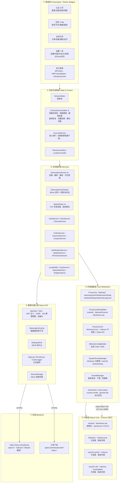
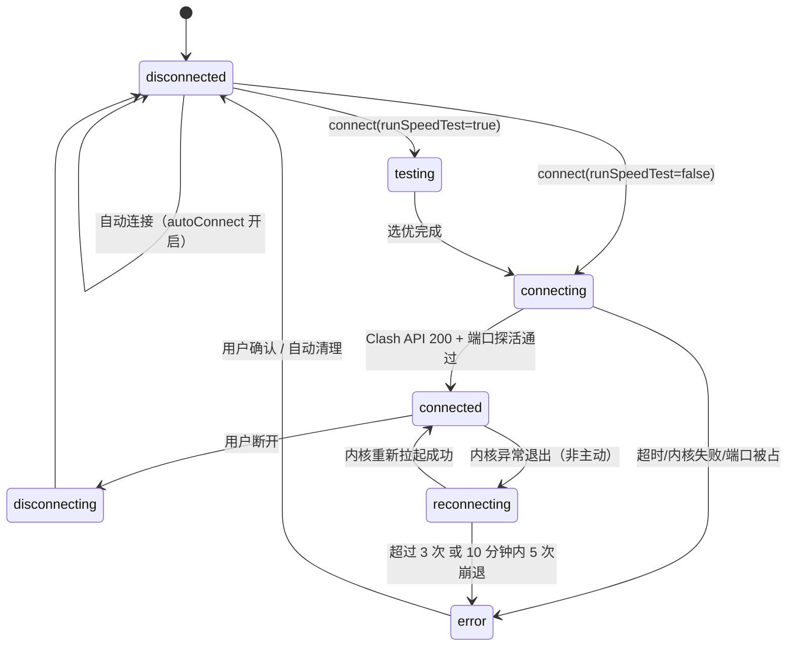
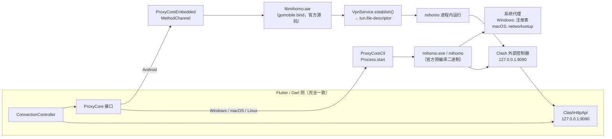
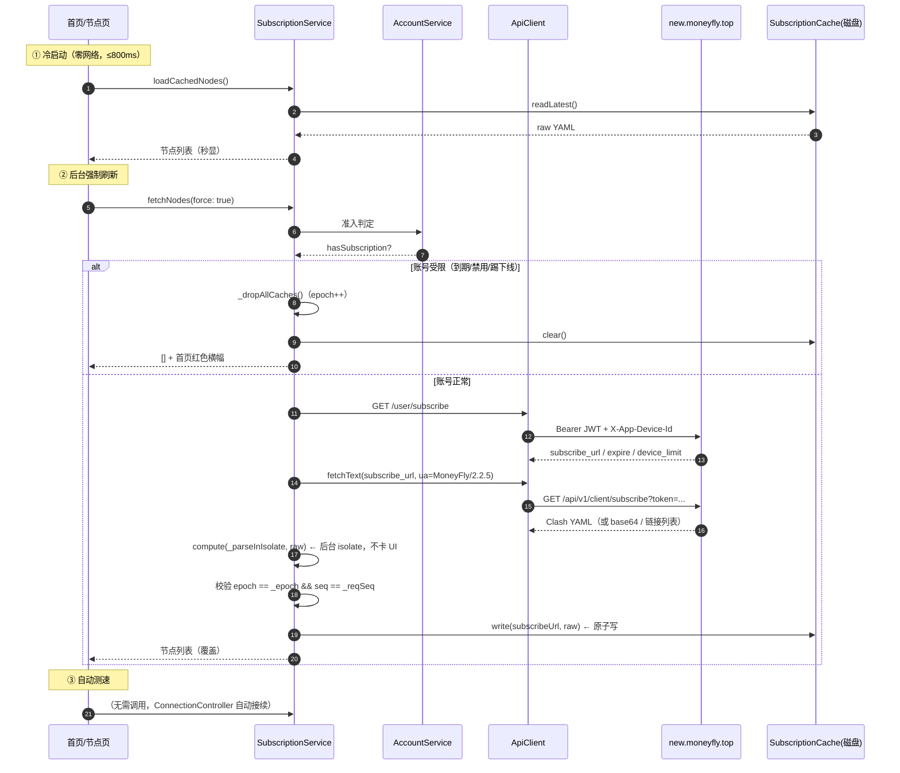
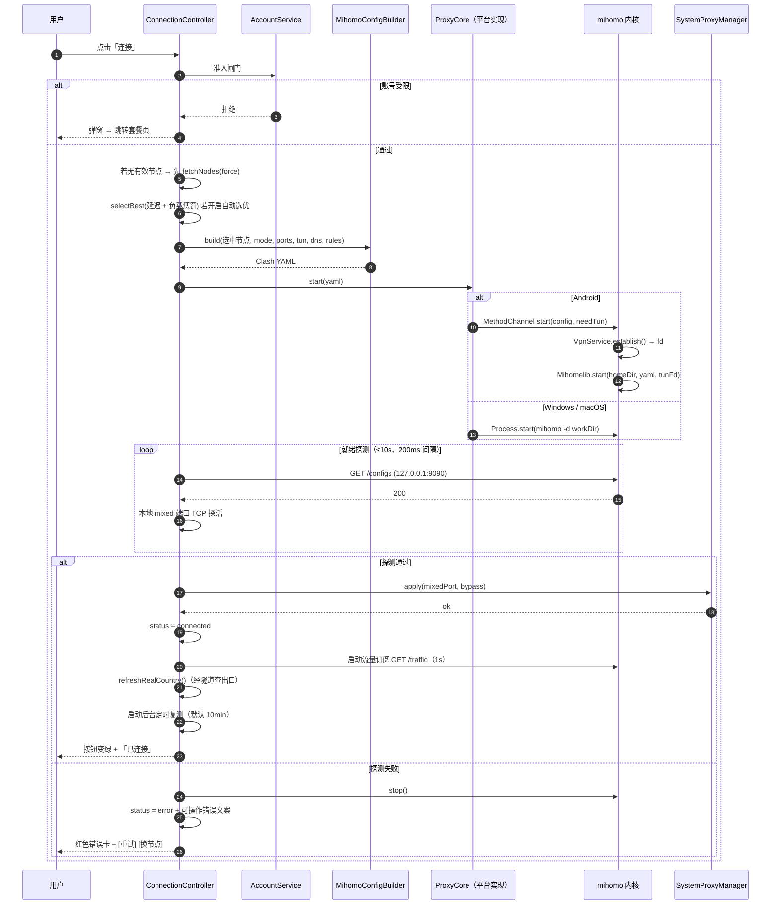

# 02 · 总体架构设计

> 文档版本 v1.0 · 对应项目 `github.com/moneyfly004/Mclash`

---

## 2.1 分层架构



---

## 2.2 模块清单与职责边界

### 2.2.1 `lib/core/proxy/` —— 内核抽象层（**唯一与内核耦合的地方**）

| 文件 | 行数 | 职责 | 关键约束 |
|---|---|---|---|
| `proxy_core.dart` | ~1380 | 抽象基类 + `ConnectionController`（全局单例）+ 状态机 + 测速调度 + 崩溃自愈 | 上层 UI 只依赖 `ConnectionController`，**绝不**直接碰内核 |
| `proxy_core_embedded.dart` | ~495 | Android 实现：MethodChannel `top.moneyfly/vpn_core` | 串行化内核调用；启动超时读 `lastStartError` 精确定位 |
| `proxy_core_cli.dart` | ~668 | 桌面实现：`Process.start(mihomo)` + 轮询 Clash API | 启动中标志 `_starting` 防并发双开；系统代理 20s 保活 |
| `mihomo_config.dart` | ~428 | 生成 Clash YAML：mixed-port / external-controller / dns(fake-ip) / tun / 分流规则 | CN 直连走 `GEOSITE,cn` + `GEOIP,CN`，离线 geo 数据内嵌 |
| `system_proxy.dart` | ~706 | 系统代理设置/恢复/残留清扫 | 三平台差异封装；`clearResidual` 判据 = 「指向本机端口 **且** 端口已无人监听」 |
| `geo_assets.dart` | ~207 | `country.mmdb` / `geosite.dat` 落盘与校验 | 原子写入；失败不标记已同步 |
| `geo_lookup.dart` | ~159 | 经隧道查出口 IP → 国家/城市 | 多源（3 个）逐源捕获，任一成功即返回 |
| `conn_error.dart` | ~74 | 连接错误文案归类 | 指向可操作方向，不出现「连接已断开」这类含糊文案 |

**状态机**



### 2.2.2 `lib/core/services/` —— 业务服务层

| 文件 | 职责 | 关键设计点 |
|---|---|---|
| `subscription_service.dart` | 订阅拉取 → 解析 → 缓存 | **代次（epoch）+ 请求序号（reqSeq）双闸**，作废在途旧结果；宽松 base64；支持 12 种协议链接 |
| `subscription_scheduler.dart` | 30 分钟定时 + 回前台补拉（≥10min） | 失败指数退避；登出即停并释放定时器 |
| `subscription_cache.dart` | 订阅原文磁盘缓存 | 原子写；换号/版本变更即失效 |
| `speed_tester.dart` | TCP 并发测速 + 选优 | 3 次取中位数；并发 12；`mfLatencyUsable` 过滤 0ms 与 ≥5000ms 的不可信值 |
| `account_service.dart` | 准入闸门 | 到期 / 订阅停用 / 账号禁用 / 设备踢下线 → 首页横幅 + 连接门禁 |
| `auth_service.dart` | 登录/登出/刷新 | 登出清 token + 清订阅缓存 + 重置连接器 |
| `settings_store.dart` | 设置持久化 | 单文件 JSON；默认测速地址强制 HTTPS |
| `kernel_manager.dart` | 内核版本与热替换 | 用户副本目录（不写安装目录）；缓存命中秒切；自检 + 回滚 |
| `kernel_log.dart` / `app_log.dart` / `crash_logger.dart` | 三级日志 | 旋转（防超长单行撑爆）；崩溃日志独立目录 |
| `tray_service.dart` | 桌面托盘 | 菜单：显示窗口 / 连接 / 断开 / 退出 |
| `network_monitor.dart` | 网络变化 | WiFi↔蜂窝切换自动重连 |
| `single_instance.dart` / `win_single_instance.dart` | 单实例 | Windows 原生 `CreateMutexW`（早于窗口创建）；mac/Linux 排他文件锁 |
| `local_notify.dart` | 本地通知 | 到期提醒 / 连接异常 |
| `update_service.dart` | 版本检查 | `/software/versions`；架构感知（Windows 用户不得被引导下 APK） |
| `app_data_cleaner.dart` | 全新安装/升级清理 | 卸载残留 → 清 token/配置/缓存，强制重新登录重拉订阅 |

### 2.2.3 `lib/pages/` —— 页面层

见 [04 信息架构与导航地图](./04-信息架构与导航地图.md) 与
[06 移动端页面设计](./06-页面设计-移动端.md) / [07 桌面端页面设计](./07-页面设计-桌面端.md)。

---

## 2.3 内核集成：同一条 Dart 代码，三种形态

这是整个架构最关键的抽象。**上层只认 `ProxyCore` 接口**，三平台实现互不感知。



### 2.3.1 Android —— 进程内嵌入（AAR）

| 项 | 值 |
|---|---|
| 制品 | `libmihomo.aar` |
| 来源 | `github.com/moneyfly004/mihomo-lib` Releases（**官方 mihomo 源码 + gomobile bind，无 fork**） |
| Java API | `top.moneyfly.mihomelib.Mihomelib.{start,stop,reload,running,version,logs}` |
| ABI | `arm64-v8a`, `armeabi-v7a`, `x86`, `x86_64`（`with_gvisor` + `cmfa` tag） |
| TUN | Kotlin `VpnService.establish()` 拿 fd → 注入 YAML `tun.file-descriptor` |
| 地址规划 | `172.19.0.1/30`，虚拟 DNS `172.19.0.2`（内核 `dns-hijack` + fake-ip 接管） |
| `auto-route` | **false**（Android 上不允许非 root 改路由表，全部由 VpnService 下发） |
| `auto-detect-interface` | **false**（VpnService 已排除自身进程） |
| 热切换 | 走 Clash API（不重启内核，不断流） |
| 二进制修复 | 内核版本随 App 更新，**不支持运行期替换** |

### 2.3.2 Windows —— 子进程（官方内核）

| 项 | 值 |
|---|---|
| 制品 | `mihomo-windows-amd64-compatible-v{V}.zip` → `mihomo.exe` |
| 位置 | 与 `Mclash.exe` 同目录（`Directory(Platform.resolvedExecutable).parent`） |
| 启动 | `Process.start(mihomo, ['-d', workDir])`，`workDir = ${systemTemp}/mclash_core` |
| 就绪 | 轮询 `GET /configs` 返回 200 **且** mixed 端口探活成功（10s 超时） |
| 代理 | 注册表 `HKCU\...\Internet Settings` + `ProxyOverride` 绕过列表 |
| 防火墙 | 连接时 `firewallAddPorts([mixedPort, apiPort])`；否则 Windows 防火墙会拦环回 |
| 兼容版原因 | 官方 `amd64` 要求 AVX2；老 CPU 跑标准版**启动即 `0xC0000005` 崩溃** |
| 单实例 | 原生 `CreateMutexW`，在创建窗口**之前**拦截，第二进程连窗口都不创建 |

### 2.3.3 macOS —— 子进程（官方内核，**双架构分别获取**）

| 架构 | 内核资产 | 说明 |
|---|---|---|
| `arm64`（Apple 芯片） | `mihomo-darwin-arm64-v{V}.gz` | 直接 `gunzip` |
| `x86_64`（Intel） | `mihomo-darwin-amd64-compatible-v{V}.gz` | **必须 compatible**：标准版要求 AMD64 v3，Rosetta 与老 Intel 不支持 → 启动即崩 |

| 项 | 值 |
|---|---|
| 位置 | `Mclash.app/Contents/MacOS/mihomo` |
| 代理 | `networksetup -setwebproxy/-setsecurewebproxy` 逐网络服务设置；绕过列表必须包含 `<local>` 与常用内网段 |
| 电源事件 | `applicationShouldTerminate` → 恢复系统代理 + 收内核（否则关机后系统代理指向死端口 → 重启整机断网） |
| 单实例 | `open -n` 双开用排他文件锁拦截（`MONEYFLY_ALLOW_MULTI=1` 供调试） |
| 分发 | `.dmg`；内含 `uninstall.command` 双击卸载 |

---

## 2.4 关键数据流

### 2.4.1 订阅数据流（含缓存与失效）



### 2.4.2 连接数据流



---

## 2.5 关键设计决策记录（ADR）

| ID | 决策 | 备选 | 理由 |
|---|---|---|---|
| **ADR-001** | 以 `mysoftware/moneyfly` 为代码基线，`clashmi-main` 为工程与 UX 参照 | 以 clashmi 为基线 | clashmi 缺 8 项外部二进制输入（见 01 §1.6.1），重建成本远高于改造；且其通用工具能力违背 P3 |
| **ADR-002** | 不导入订阅，订阅 URL 由后台随账号下发 | 提供「导入订阅」入口 | P1 零配置原则；同时消除用户误导入他人订阅带来的账号安全与计费争议 |
| **ADR-003** | 内核**不使用 fork**，全平台用官方 mihomo（Android 走 gomobile 包装，桌面走官方预编译） | 使用魔改内核 | 可跟随官方安全更新（每日自动检测）；避免长期维护分歧 |
| **ADR-004** | Android 走**进程内 AAR**，桌面走**子进程** | 全平台统一子进程 | 非 root 全局代理在 Android 上**只能**通过 `VpnService` 提供 TUN fd；桌面端无此限制，子进程更易热替换与排障 |
| **ADR-005** | macOS Intel 使用 `compatible` 内核 | 使用标准版 | 标准版要求 AMD64 v3（AVX2），Rosetta 与老 Intel 不支持 → 启动即 `SIGILL/崩溃` |
| **ADR-006** | 订阅拉取使用 **epoch + reqSeq 双闸** | 只判空 / 只判 TTL | 并发拉取（手动+定时+回前台+购买后）会让「准入状态变化前发出的旧请求」晚到后把老配置写回，使过期用户重新拿到可用线路（**计费漏洞**） |
| **ADR-007** | 账号受限时用**空/占位覆盖**缓存，而非保留旧配置 | 保留上次成功配置 | 否则到期用户可继续使用缓存中的可用线路 |
| **ADR-008** | 就绪判定 = Clash API 200 **且** 本地端口探活 | 只看 API 200 | 端口被占用/非法时内核照跑照 200 → 误判「已连接」并把系统代理指向死端口 |
| **ADR-009** | 桌面端系统代理由 App 接管，连接时设置、断开时恢复 | 让用户手动配系统代理 | P2 一键原则；并为此实现残留清扫与关机钩子，避免「重启整机断网」 |
| **ADR-010** | 测速在**副本**上进行，结果不回写传入列表元素 | 原地改 | 断开/切换瞬间的测速结果不得污染 UI 当前列表 |
| **ADR-011** | 内核更新写入**用户副本目录**，绝不改安装目录 | 直接替换安装目录 | 装到 `Program Files` 等只读目录也能更新；配合缓存 + 自检 + 回滚 |
| **ADR-012** | 关闭窗口默认行为 = 最小化到托盘，且支持「记住我的选择」 | 直接退出 | 桌面代理常驻场景下误关窗口不应断网 |
| **ADR-013** | 主界面**单一大按钮**，节点切换走底部弹层 | 首页内嵌节点列表 | P3 简洁；首页信息密度需 ≤ 7 个可点击元素 |
| **ADR-014** | 主题提供 6 套**完整配色**（非只换品牌色） | 只做明/暗两套 | 不同配色需要整套明暗属性自洽，只换主色会出现白底白字/黑底黑字 |
| **ADR-015** | 全平台统一使用官方二进制 + `moneyfly004/mihomo-lib` 的 AAR，**不在主仓库现编内核** | 每次构建现编 | 省 10~20 分钟/次；内核版本升级只改一个 `MIHOMO_VERSION` 变量 |

---

## 2.6 目录结构（目标形态）

```
Mclash/
├── .github/workflows/
│   ├── release.yml              # Android(分ABI)+AAB / Windows exe+zip / macOS arm64+x64+universal
│   └── ci.yml                   # analyze + test
├── android/
│   ├── app/
│   │   ├── build.gradle.kts     # applicationId=top.moneyfly.mclash，签名走 Secrets
│   │   ├── libs/libmihomo.aar   # CI 下载（不入库）
│   │   └── src/main/
│   │       ├── AndroidManifest.xml
│   │       └── kotlin/top/moneyfly/mclash/
│   │           ├── MainActivity.kt
│   │           ├── vpn/MclashVpnService.kt      ★ VpnService + libmihomo
│   │           └── tile/MclashTileService.kt    ← 吸收 A-02（快捷磁贴）
│   └── mihomo-core/             # 本地编 AAR 用（仅调试）
├── assets/
│   ├── moneyfly-logo.png
│   ├── tray_icon.ico
│   ├── flags/                   # 国旗 PNG（Windows emoji 兜底）
│   └── rules/{country.mmdb,geosite.dat}   # CI 下载，不入库
├── docs/design/                 # ★ 本设计文档套件
│   ├── 01..10-*.md
│   └── mockups/                 # 高保真 HTML 设计稿
├── lib/
│   ├── main.dart                # 入口 + MainShell（4 Tab / 桌面 NavigationRail）
│   ├── core/
│   │   ├── api/                 # ApiClient · Endpoints · UserAgent
│   │   ├── models/              # 数据模型
│   │   ├── proxy/               # ★ 内核抽象层（见 2.2.1）
│   │   └── services/            # ★ 业务服务层（见 2.2.2）
│   ├── pages/                   # 页面（见 04/06/07）
│   ├── theme/                   # ★ 设计系统（见 03）
│   ├── widgets/                 # 通用组件
│   └── l10n/                    # i18n（zh / en）
├── macos/                       # Runner + entitlements + DMG 打包
├── windows/                     # Runner + 原生单实例 mutex + Inno Setup 脚本
├── scripts/
│   ├── merge_macos_universal.sh
│   ├── uninstall_macos.command
│   └── windows_installer.iss
├── tool/
│   ├── fetch_mihomo.sh          # 开发机拉内核
│   ├── fetch_geodata.sh         # 开发机拉 geo 数据
│   └── build_mihomo_aar.sh      # 本地编 AAR（调试用）
├── test/                        # 单元 + 集成（含真实内核 e2e）
└── pubspec.yaml
```

---

## 2.7 可靠性设计（本产品的护城河）

商用客户端与「玩家工具」最大的区别在于**故障自愈**。以下 8 条为本项目的可靠性基线：

| # | 故障场景 | 处理 |
|---|---|---|
| R-01 | 内核被安全软件结束 / 崩溃退出 | **无论「断线自动重连」开关是否开启**，都自动拉起（属客户端自身故障）。最多 3 次；10 分钟内崩退 ≥5 次则熔断，避免连崩循环 |
| R-02 | 「重连上限一连上就清零」导致无限自连 | 改为**稳定存活 ≥60s** 后才清零；配合熔断 |
| R-03 | 退出后重开连不上（端口/缓存锁被孤儿内核占用） | 退出时无条件 `killStaleKernels()`；启动巡检**先收残留内核、再判系统代理**（顺序不可反） |
| R-04 | 启动巡检误杀**另一个实例正在用的活内核** | 只收「父进程已消失的真孤儿」；仍在工作的内核一律不动 |
| R-05 | 启动巡检把活着的系统代理当残留清掉（界面已连接但打不开网页） | 判据 = 「指向本机端口 **且** 该端口已无人监听」才算残留 |
| R-06 | 关机/注销后系统代理残留指向死端口 → 重启整机断网 | Windows `WM_QUERYENDSESSION/WM_ENDSESSION`、macOS `applicationShouldTerminate`、Linux `SIGTERM/SIGINT` 钩子做最后清理（2s 超时） |
| R-07 | 快速连点造成双开内核 / 孤儿进程 | 启停互斥（`_starting` 标志 + `_stopInFlight` Future） |
| R-08 | 内核 panic 跨 cgo 边界崩掉整个 App | Go 层 `recover()` + fd 兜底关闭，把崩溃转成「可重试错误」 |

### 错误文案原则

> **任何连接失败都必须指向可操作方向。**
> ❌ 「连接已断开」 → ✅ 「内核反复异常退出，可能被安全软件拦截；退出码 -9」
> ❌ 「lookupViaProxy 失败」 → ✅ 「三个出口查询源均失败（TLS 握手被中断 / 超时 / 不可达）」
