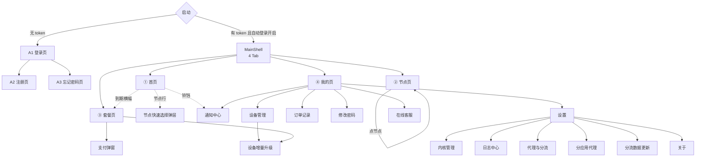

# 04 · 信息架构与导航地图

> 文档版本 v1.0 · 对应项目 `github.com/moneyfly004/Mclash`

---

## 4.1 页面总清单

> 共 **24 个页面 + 6 个全局弹层**。P0 页面 22 个，P1 页面 2 个。

| ID | 页面 | 文件 | 入口 | 平台 | 优先级 |
|---|---|---|---|---|---|
| **A. 认证区（未登录）** |||||
| `A1` | 登录页 | `pages/auth/login_page.dart` | 启动路由（未登录） | 全平台 | P0 |
| `A2` | 注册页 | `pages/auth/register_page.dart` | 登录页「注册账号」 | 全平台 | P0 |
| `A3` | 忘记密码页 | `pages/auth/forgot_password_page.dart` | 登录页「忘记密码」 | 全平台 | P0 |
| `A4` | 修改密码页 | `pages/auth/change_password_page.dart` | 我的 → 修改密码 | 全平台 | P0 |
| **B. 主壳 4 Tab（已登录）** |||||
| `B1` | 首页 | `pages/home/home_page.dart` | Tab 0 | 全平台 | P0 |
| `B2` | 节点页 | `pages/nodes/nodes_page.dart` | Tab 1 | 全平台 | P0 |
| `B3` | 套餐页 | `pages/package/package_page.dart` | Tab 2 | 全平台 | P0 |
| `B4` | 我的页 | `pages/profile/profile_page.dart` | Tab 3 | 全平台 | P0 |
| **C. 业务子页** |||||
| `C1` | 设备管理页 | `pages/devices/devices_page.dart` | 我的 → 设备管理 | 全平台 | P0 |
| `C2` | 设备增量升级页 | `pages/package/upgrade_devices_page.dart` | 设备页/套餐页「+N 台」 | 全平台 | P0 |
| `C3` | 订单记录页 | `pages/orders/orders_page.dart` | 我的 → 订单记录 | 全平台 | P0 |
| `C4` | 通知中心页 | `pages/notifications/notifications_page.dart` | 首页铃铛 / 我的 → 通知 | 全平台 | P0 |
| **D. 设置区** |||||
| `D1` | 设置主页 | `pages/settings/settings_page.dart` | 我的 → 设置 | 全平台 | P0 |
| `D2` | 内核管理页 | `pages/settings/kernel_page.dart` | 设置 → 内核管理 | **仅桌面** | P0 |
| `D3` | 日志中心页 | `pages/settings/log_center_page.dart` | 设置 → 日志中心 | 全平台 | P0 |
| `D4` | 分流与代理页 | `pages/settings/access_page.dart` | 设置 → 代理与分流 | 全平台 | P0 |
| `D5` | 分应用代理页 | `pages/settings/bypass_page.dart` | 设置 → 分应用代理 | **仅 Android** | P1 |
| `D6` | 分流数据更新页 | `pages/settings/geo_update_page.dart` | 设置 → 分流数据 | 全平台 | P0 |
| **E. P1 预留** |||||
| `E1` | 关于页 | `pages/settings/about_page.dart`（新增） | 我的 → 关于 | 全平台 | P1 |
| `E2` | 工单 / 客服页 | `pages/support/support_page.dart`（新增，内嵌 WebView） | 我的 → 在线客服 | 全平台 | P1 |
| **F. 全局弹层 / 覆盖层** |||||
| `F1` | 节点快速选择弹层 | `_NodePickerSheet`（首页内） | 首页节点行点击 | 移动 P0 / 桌面可复用 | P0 |
| `F2` | 支付弹窗（二维码） | `pages/payment/payment_dialog.dart` | 套餐页「立即支付」 | 全平台 | P0 |
| `F3` | 关闭行为询问弹窗 | `main.dart` `onWindowClose` | 桌面点窗口关闭 | **仅桌面** | P0 |
| `F4` | 国家快捷切换卡组 | `_buildQuickCountries`（首页内） | 首页 | 全平台 | P0 |
| `F5` | 排序 / 筛选选择器 | `_pickSort` / `_picker` | 节点页、设置项 | 全平台 | P0 |
| `F6` | 全局 Toast / SnackBar | `ScaffoldMessenger` | 全局 | 全平台 | P0 |

---

## 4.2 移动端导航结构

### 4.2.1 底部导航（< 840px）

| 序号 | 图标（未选中 → 选中） | 文案 key | 中文 | English |
|---|---|---|---|---|
| 0 | `home_outlined` → `home` | `home` | 首页 | Home |
| 1 | `dns_outlined` → `dns` | `nodes_title` | 节点 | Nodes |
| 2 | `payments_outlined` → `payments` | `purchase_title` | 套餐 | Plans |
| 3 | `person_outline` → `person` | `profile_title` | 我的 | Me |

**规则**
- 选中色 `MFColors.brandLight`，未选中 `MFColors.txt3`
- 背景 `MFColors.bg`，顶部 1px `MFColors.line`
- 图标 22px，label 10.5px
- **Tab 3「我的」在有新版本时右上角挂 7px 红点**（`UpdateService.hasUpdate`）
- `IndexedStack` 保活已访问 Tab，未访问 Tab 渲染 `SizedBox.shrink()`（避免登录瞬间并发拉取）
- 非活动 Tab 用 `TickerMode(enabled: false)` 停动画 ticker

### 4.2.2 桌面导航（≥ 840px）

同一份 `_mainNavEntries` 定义同时驱动两种导航，**图标与文案完全一致**：

| 属性 | 值 |
|---|---|
| 形态 | 左侧 `NavigationRail` |
| `labelType` | `all`（图标 + 文字都显示） |
| 指示器 | `indicatorColor: brand.withOpacity(.12)` |
| 选中图标 | `brandLight`；未选中 `txt3` |
| 选中文字 | 12px / 500 / `brandLight`；未选中 12px / `txt3` |
| 右侧分隔 | `1px MFColors.line` |
| 内容区 | `Expanded`，宽度 ≥ 840px 时内容居中，最大 1040px |

---

## 4.3 首页信息架构（`B1`）—— 单屏元素预算

> **硬约束：首页单屏 ≤ 7 个可点击元素。**

| # | 区块 | 可点击 | 说明 |
|---|---|---|---|
| 1 | 顶部栏 `_buildHeader` | ✅ 通知铃铛（1） | 左：品牌标 + 「MoneyFly」；右：通知铃铛（带未读红点） |
| 2 | 订阅信息条 `_buildSubInfoBar` | ✖ | 到期时间 · 剩余天数 · 剩余流量（一行微型信息条） |
| 3 | 账号横幅 `_buildAccountBanner` | ✅ 「去续费」（2） | **仅账号受限时出现**：到期 / 订阅停用 / 账号禁用 / 设备被踢 |
| 4 | 连接卡 `_buildConnectCard` | ✅ 大按钮（3）· 节点行（4） | 核心区：96px 连接环 + 状态文字 + 节点名/延迟 + 错误行动按钮 |
| 5 | 模式切换 `_buildModeSwitch` | ✅ 智能 / 全局（5） | 分段控件，两个选项卡 36px 高 |
| 6 | 实时统计 `_buildStats` | ✖ | 上行速率 · 下行速率 · 本次时长（三卡）+ 曲线 |
| 7 | 自动测速卡 | ✅ 立即重测（6） | 「最优线路」展示 + 状态徽章 + 重新测速按钮 |
| 8 | 国家快捷切换 `_buildQuickCountries` | ✅ 国家卡（7…） | 3 列网格，首格「自动」+ 最多 5 个国家 |

> 若「账号横幅」出现，则隐藏「自动测速卡」以维持预算（受限账号不需要测速）。

**滚动行为**：整页纵向滚动。上半部（1–4）**固定不滚**，下半部（5–8）滚动 —— 保证主按钮永远可见。

---

## 4.4 节点页信息架构（`B2`）

| 区块 | 内容 |
|---|---|
| 顶部栏 | 标题「节点」+ 右侧「⚡ 测速」文字按钮 + 排序图标 |
| 自动选优条 | `[⚡ 自动选优]` 说明 + 状态徽章 + 「立即选优」按钮 |
| 搜索栏 | 46px 输入框（搜索节点名/国家）+ 46×46 排序图标按钮 + 「最优」小按钮 |
| 进度条 | 测速进行中显示 `已完成/总数` 进度条（例：`12/68`） |
| 列表 | 按国家分组（分组头：国旗 + 国家名 + `N 个节点`）→ 节点行 |
| 空态 | 「暂无节点」+ 副文案「订阅同步后可在此查看线路」+ 重试按钮 |
| 错误态 | 红色卡 + 错误原因 + 「重新同步」按钮 |

**节点排序选项**：`默认（订阅顺序）` / `延迟从低到高` / `延迟从高到低` / `按国家` / `按名称`

**筛选**：全部 / 仅在线 / 仅收藏；国家多选筛选（点击分组头切换）

---

## 4.5 套餐页信息架构（`B3`）

| 区块 | 内容 |
|---|---|
| 标题区 | 「套餐购买」22px + 副标题「选择一个适合你的套餐」 |
| 当前订阅卡 | 仅已有订阅时显示：套餐名 + 状态徽章 + 到期日 + 剩余天数 |
| 套餐卡片列表 | 每卡：名称 / 价格（大号 Chakra Petch）/ 时长 / 设备数 / 流量 / 推荐标签 |
| 套餐详情条 | 三格：流量 · 设备数 · 有效期 |
| 优惠券输入 | 输入框 + 「验证」按钮；验证成功显示绿色 `-¥X` |
| 支付方式 | 支付宝 / 微信 / USDT 单选卡（34×34 品牌色图标 + 名称 + 说明 + 单选圆） |
| 底部结算栏 | 左：实付金额；右：主按钮「立即支付」 |
| 设备增量入口 | 「需要更多设备？+N 台」→ `C2` |

---

## 4.6 我的页信息架构（`B4`）

| 区块 | 内容 |
|---|---|
| 头部 | 头像标（56px 品牌标）+ 用户名 + 邮箱 + 右侧余额（`--brandLight` 大号数字） |
| 到期提醒横幅 | 剩余 ≤ 7 天时出现（琥珀色），「立即续费」 |
| 公告横幅 | 后台公告（可关闭，带 `×`） |
| 订阅卡 | 22px 圆角，渐变底 + 右上角品牌光晕；套餐名 + 状态徽章 + 三格（到期日 / 剩余天数 / 设备数） |
| 功能菜单 | 设备管理 / 订单记录 / 通知中心 / 修改密码 / 在线客服 |
| 系统菜单 | 设置 / 关于 / 版本更新（有新版本时红点） |
| 退出登录 | 红色 ghost 按钮（二次确认） |

---

## 4.7 设置页信息架构（`D1`）

> 分组顺序即设计稿顺序，**共 7 组**。

| 组 | 标题 | 行项 |
|---|---|---|
| 1 | **连接** | 连接模式（智能/全局 分段）· 自动连接 · 自动测速与选优 · 断线自动重连 · 开机自启动（桌面）· 系统代理（桌面） |
| 2 | **代理与分流** | 代理与分流（→`D4`）· 分应用代理（→`D5`，Android）· 分流数据更新（→`D6`）· 本地端口 · 内核 API 端口 · 测速地址 · 订阅 UA |
| 3 | **内核** | 内核管理（→`D2`，桌面）· 内核日志级别 · 放宽 hy2/tuic 证书校验 |
| 4 | **外观** | 外观模式（6 套色卡横滑选择）· 语言（中文/English） |
| 5 | **诊断** | 日志中心（→`D3`）· 崩溃日志开关 · 导出诊断包 |
| 6 | **桌面** | 关闭窗口行为（每次询问/最小化到托盘/退出）· 托盘图标行为 |
| 7 | **数据与危险** | 清理本地数据 · 检查更新 · 关于 · 版本号 |

---

## 4.8 全局状态与覆盖层

### 4.8.1 全局横幅（`AccountBanner`）

由 `AccountService` 驱动，**四类状态**，出现在首页连接卡上方：

| 状态 | 触发条件 | 颜色 | 文案 | 行动 |
|---|---|---|---|---|
| 即将到期 | `remainingDays ∈ [1,7]` | 琥珀 | 「订阅将于 N 天后到期」 | [去续费] |
| 已到期 | `isExpired == true` | 红 | 「订阅已到期，服务已暂停」 | [立即续费] |
| 订阅停用 | `isActive == false` | 红 | 「订阅已被停用，请联系客服」 | [联系客服] |
| 账号禁用 | `isActive == false`（用户级） | 红 | 「账号已被禁用」 | — |
| 设备被踢 | 订阅 403「此设备已被移除并踢下线」 | 红 | 「本设备已被移除」 | [重新登录] |

> 受限状态下**连接按钮必须禁用**并清空节点列表（防绕过计费）。

### 4.8.2 加载态语义（重要）

| 场景 | 展示 | ❌ 错误做法 |
|---|---|---|
| 刚登录，订阅正在拉取 | 「正在同步订阅…」（中性色 `--txt-2`） | 显示红色错误文案 |
| 正在测速 | 进度条 `12/68` + 「正在测速…」 | 显示「无可用节点」 |
| 正在连接 | 「正在连接…」+ 旋转环 | 显示「连接失败」 |
| 真失败 | 红色错误卡 + 可操作原因 + 行动按钮 | 含糊的「连接已断开」 |

---

## 4.9 页面跳转矩阵

| 从 \ 到 | A1 | A2 | A3 | A4 | B1 | B2 | B3 | B4 | C1 | C2 | C3 | C4 | D1 | D2 | D3 | D4 | D5 | D6 | E1 | E2 | F1 | F2 |
|---|---|---|---|---|---|---|---|---|---|---|---|---|---|---|---|---|---|---|---|---|---|---|
| **A1 登录** | — | ✅ | ✅ | | | | | | | | | | | | | | | | | | | |
| **A2 注册** | ✅ | — | | | | | | | | | | | | | | | | | | | | |
| **A3 忘记密码** | ✅ | | — | | | | | | | | | | | | | | | | | | | |
| **A4 修改密码** | | | | — | | | | | | | | | | | | | | | | | | |
| **B1 首页** | | | | | — | | ✅ | | | | | ✅ | | | | | | | | | ✅ | |
| **B2 节点** | | | | | ✅ | — | | | | | | | | | | | | | | | | |
| **B3 套餐** | | | | | ✅ | | — | | | ✅ | | | | | | | | | | | | ✅ |
| **B4 我的** | | | | ✅ | | | ✅ | — | ✅ | | ✅ | ✅ | ✅ | | | | | | ✅ | ✅ | | |
| **C1 设备** | | | | | | | ✅ | ✅ | — | ✅ | | | | | | | | | | | | |
| **C2 增量升级** | | | | | | | ✅ | | ✅ | — | | | | | | | | | | | | ✅ |
| **C3 订单** | | | | | | | ✅ | ✅ | | | — | | | | | | | | | | | |
| **C4 通知** | | | | | ✅ | | | ✅ | | | | — | | | | | | | | | | |
| **D1 设置** | | | | ✅ | ✅ | ✅ | | ✅ | | | | | — | ✅ | ✅ | ✅ | ✅ | ✅ | ✅ | | | |
| **D2 内核** | | | | | ✅ | | | ✅ | | | | | ✅ | — | | | | | | | | |
| **D3 日志** | | | | | | | | ✅ | | | | | ✅ | | — | | | | | | | |
| **D4 分流** | | | | | ✅ | | | ✅ | | | | | ✅ | | | — | | | | | | |
| **D5 分应用** | | | | | ✅ | | | ✅ | | | | | ✅ | | | | — | | | | | |
| **D6 分流数据** | | | | | | | | ✅ | | | | | ✅ | | | | | — | | | | |
| **E1 关于** | | | | | | | | ✅ | | | | | ✅ | | | | | | — | | | |
| **E2 客服** | | | | | | | | ✅ | | | | | | | | | | | | — | | |

**会话失效（401 refresh 失败）** → `rootNavigatorKey.currentState.popUntil((r) => r.isFirst)` 清空路由栈，强制回登录页（避免设置/订单页残留盖住登录页）。

---

## 4.10 深链接（Deep Link）

| Scheme | 行为 | 说明 |
|---|---|---|
| `mclash://connect` | 直接连接 | 供快捷磁贴 / 控制中心开关调用 |
| `mclash://disconnect` | 断开 | 同上 |
| `mclash://reconnect` | 重连 | 同上 |
| `mclash://open?page=plans` | 打开套餐页 | 供后台推送/邮件引导续费 |
| `moneyfly://pay/success?order_no=X` | 支付同步回调后回 App | 与后台 `PAYMENT_RETURN_URL` 对齐 |

> **不接受** `mclash://import?url=...` 这类订阅导入深链（违背 P1 零配置原则）。
