# 04 · 信息架构与导航地图

> 文档版本 **v3.0** —— **Clash Mi 视觉语言 + 4 个底部 Tab**
> 对应项目 `github.com/moneyfly004/Mclash`
>
> v1.0 = MoneyFly 圆角渐变风格（废弃）· v2.0 = 纯 Clash Mi 单页滚动无导航（废弃）
> **v3.0 = 表现层与能力层沿用 Clash Mi，导航层新增 4 Tab 底部导航**

---

## 4.0 导航模型

| 维度 | 决定 |
|---|---|
| **视觉语言** | 100% Clash Mi（Material 3 + 种子色 `#293CA0` + 方角 + 高密度列表 + 3 主题） |
| **能力范围** | Clash Mi 全部保留（仅移除 zashboard 面板与二维码工具 2 项） |
| **一级导航** | **4 个底部 Tab：主页 · 节点列表 · 套餐购买 · 我的** |
| 二级及以下 | Clash Mi 原样：**纯路由 push** + **模态底部弹层** |
| 页面栈 | **每个 Tab 一个独立 `Navigator`**（切换 Tab 保留各自栈，回到原位置） |
| 提示 | **`SimpleDialog`**（全 App 无 SnackBar / 无 Toast） |
| 顶部栏 | 零高度 `AppBar` + 手写 `Row`（50×44 命中区 / 标题 18 w600 居中） |

### 4.0.1 为什么底部导航要「新造」

Clash Mi **完全没有底部导航**（源码里 `BottomNavigationBar` 零次出现，`bottomNavigationBarTheme` 为 `null`，
也没有 `NavigationBar` / `NavigationRail` / `Drawer` / `TabBar`）。

因此 Mclash 需要**按 Clash Mi 的视觉语言新造一个导航组件**，而不是套 M3 默认的 `NavigationBar`：

| M3 `NavigationBar` 默认 | **Mclash 底部导航（Clash Mi 风格）** |
|---|---|
| 高 80 | **高 56**（+ 安全区） |
| 选中项有 `secondaryContainer` 胶囊指示器 | **无指示器**（方角风格不配胶囊） |
| 图标 24 + label 12（M3 默认，带 letterSpacing） | 图标 **24** + label **12**，无 letterSpacing |
| 背景 `surfaceContainer` | 背景 **`colorScheme.surface`**（与页面同底） |
| 无顶边 | **`Divider(height: 1, thickness: 0.3)`**（全 App 唯一分隔线形式） |
| 选中色 `onSecondaryContainer` | 选中 **`ThemeDefine.kColorBlue` `#FF2196F3`** |

---

## 4.1 底部导航规格

```
┌──────────────────────────────────────────────────┐
│                                                  │
│                  内容区                           │
│                                                  │
├──────────────────────────────────────────────────┤  ← Divider(height: 1, thickness: 0.3)
│                                                  │
│      ⌂             ▤             ▦          ◔    │  图标 24，居中
│    主页         节点列表      套餐购买      我的   │  label 12
│                                                  │
└──────────────────────────────────────────────────┘
```

| 属性 | 值 |
|---|---|
| 高度 | **56**（不含底部安全区；`SafeArea(top: false)` 包裹） |
| 背景 | `colorScheme.surface`（深 `#121212` / 浅 `#F0F0F0`） |
| 顶边 | `const Divider(height: 1, thickness: 0.3)` |
| 图标尺寸 | **24** |
| label 尺寸 | **12** |
| 选中 | 图标 + label 均 `#FF2196F3` |
| 未选中 | `colorScheme.onSurfaceVariant`（深 `#C7C5D0` / 浅 `#46464F`） |
| 指示器 | **无** |
| 点击涟漪 | M3 默认 `InkRipple`（对整格生效） |
| 命中区 | 每格 `flex: 1`，整高可点 |
| 切换动画 | **无自定义动画**（仅颜色瞬时切换，符合 Clash Mi 纪律） |
| 红点 | 8×8 `Colors.red`，位于图标右上角 `Positioned(top: 2, right: -2)` |

### 4.1.1 四个 Tab 定义

| # | label | 图标（未选中 / 选中） | badge | 职责 |
|---|---|---|---|---|
| 0 | **主页** | `Icons.home_outlined` / `Icons.home` | — | 连接开关 · 四模式 · 我的配置 · 代理入口 · 快捷入口 · 设置入口 |
| 1 | **节点列表** | `Icons.dns_outlined` / `Icons.dns` | — | 自动选优 · 搜索 · 排序 · 测速 · 国家分组 · 节点列表 · 代理组入口 |
| 2 | **套餐购买** | `Icons.shopping_cart_outlined` / `Icons.shopping_cart` | — | 当前订阅摘要 · 套餐列表 · 优惠券 · 支付方式 · 结算 |
| 3 | **我的** | `Icons.person_outline` / `Icons.person` | **未读通知红点** | 账号 · 订阅卡 · 订单 · 设备 · 通知 · 客服 · 修改密码 · 设置 · 退出登录 |

> **badge**：仅 Tab 3 在 `GET /notifications/unread-count > 0` 时显示 8×8 红点。

### 4.1.2 桌面端（≥ 840px）

Clash Mi 桌面与移动**同一套布局**（无侧边栏）。但 4 Tab 在宽屏上放底部会很怪，因此：

| 宽度 | 形态 |
|---|---|
| < 840px | **底部导航**（同移动端） |
| ≥ 840px | **左侧导航栏**（`NavigationRail` 的 Clash Mi 化版本） |

**桌面左侧导航规格**（与底部导航同一套视觉语言）：

| 属性 | 值 |
|---|---|
| 宽度 | **88** |
| 背景 | `colorScheme.surface` + 右侧 `Divider(height:1, thickness:0.3)` 竖向版（`VerticalDivider(width: 1, thickness: 0.3)`） |
| 图标 | **26**（桌面用 26，与顶部栏动作图标一致） |
| label | **12** |
| 选中 | `#FF2196F3` |
| 未选中 | `onSurfaceVariant` |
| 指示器 | 无 |
| 每项高度 | **56**，垂直居中排列 |

> 关键：**两套导航共用同一份 `_mainNavEntries` 定义**（图标 / label / badge key），
> 切换宽度时**不重建页面状态**（每个 Tab 一个 `IndexedStack` 保活的 `Navigator`）。

---

## 4.2 四个 Tab 的内容结构

### 4.2.1 Tab 0 · 主页（= Clash Mi 首页原样）

```
┌──────────────────────────────────────────────────┐
│                   Mclash                          │  居中标题 18/w600
│                                                   │
│  ┌── Card ①  连接卡 ───────────────────────────┐  │
│  │ ● 已连接                        [ 开关 ]     │  │
│  │ ↑ 1.2 GB   ↓ 8.4 GB                          │  │
│  │ ↑ 120 KB/s   ↓ 840 KB/s                      │  │
│  │ ────────────────────────────────────────────  │  │
│  │    [ 规则 ][ 全局 ][ 直连 ][ 拦截 ]           │  │
│  │ ────────────────────────────────────────────  │  │
│  │ 我的配置                     🔔  ⊕   ›        │  │
│  │ MoneyFly 订阅                                 │  │
│  │ ↑ 42.3 GB ↓ 128.4 GB/100 GB                   │  │
│  │ 2026-03-14 到期                               │  │
│  │ ────────────────────────────────────────────  │  │
│  │ 代理                                  ›       │  │
│  │ 🇯🇵 手动选择 -> 日本·东京 01 (86 ms)           │  │
│  │ ────────────────────────────────────────────  │  │
│  │   [ 运行时配置 ]        [ 网络检测 ]           │  │
│  └───────────────────────────────────────────────┘  │
│                                                   │
│  🆕 账户状态条（仅受限或有订阅时显示一行，点击跳 Tab 3）│
│  ┌───────────────────────────────────────────────┐  │
│  │ ⏰ 订阅将于 5 天后到期                      ›  │  │  ← 正常态也显示（一行摘要）
│  └───────────────────────────────────────────────┘  │
│                                                   │
│  ┌── Card ②  设置卡（Clash Mi 原样）───────────┐  │
│  │ ⚙ 应用设置                               ›   │  │
│  │ ⚙ 内核设置                               ›   │  │
│  │ 🍱 核心日志                              ›   │  │
│  │ ☁ 备份与同步                             ›   │  │
│  │ 🆕 更新版本 2.4.0                        ›   │  │  ← 仅在有新版时
│  │ ? 帮助                                   ›   │  │
│  │ ⓘ 关于                                   ›   │  │
│  └───────────────────────────────────────────────┘  │
├───────────────────────────────────────────────────┤
│    ⌂              ▤              ▦           ◔    │
│  主页          节点列表       套餐购买       我的  │
└───────────────────────────────────────────────────┘
```

| 区块 | 说明 |
|---|---|
| Card ① 连接卡 | **Clash Mi 原样**（状态点 + 开关 + 流量 2 行 + 四模式 + 我的配置 + 代理 + 快捷入口） |
| 🆕 账户状态条 | **一行** `ListTile`，`title` 为账户摘要，`trailing` `›`；点击 → Tab 3。**只在有两件事时显示**：① 有活跃订阅（显示到期/剩余/流量）② 受限状态（显示红色警告） |
| Card ② 设置卡 | **Clash Mi 原样**（7 行） |

> **为什么把账户卡从 v2.0 的「5 行卡片」压成「1 行状态条」**：现在有了「我的」Tab 承载完整的账户中心。
> 主页只保留**速览 + 跳转**，避免同一批入口在主页 / 套餐 / 我的三处重复出现。
> 用户最初选的是"新增账户卡放在连接卡下方" —— 这条被满足（位置一致），只是把它做成了 1 行摘要条。

**连接卡区块可见性**（Clash Mi 原逻辑）

| 区块 | 未连接 | 已连接 |
|---|---|---|
| 状态点 + 文字 + 开关 | ✅ | ✅ |
| 流量总量行 / 网速行 | ❌ | ✅ |
| 四模式控件 | ✅ | ✅ |
| 我的配置行 | ✅ | ✅ |
| 代理行 | ❌ | ✅ |
| 快捷入口行 | ❌ | ✅ |

### 4.2.2 Tab 1 · 节点列表 🆕

```
┌──────────────────────────────────────────────────┐
│ 节点列表                        ⚙ 组   ⇅   ⚡    │  18/w600 左对齐（Tab 根页不用居中标题）
│                                                   │
│ ┌── 自动选优条 ──────────────────────────────┐   │
│ │ ⚡ 自动选优已开启              ● 已选优     │   │
│ │                              [ 立即选优 ]   │   │
│ └─────────────────────────────────────────────┘   │
│                                                   │
│ ┌── 搜索 + 排序 ─────────────────────────────┐   │
│ │ 🔍 搜索节点 / 国家              ✕          │   │  ← 高 44，r0，无边框
│ └─────────────────────────────────────────────┘   │
│ ┌────────────────────────────────────────────┐   │
│ │ ▓▓▓▓▓▓▓▓▓░░░░░░░░░░░  12 / 68             │   │  测速进度（仅测速时）
│ └────────────────────────────────────────────┘   │
│                                                   │
│  ▾ 🇯🇵 日本                              8 个     │  分组头（可折叠，15/14 + 计数）
│  ┌────────────────────────────────────────────┐  │
│  │ 🇯🇵 日本 · 东京 · 01                        │  │  当前节点：文字 kColorBlue + ✓
│  │    vmess · (86 ms)                     ✓   │  │  行高 66
│  │ ───────────────────────────────────────────│  │
│  │ 🇯🇵 日本 · 大阪 · 02                        │  │
│  │    trojan · (112 ms)                       │  │
│  └────────────────────────────────────────────┘  │
│  ▸ 🇸🇬 新加坡                            6 个     │
│  ▸ 🇺🇸 美国                             12 个     │
│  ▸ 🇭🇰 香港                              9 个     │
│  ▸ 🌐 未识别地区                         4 个     │
├───────────────────────────────────────────────────┤
│    ⌂              ▤              ▦           ◔    │
│  主页          节点列表       套餐购买       我的  │
└───────────────────────────────────────────────────┘
```

| 元素 | 规格 | 来源 |
|---|---|---|
| 标题 | **左对齐** 18/w600「节点列表」（Tab 根页不用居中标题 + 返回箭头） | 🆕 |
| 右侧「组」按钮 | `Icons.account_tree_outlined` **26** → C-12 代理（代理组列表） | 🆕 |
| 右侧排序 | `Icons.sort` **26**，`delayTestSort` 开时 `Colors.green` | Clash Mi C-12 |
| 右侧测速 | `Icons.bolt_outlined` **26**；测速中换成 26×26 环形 + 中间数字 8/10px | Clash Mi C-12 |
| 自动选优条 | 🆕 一行 + 一个胶囊按钮（Clash Mi 的 `ElevatedButton` 小号） | 🆕 |
| 搜索框 | 高 **44**，`r0`，`InputBorder.none`，`Icons.search_outlined` 前置 + `Icons.clear_outlined` 后置 | Clash Mi C-15 |
| 测速进度 | 🆕 4px 条 + `12 / 68`（12px） | 🆕 |
| 分组头 | 国旗图标 + 国名（15/14）+ 右对齐计数（12px）；`▾/▸` 可折叠 | 🆕 |
| 节点行 | 行高 **66**，`margin bottom 2`，`padding horizontal 10`，`r0`；名称 + 类型 + 延迟（色阶）；当前节点 `kColorBlue` + `Icons.done` | Clash Mi C-15 |
| 延迟色阶 | `<800` → `#FF08C70F`｜`800–1499` → `onSurfaceVariant`｜`≥1500` → `Colors.red` | Clash Mi（修正中间档） |
| 默认展开 | 仅当前节点所在国家展开，其余折叠；搜索时全部强制展开 | 🆕 |
| 空态 | 列表空 = 什么都不显示（Clash Mi 风格） | Clash Mi |

> **与 Clash Mi 的映射**：这个 Tab 把 Clash Mi 的
> `C-12 代理（代理组列表）` + `C-15 代理节点列表` **合并提升为一级 Tab**。
> 代理组仍可通过右上角「组」按钮进入（C-12 → C-14 → C-15 链路完整保留）。

### 4.2.3 Tab 2 · 套餐购买 🆕

```
┌──────────────────────────────────────────────────┐
│ 套餐购买                                          │  左对齐 18/w600
│                                                   │
│ ┌── 当前订阅 ────────────────────────────────┐   │
│ │ 标准版 · 100G                 ● 生效中      │   │
│ │ 2026-03-14 到期 · 剩余 128 天 · 设备 2/3   │   │
│ │ ▓▓▓▓▓▓▓▓░░░░░░░░░  42.3 / 100 GB           │   │
│ └─────────────────────────────────────────────┘   │
│                                                   │
│ ┌── 标准版 ─────────────────────── 最划算 ──┐   │
│ │ ¥ 19.9 /月                                 │   │  名称 17/w500；价格 17/w500
│ │ 30 天 · 3 设备 · 100 GB                    │   │  12px
│ └─────────────────────────────────────────────┘   │  ← 选中：Card 边框 kColorBlue
│ ┌── 轻量版 ─────────────────────────────────┐   │
│ │ ¥ 9.9 /月                                  │   │
│ │ 30 天 · 1 设备 · 30 GB                     │   │
│ └─────────────────────────────────────────────┘   │
│ ┌── 旗舰版 ─────────────────────────────────┐   │
│ │ ¥ 49.9 /月                                 │   │
│ │ 30 天 · 5 设备 · 500 GB                    │   │
│ └─────────────────────────────────────────────┘   │
│                                                   │
│ ┌── 优惠码 ─────────────────────────────────┐   │
│ │ ┌──────────────────────┐  [  验证  ]       │   │
│ │ └──────────────────────┘                   │   │
│ └─────────────────────────────────────────────┘   │
│                                                   │
│ ┌── 支付方式 ───────────────────────────────┐   │
│ │ 支付宝                推荐 · 扫码支付  ✓   │   │  ListTile，选中 = kColorBlue + Icons.done
│ │ 微信支付                      扫码支付      │   │
│ │ USDT                    链上确认后开通      │   │
│ └─────────────────────────────────────────────┘   │
│                                                   │
│ ┌─────────────────────────────────────────────┐   │
│ │ 需要更多设备？ +N 台                     ›  │   │  → M-09
│ └─────────────────────────────────────────────┘   │
│                                                   │
│ ┌─────────────────────────────────────────────┐   │
│ │ 合计 ¥19.9          [ ▓ 立即支付 ▓ ]        │   │
│ └─────────────────────────────────────────────┘   │
├───────────────────────────────────────────────────┤
│    ⌂              ▤              ▦           ◔    │
└───────────────────────────────────────────────────┘
```

> **风格约束**：不用大号彩色价格、不用渐变卡片、不用"热门"浮标。
> 价格就是 `17/w500`，推荐标签就是 `kColorBlue` 文字。完全贴合 Clash Mi 的克制风格。

### 4.2.4 Tab 3 · 我的 🆕

```
┌──────────────────────────────────────────────────┐
│ 我的                                              │  左对齐 18/w600
│                                                   │
│ ┌── 用户 ────────────────────────────────────┐   │
│ │ MoneyFly                                   │   │  17/w500
│ │ moneyfly@example.com                       │   │  12px
│ │ 账户余额                            ¥ 128.50│   │
│ └─────────────────────────────────────────────┘   │
│                                                   │
│ ┌── 订阅卡 ─────────────────────────────────┐   │
│ │ 标准版 · 100G                 ● 生效中      │   │
│ │ ──────────────────────────────────────────  │   │
│ │ 到期时间        剩余天数        设备数       │   │
│ │ 2026-03-14      128 天          2 / 3       │   │
│ │ ▓▓▓▓▓▓▓▓░░░░░░░░░  42.3 / 100 GB           │   │
│ └─────────────────────────────────────────────┘   │
│                                                   │
│ ┌── 账户 ────────────────────────────────────┐   │
│ │ 套餐与续费                              ›   │   │  → Tab 2（切换 Tab）
│ │ 我的订单                                ›   │   │
│ │ 设备管理                            2/3 ›   │   │
│ │ 通知中心                             3  ›   │   │  ← 数字或 8×8 红点
│ │ 修改密码                                ›   │   │
│ │ 在线客服                                ›   │   │
│ └─────────────────────────────────────────────┘   │
│                                                   │
│ ┌── 设置（= Clash Mi 设置卡）────────────────┐   │
│ │ ⚙ 应用设置                              ›   │   │
│ │ ⚙ 内核设置                              ›   │   │
│ │ 🍱 核心日志                             ›   │   │
│ │ ☁ 备份与同步                            ›   │   │
│ │ 🆕 更新版本 2.4.0                       ›   │   │
│ │ ? 帮助                                  ›   │   │
│ │ ⓘ 关于                                  ›   │   │
│ └─────────────────────────────────────────────┘   │
│                                                   │
│ ┌─────────────────────────────────────────────┐   │
│ │              退出登录                        │   │  Text(Colors.red) 居中
│ └─────────────────────────────────────────────┘   │
├───────────────────────────────────────────────────┤
│    ⌂              ▤              ▦           ◔    │
│  主页          节点列表       套餐购买       我的  │
└───────────────────────────────────────────────────┘
```

> **设置卡出现在两处**（主页 Card ② 与「我的」Tab）—— **这是刻意的**：
> Clash Mi 用户习惯在主页找设置，MoneyFly 用户习惯在「我的」找设置，两条路径都通。
> 两处指向**同一个** `GroupScreen`，无逻辑重复。

---

## 4.3 完整页面清单

> 共 **47 个页面/弹层**：Clash Mi 继承 40 + MoneyFly 新增 11 − 移除 4。

### 4.3.1 一级 Tab 与 Tab 内根页

| ID | 页面 | 文件 | 所属 Tab |
|---|---|---|---|
| **T-0** | 主页 | `home_screen.dart` + `home_screen_widgets.dart` | Tab 0 |
| **T-1** | 节点列表 | `mf_nodes_screen.dart` | Tab 1 |
| **T-2** | 套餐购买 | `mf_plan_screen.dart` | Tab 2 |
| **T-3** | 我的 | `mf_profile_screen.dart` | Tab 3 |

### 4.3.2 Clash Mi 继承的二级及以下页面（原样保留）

| ID | 页面 | 入口（Tab） | 区间 |
|---|---|---|---|
| **C-01** | 我的配置 | T-0 主页连接卡 | 二级 |
| **C-02** | 配置编辑 | C-01「更多」→ 编辑 | 三级 |
| **C-03** | 覆写设置编辑 | C-01「更多」→ 覆写设置 | 三级 |
| **C-04** | 覆写列表 | 内核设置 → 覆写 | 三级 |
| **C-05** | 添加配置（弹层） | C-01「+」/ T-0「+」 | 弹层 |
| **C-06** | 从 URL 添加配置 | C-05（🙈 开发者） | 三级 |
| **C-07** | 从文件导入配置 | C-05（🙈 开发者） | 三级 |
| **C-08** | 扫码添加配置 | C-05（🙈 开发者） | 三级 |
| **C-09** | 从 URL 添加覆写 | C-04 | 三级 |
| **C-10** | 从文件导入覆写 | C-04 | 三级 |
| **C-11** | 代理（代理组列表） | T-0 主页连接卡 / T-1 右上「组」 | 二级 |
| **C-12** | 节点选择（弹层） | C-11 / 代理组行 | 弹层 |
| **C-13** | 代理组详情 | C-11 | 三级 |
| **C-14** | 代理节点列表 | C-13 | 四级 |
| **C-15** | 代理组模板 | 内核设置 | 三级 |
| **C-16** | 代理组模板编辑 | C-15 | 四级 |
| **C-17** | 规则提供者 | 内核设置 | 三级 |
| **C-18** | 规则提供者编辑 | C-17 | 四级 |
| **C-19** | 规则模板 | 内核设置 | 三级 |
| **C-20** | 规则模板编辑 | C-19 | 四级 |
| **C-21** | 单条规则编辑 | C-20 | 五级 |
| **C-22** | 网络检测 | T-0 主页连接卡 | 二级 |
| **C-23** | 运行时配置查看 | T-0 主页连接卡 | 二级 |
| **C-24** | 核心日志 | T-0 Card② / T-3 | 二级 |
| **C-25** | 备份与同步（弹层） | T-0 Card② / T-3 | 弹层 |
| **C-26** | iCloud 备份 | C-25 | 三级 |
| **C-27** | WebDAV 备份 | C-25 | 三级 |
| **C-28** | 局域网同步 | C-25 | 三级 |
| **C-29** | 导入导出（弹层） | C-25 | 弹层 |
| **C-30** | 帮助（弹层） | T-0 Card② / T-3 | 弹层 |
| **C-31** | 关于 | T-0 Card② / T-3 | 二级 |
| **C-32** | 开发者选项 | C-31 长按版本 | 三级 |
| **C-33** | 分应用代理（Android） | 内核设置 | 三级 |
| **C-34** | 语言设置 | 应用设置 | 三级 |
| **C-35** | 内嵌 WebView | 客服 / 官网 / FAQ / 用户协议 | 二级 |
| **C-36** | 用户协议 | 首次启动（iOS/macOS） | 全屏 |
| **C-37** | 版本更新 | T-0 红点行 / 自动检查 | 全屏 |
| **C-38** | 启动失败诊断 | 启动前置检查失败 | 全屏（替代 TabShell） |
| **C-39** | 列表编辑器 | 应用设置 → 绕过系统代理域名 | 三级 |
| **C-40** | 键值编辑器 | 内核设置 → Hosts | 三级 |
| **C-41** | 应用设置（`GroupScreen`） | T-0 Card② / T-3 | 二级 |
| **C-42** | 内核设置（`GroupScreen`） | T-0 Card② / T-3 | 二级 |
| **C-43** | 内核设置 8 个子页 | C-42 | 三级 |

### 4.3.3 🆕 MoneyFly 页面

| ID | 页面 | 文件 | 入口 | 区间 |
|---|---|---|---|---|
| **M-01** | 登录 | `mf_login_screen.dart` | 未登录时根路由（替代 TabShell） | 一级 |
| **M-02** | 注册 | `mf_register_screen.dart` | M-01「注册账号」 | 二级 |
| **M-03** | 忘记密码 | `mf_forgot_password_screen.dart` | M-01「忘记密码」 | 二级 |
| **M-04** | 我的订单 | `mf_orders_screen.dart` | T-3 | 二级 |
| **M-05** | 设备管理 | `mf_devices_screen.dart` | T-3 | 二级 |
| **M-06** | 设备增量升级 | `mf_upgrade_devices_screen.dart` | M-05 / T-2 | 三级 |
| **M-07** | 通知中心 | `mf_notifications_screen.dart` | T-3 / T-0 铃铛红点 | 二级 |
| **M-08** | 修改密码 | `mf_change_password_screen.dart` | T-3 | 三级 |
| **M-09** | 支付（弹层） | `mf_payment_sheet.dart` | T-2「立即支付」 | 弹层 |

> **不再需要独立的「我的账户」页与「套餐与续费」页** —— 它们已是 Tab 3 与 Tab 2 本身。

### 4.3.4 ❌ 移除

| 原 | 内容 | 理由 |
|---|---|---|
| — | 面板（zashboard 内嵌 + `assets/zashboard/` + `zashboard.dart`） | D-01 用户确认删 |
| — | 文本转二维码 / 独立扫码工具页 | D-02 用户确认删（局域网同步的扫码保留） |
| — | 服务商登录流程（`login_screen` + 3 个 step + `v2board`/`xboard`/`sspanel`） | MoneyFly 登录取代 |
| — | 通知服务商信息弹层 | 无第三方服务商概念；红点改由 MoneyFly 通知驱动 |

---

## 4.4 导航地图

```mermaid
graph TD
    ROOT{"启动前置检查"} -->|失败| FAIL["C-38 启动失败诊断"]
    ROOT -->|成功| AUTH{"已登录?"}
    AUTH -->|否| M01["M-01 登录"]
    M01 --> M02["M-02 注册"]
    M01 --> M03["M-03 忘记密码"]
    AUTH -->|是| SHELL["TabShell（4 Tab + 每 Tab 独立 Navigator）"]

    SHELL --> T0["T-0 主页"]
    SHELL --> T1["T-1 节点列表"]
    SHELL --> T2["T-2 套餐购买"]
    SHELL --> T3["T-3 我的"]

    %% Tab 0
    T0 --> C01["C-01 我的配置"]
    T0 --> C11["C-11 代理"]
    T0 --> C22["C-22 网络检测"]
    T0 --> C23["C-23 运行时配置"]
    T0 --> C41["C-41 应用设置"]
    T0 --> C42["C-42 内核设置"]
    T0 --> C24["C-24 核心日志"]
    T0 --> C25["C-25 备份与同步 弹层"]
    T0 --> C30["C-30 帮助 弹层"]
    T0 --> C31["C-31 关于"]
    T0 -.->|账户状态条| T2

    C01 --> C05["C-05 添加配置 弹层"]
    C01 --> C02["C-02 配置编辑"]
    C01 --> C03["C-03 覆写设置"]
    C05 -.->|🙈 开发者| C06["C-06 从 URL"]
    C05 -.->|🙈 开发者| C07["C-07 从文件"]
    C05 -.->|🙈 开发者| C08["C-08 扫码"]

    %% Tab 1
    T1 --> C11
    T1 --> C12["C-12 节点选择 弹层"]
    C11 --> C12
    C11 --> C13["C-13 代理组详情"]
    C13 --> C14["C-14 代理节点列表"]

    %% Tab 2
    T2 --> M09["M-09 支付 弹层"]
    T2 --> M06["M-06 设备增量升级"]

    %% Tab 3
    T3 --> T2
    T3 --> M04["M-04 我的订单"]
    T3 --> M05["M-05 设备管理"]
    T3 --> M07["M-07 通知中心"]
    T3 --> M08["M-08 修改密码"]
    T3 --> C35["C-35 在线客服 WebView"]
    T3 --> C41
    T3 --> C42
    T3 --> C24
    T3 --> C25
    T3 --> C30
    T3 --> C31
    M05 --> M06

    %% 设置树
    C41 --> C34["C-34 语言"]
    C41 --> C39["C-39 列表编辑器"]
    C42 --> C33["C-33 分应用代理"]
    C42 --> C40["C-40 Hosts 编辑器"]
    C42 --> C04["C-04 覆写列表"]
    C42 --> C15["C-15 代理组模板"]
    C42 --> C17["C-17 规则提供者"]
    C42 --> C19["C-19 规则模板"]
    C42 --> C43["C-43 TUN / DNS / TLS / 嗅探 / NTP / GEO 子页"]
    C25 --> C26["C-26 iCloud"]
    C25 --> C27["C-27 WebDAV"]
    C25 --> C28["C-28 局域网同步"]
    C25 --> C29["C-29 导入导出 弹层"]
    C31 -.->|长按版本| C32["C-32 开发者选项"]
```



---

## 4.5 Tab 内的顶部栏规范

> **Tab 根页**（T-0/T-1/T-2/T-3）与 **二级页** 的顶部栏不同。

| | Tab 根页（T-1/T-2/T-3） | Tab 根页（T-0 主页） | 二级及以下 |
|---|---|---|---|
| 左侧 | 无返回箭头 | 无返回箭头 | `SizedBox(50,44)` + `Icons.arrow_back_ios_outlined` **26** |
| 标题 | **左对齐** 18/w600 | **居中** 18/w600（Clash Mi 原样） | **居中** 18/w600 |
| 右侧 | 页面专属动作 | 无 | 页面专属动作 |
| 上边距 | `fromLTRB(0, 20, 0, 0)` | `fromLTRB(0, 20, 0, 0)` | 同 |

**各 Tab 根页右侧动作**

| Tab | 右侧动作 |
|---|---|
| T-0 主页 | 无（Clash Mi 原样） |
| T-1 节点列表 | `Icons.account_tree_outlined` **26**（→ C-11）+ `Icons.sort` **26** + `Icons.bolt_outlined` **26** |
| T-2 套餐购买 | 无 |
| T-3 我的 | 无 |

**二级页右侧动作**（Clash Mi 原样）

| 页面 | 动作 |
|---|---|
| C-01 我的配置 | `cloud_download_outlined` **30**（更新全部）+ `add` **30** |
| C-11 代理 | `sort` **26** + `bolt_outlined` **26** |
| C-22 网络检测 | `copy` **26**（有结果时） |
| C-42 内核设置 | `file_present` **26**（导出运行时配置） |
| C-24 核心日志 / C-23 文件查看 | `more_vert_outlined` **26** |
| C-33 分应用代理 | `select_all` / `paste` / `cut` / `export` |
| 模板/规则编辑页 | `done_outlined` **26**（保存） |

---

## 4.6 Tab 切换行为

| 场景 | 行为 |
|---|---|
| 点 Tab | 切换 `IndexedStack` index；**不重建页面状态** |
| 每 Tab 的路由栈 | **各自独立**（Tab 1 进了节点详情，切到 Tab 3 再切回，仍在节点详情） |
| 再点当前 Tab | 该 Tab 的 Navigator `popUntil(isFirst)`（回到根页） |
| 系统返回键（Android） | 当前 Tab 栈非根 → `pop`；已是根 → 若不在 Tab 0 则切到 Tab 0；已在 Tab 0 → `MoveToBackgroundUtils.moveToBackground()`（Clash Mi 原逻辑） |
| 跨 Tab 跳转 | 例：T-2 的「设备增量升级」→ 仍在 Tab 2 栈内；T-0 账户状态条 → `setTab(2)` |
| 非当前 Tab 的重绘 | `LasyRenderingState` **延迟重绘**（Clash Mi 原机制）—— 后台 Tab 不重绘 |
| 会话失效 | `popUntil(isFirst)`（所有 Tab 栈）+ 清 token + 清订阅缓存 → 回 M-01 |
| 深链 `mclash://open?page=plans` | `setTab(2)` |

---

## 4.7 全局状态与横幅

### 4.7.1 登录态

```
未登录          → 根路由 = M-01 登录页（不显示 TabShell）
已登录          → 根路由 = TabShell（4 Tab）
会话失效（401 refresh 失败） → 清所有 Tab 栈 + 清 token + 清订阅缓存 + 清空节点 → M-01
```

### 4.7.2 准入闸门（5 态）出现在两处

| 位置 | 形式 |
|---|---|
| **T-0 主页 · 账户状态条** | 一行 `ListTile`，红色文字 + `›`，点击 → `setTab(2)` |
| **T-3 我的 · 订阅卡上方** | 一行红色提示（同 Clash Mi 的设置行样式） |

| 状态 | 触发 | 文案 | 行动 |
|---|---|---|---|
| 即将到期 | `remainingDays ∈ [1,7]` | 订阅将于 N 天后到期 | → Tab 2 |
| 已到期 | `isExpired` | 订阅已到期，服务已暂停 | → Tab 2 |
| 订阅停用 | `isActive == false` | 订阅已被停用，请联系客服 | → C-35 |
| 账号禁用 | 用户级 `isActive == false` | 账号已被禁用 | → C-35 |
| 设备被踢 | 订阅 403「已被移除」 | 本设备已被移除 | → M-01 |
| 设备已满 | `limit > 0 && used >= limit` | 设备数量已达上限（N/M） | → M-05 |
| 正常 | — | 状态条显示「到期 <日期> · 剩余 N 天」非红色；T-3 不显示提示条 | — |

**受限状态下**：T-0 主页连接开关 **`onChanged: null`（禁用）**；点击弹 D-09 准入闸门弹窗。

### 4.7.3 通知红点（两处）

| 位置 | 形式 |
|---|---|
| Tab 3「我的」图标右上角 | 8×8 `Colors.red` 圆点 |
| T-0 主页「我的配置」行右侧（原服务商图标位置） | 8×8 `Colors.red` 圆点；点击 → M-07 |

数据源：`GET /notifications/unread-count`。

---

## 4.8 弹层清单（`showSheet`）

> 全 App **只有 12 个弹层**，全部走同一个 `showSheet()`，除支付外全部 `height: 400`。

| # | 弹层 | 触发 |
|---|---|---|
| S-01 | 添加配置 | C-01「+」/ T-0「+」 |
| S-02 | 节点选择 | C-11 组行 / C-13 |
| S-03 | 配置「更多」 | C-01 配置行 `⋮` |
| S-04 | 覆写「更多」 | C-04 |
| S-05 | 字符串选择器 | 主题 / 日志等级 / 更新通道 / TLS 指纹 / find-process-mode |
| S-06 | 备份与同步 | T-0 Card② / T-3 |
| S-07 | 导入导出 | S-06 |
| S-08 | 帮助 | T-0 Card② / T-3 |
| S-09 | 文本编辑器（更多） | C-23 / C-24 |
| S-10 | 覆写选择器 | C-03 |
| S-11 | 排序选择器（🆕） | T-1 `Icons.sort` 长按 / 点击（默认/延迟/名称/按国家） |
| S-12 | 🆕 **支付** | T-2「立即支付」 |

---

## 4.9 对话框清单（`DialogUtils`）

| # | 方法 | 场景 |
|---|---|---|
| D-01 | `showAlertDialog` | 通用提示 / 错误 |
| D-02 | `showConfirmDialog` | 删除确认 / 连接确认 / 重连确认 |
| D-03 | `showTextInputDialog` | 备注 / URL / 名称 |
| D-04 | `showIntInputDialog` / `showIntRangeInputDialog` / `showTextIntRangeInputDialog` | 端口 / 超时 / 区间 |
| D-05 | `showTimeIntervalPickerDialog` | 订阅更新间隔 / TCP 保活 |
| D-06 | `showStringPickerDialog` | 下拉选择 |
| D-07 | `showLoadingDialog` | 加载中 |
| D-08 | `showPasswordInputDialog` | sudo 密码（Linux TUN） |
| D-09 | 🆕 准入闸门弹窗 | 到期 / 停用 / 禁用 / 被踢 / 设备满 / 未开通 |
| D-10 | 🆕 关闭窗口询问（桌面） | 最小化到托盘 / 退出 / 每次询问 |

---

## 4.10 深链接

| Scheme | 行为 |
|---|---|
| `clash://install-config?url=...` | 安装配置（开发者模式） |
| `clash://connect` / `disconnect` / `reconnect` | 连接控制 |
| `mclash://connect` / `disconnect` / `reconnect` | 同上 |
| `mclash://open?page=home\|nodes\|plans\|profile` | **切换 Tab** |
| `moneyfly://pay/success?order_no=X` | 支付同步回调 |

---

## 4.11 版本演进对照

| 维度 | v1.0 | v2.0 | **v3.0（本版）** |
|---|---|---|---|
| 视觉语言 | MoneyFly 圆角渐变 | Clash Mi | **Clash Mi** |
| 能力范围 | 砍到只剩业务 | Clash Mi 全保留 | **Clash Mi 全保留** |
| 一级导航 | 4 Tab 底部导航 | 无（单页滚动） | **4 Tab 底部导航** |
| 主页内容 | 连接卡 + 测速卡 + 国家卡 | 连接卡 + 账户卡 + 设置卡 | **Clash Mi 连接卡 + 1 行账户状态条 + 设置卡** |
| 节点管理 | 独立 Tab（自研） | 二级页（Clash Mi 原样） | **独立 Tab（Clash Mi 组件拼装）** |
| 套餐购买 | 独立 Tab（自研圆角） | 二级页 | **独立 Tab（Clash Mi 风格）** |
| 我的 | 独立 Tab（自研） | 二级页 | **独立 Tab（Clash Mi 设置卡 + MoneyFly 账户）** |
| 桌面 | 侧边栏 96px | 同移动端 | **≥840px 左侧导航 88px** |
