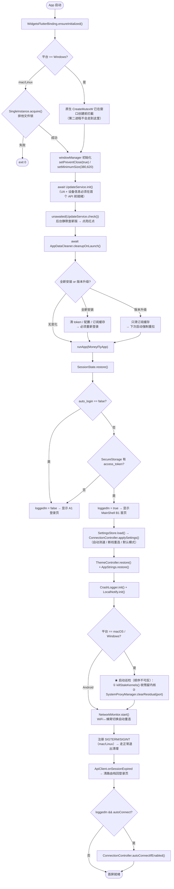
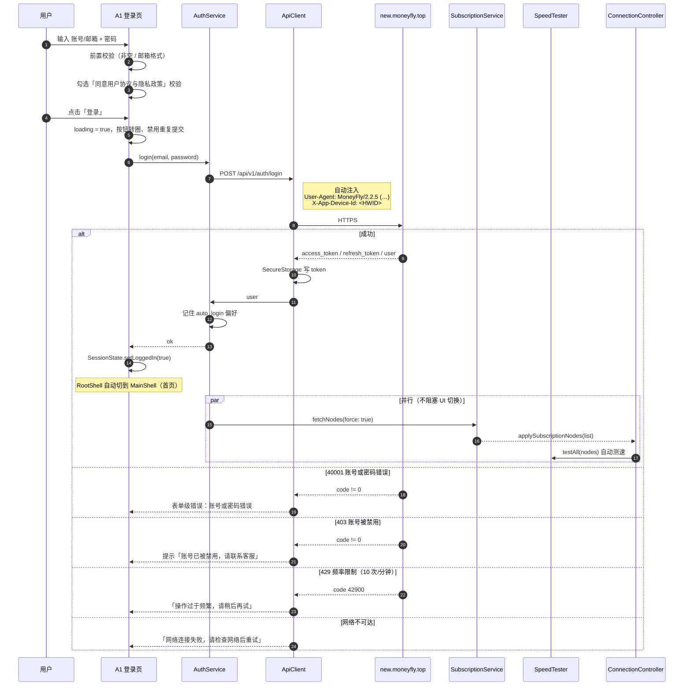
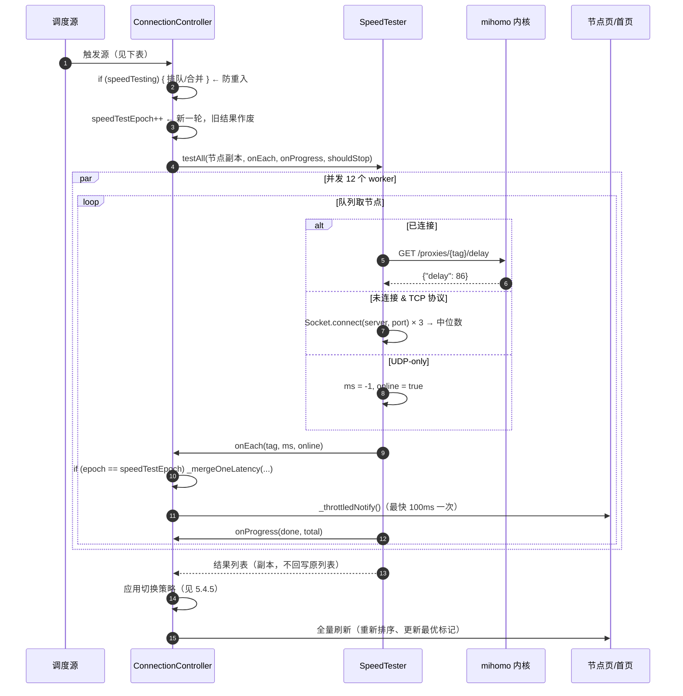
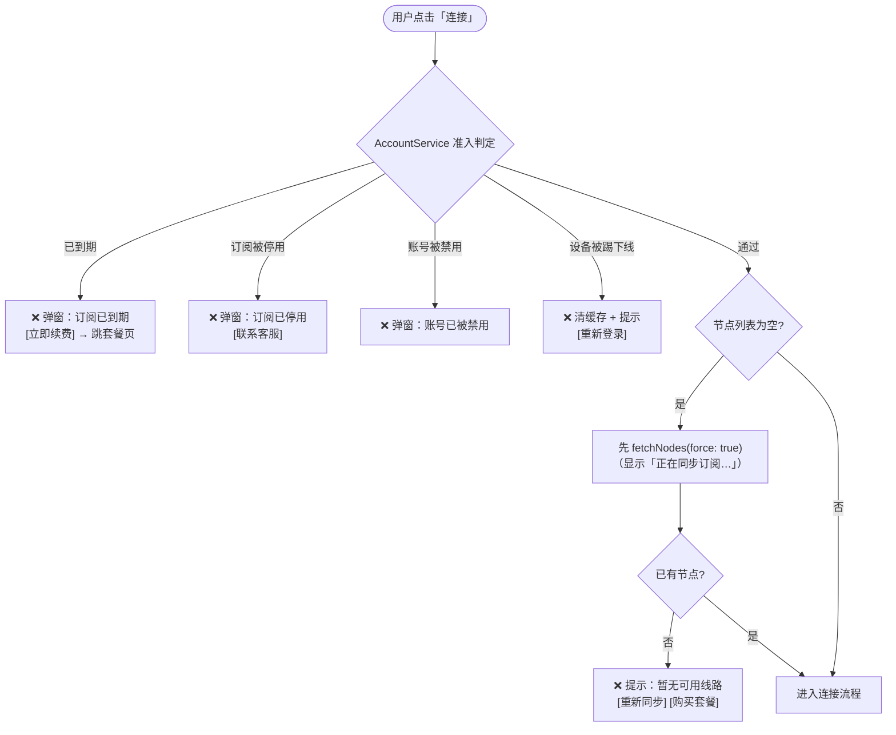
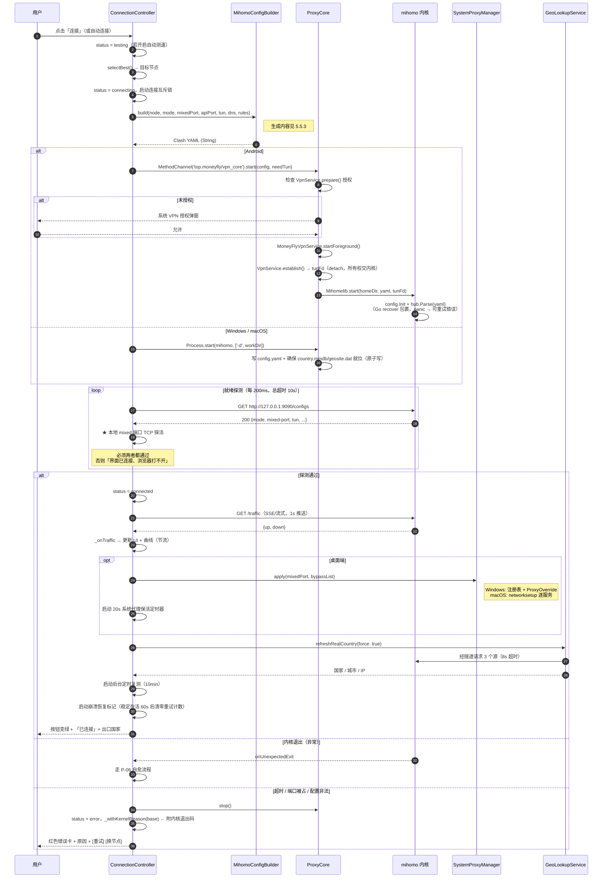
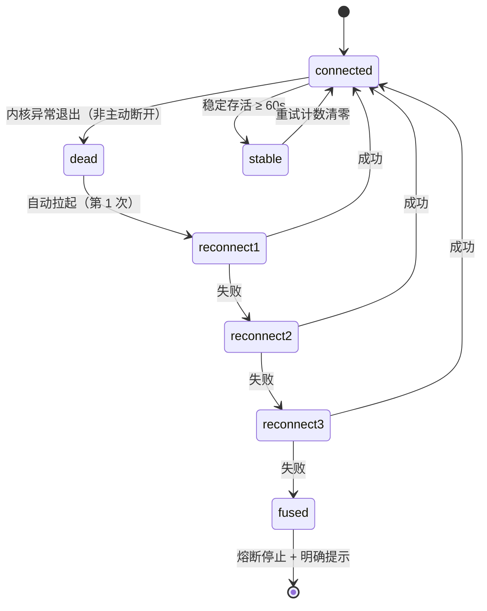
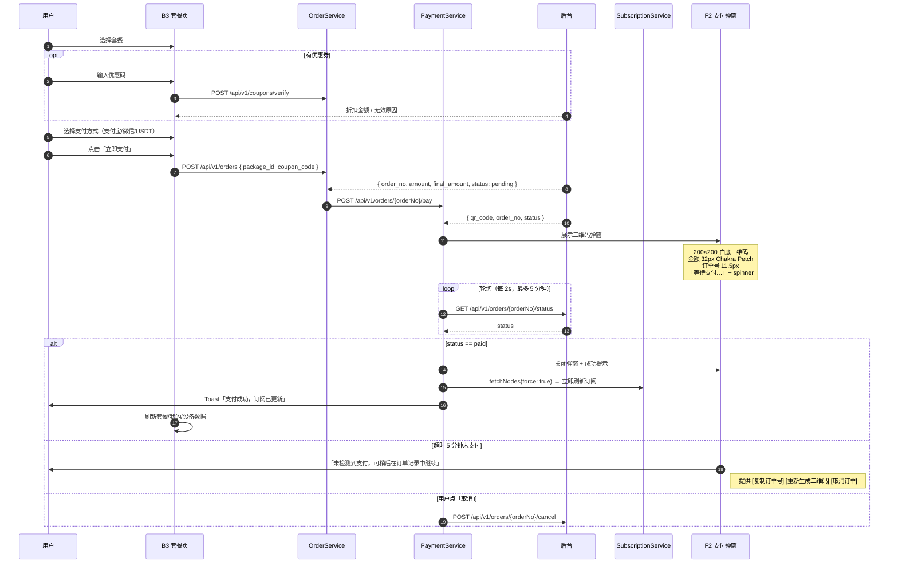
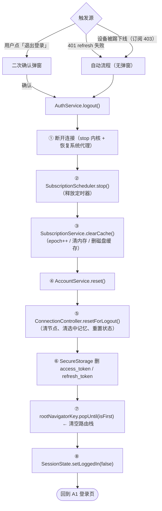

# 05 · 核心流程设计

> 文档版本 v1.0 · 对应项目 `github.com/moneyfly004/Mclash`
> 本文描述 6 条关键流程的**完整时序、状态判定、边界与失败处理**。

---

## 5.0 流程总览

| # | 流程 | 触发 | 关键依赖 |
|---|---|---|---|
| P-01 | 冷启动与自动登录 | App 启动 | `AppDataCleaner` → `SessionState.restore` |
| P-02 | 登录 | 用户提交表单 | `/auth/login` → `/user/subscribe` → 拉订阅 → 测速 |
| P-03 | **自动拉取订阅** | 登录后 / 30min 定时 / 回前台 / 购买后 | `SubscriptionService` + `SubscriptionScheduler` |
| P-04 | **自动测速与选优** | 订阅更新后 / 连接后 / 手动 | `SpeedTester` + `selectBest` |
| P-05 | **一键连接** | 点击主按钮 | 准入闸门 → 生成 YAML → 启动内核 → 就绪探测 → 系统代理 |
| P-06 | 断线自愈与重连 | 内核异常退出 / 网络变化 | `ConnectionController` 崩溃恢复 |
| P-07 | 支付与续费 | 套餐页支付 | `/orders` → `/payment` → 轮询 → 刷新订阅 |
| P-08 | 登出 / 会话失效 | 用户登出 / 401 | 清 token + 清缓存 + 断连 + 回登录页 |

---

## P-01 · 冷启动与自动登录



### 启动巡检顺序为什么不能反

> 残留判定用「本地端口是否还有进程监听」区分「死掉的残留」与「别的实例正在用的活代理」。
> 若**先**判代理（此时被强杀留下的孤儿内核还活着、端口在听 → 代理被保留），
> 紧接着把它当孤儿收掉 → 系统代理指向一个刚被杀死的端口 → **用户重启 App 反而整机断网**。

### 定时器与后台任务清单

| 任务 | 时机 | 停止条件 |
|---|---|---|
| `SubscriptionScheduler`（30min） | 登录成功 | 登出 / 会话失效 |
| 回前台补拉（≥10min 间隔） | `AppLifecycleState.resumed` | — |
| 流量订阅（1s） | 连接成功 | 断开 |
| 系统代理保活（20s） | 连接成功（桌面） | 断开 |
| 后台定时复测（默认 10min） | 连接成功 | 断开 |
| 更新检查 | 启动 + 「我的」页进入 | — |

---

## P-02 · 登录



### 登录页交互细节

| 项 | 规格 |
|---|---|
| 品牌区 | 60×60 品牌标 + `Money`**`Fly`** 字标（26px）+ slogan「极速 · 稳定 · 全球畅连」 |
| 光晕 | 左上 `rgba(69,95,233,.35)` 340px 模糊球 + 右下 `rgba(122,92,255,.22)` |
| 字段 | 「账号 / 邮箱」、「密码」（右侧眼睛切换明文） |
| 自动登录 | 开关行：「自动登录」+ 右侧 44×26 开关（默认开） |
| 忘记密码 | 右侧文字链接 |
| 主按钮 | 「登录」54px |
| 底部 | 「还没有账号？**立即注册**」 |
| 协议 | 复选框 + 「我已阅读并同意《用户协议》与《隐私政策》」（未勾选时主按钮禁用并抖动提示） |

---

## P-03 · 自动拉取订阅（核心流程 ★）

> **要求原文**：「能自动拉取用户的订阅」「客户不需要导入订阅，订阅从我的后台网站拉取」

### 5.3.1 数据来源

| 步骤 | 接口 | 返回 |
|---|---|---|
| ① 订阅元信息 | `GET /api/v1/user/subscribe`（XBoard 兼容） | `subscribe_url` / `expire_time` / `device_limit` / `current_devices` / `status` |
| ② 订阅内容 | `GET {subscribe_url}`（自带 token） | Clash YAML / base64 整包 / 明文链接列表 |
| ③ 解析 | 本地 isolate | `List<ProxyNode>` |

### 5.3.2 完整时序（含三重防护）

```mermaid
sequenceDiagram
    autonumber
    participant UI as 首页/节点页
    participant SS as SubscriptionService
    participant ACC as AccountService
    participant API as ApiClient
    participant BE as 后台
    participant CACHE as SubscriptionCache

    rect rgb(20,25,38)
    Note over UI,CACHE: 阶段 ① 冷启动秒显（零网络，目标 ≤ 800ms）
    UI->>SS: loadCachedNodes()
    SS->>CACHE: readLatest()（校验安装标识 + 版本匹配）
    CACHE-->>SS: raw
    SS->>SS: compute(_parseInIsolate, raw)
    SS-->>UI: 节点列表（先渲染出来）
    end

    rect rgb(20,25,38)
    Note over UI,CACHE: 阶段 ② 强制刷新（后台）
    UI->>SS: fetchNodes(force: true)
    SS->>SS: _enterSync()  → syncing = true（UI 显示「正在同步订阅…」）
    SS->>SS: epoch = _epoch（记录代次快照）
    SS->>API: GET /user/subscribe
    API->>BE: Bearer JWT
    BE-->>API: { subscribe_url, expire_time, device_limit, status, is_active }
    alt subscribe_url 为空
        SS-->>UI: [] → 空态「请先购买套餐」
    else hasSubscription == false（到期/停用）
        SS->>SS: _dropAllCaches()   ← epoch++
        SS->>CACHE: clear()
        SS-->>UI: [] + AccountService 横幅
    else 账号正常
        SS->>SS: seq = ++_reqSeq（请求序号快照）
        SS->>API: fetchText(subscribe_url, ua = 自定义或 MoneyFly/2.2.5)
        API->>BE: GET /api/v1/client/subscribe?token=…
        BE-->>API: Clash YAML
        SS->>SS: compute(_parseInIsolate, raw)   ← 大订阅不卡 UI
        SS->>SS: 解析出节点后过滤占位伪节点
        alt epoch != _epoch || seq != _reqSeq
            Note over SS: 在途期间发生登出/清缓存/更新请求
            SS-->>UI: [] ← 返回空，绝不返回旧节点
        else 校验通过
            SS->>SS: _cache = nodes; _cacheTime = now
            SS->>CACHE: write(subscribeUrl, raw)  ← 原子写，写完才返回
            SS-->>UI: 节点列表（覆盖）
        end
    end
    SS->>SS: _exitSync() → syncing = false
    end

    rect rgb(20,25,38)
    Note over UI,CACHE: 阶段 ③ 失败回退（离线兜底）
    Note right of SS: 网络/超时/5xx：<br/>若内存缓存仍在 30min TTL 内 → 返回缓存<br/>否则 rethrow 由调用方提示
    Note right of SS: 命中「禁用/封禁」文案 → _dropAllCaches()<br/>命中「已被移除/踢下线」→ _dropAllCaches() + 断开连接
    end
```

### 5.3.3 三重防护的必要性

| 防护 | 机制 | 防的是什么 |
|---|---|---|
| **① epoch（清缓存代次）** | `clearCache()` / `_dropAllCaches()` 时 `_epoch++`；拉取返回后校验 `epoch == _epoch` | 拉取在途期间**登出/切号/受限清缓存** → 禁止把旧账号数据写回内存或磁盘（防「清完又复活」） |
| **② reqSeq（请求序号）** | 每次拉取 `seq = ++_reqSeq`；返回后校验 `seq == _reqSeq`，只允许最后一次发出的请求写缓存 | 同一账号并发拉取（手动 + 定时 + 回前台 + 购买后）时，「准入状态变化前发出的旧请求」晚到后把老配置写回 → **使过期用户重新拿到可用线路（计费漏洞）** |
| **③ 磁盘缓存 TTL + 安装/版本校验** | `SubscriptionCache.readLatest()` 内部完成失效判定与删除 | 换号残留、跨版本残留 |

### 5.3.4 账号受限时的强制行为

> **受限时必须用空列表覆盖缓存，而不是保留旧配置。**

```dart
// fetchNodes 中的关键分支
if (!info.hasSubscription) {
  _dropAllCaches();     // 内存 + 磁盘；同时 epoch++
  return [];            // 返回空 → applySubscriptionNodes([]) 清空 UI 与连接器
}
```

**原因**：订阅是准入闸门的**执行者**。到期 / 被禁用 / 未开通套餐时后端会下发**占位（虚假）节点**
（`server: baidu.com`，名称带 📢⏰📱💬🎯🚀♻️🔯🔮🛑🐟 等 emoji）。
若客户端「因为解析结果为空而跳过覆盖」，老用户就能继续用缓存里的可用线路。

**伪节点过滤规则**（`_isPanelPseudoNode`）：
```dart
const markers = ['📢','⏰','📱','💬','🎯','🚀','♻️','🔯','🔮','🛑','🐟'];
return markers.any((m) => n.tag.contains(m)) || n.server == 'baidu.com';
```

### 5.3.5 订阅解析能力（必须全部支持）

**三种订阅形态**（自动识别，无需用户选择格式）：

| 形态 | 识别方式 | 处理 |
|---|---|---|
| Clash YAML | `loadYaml` 返回 `Map` 且含 `proxies` | 直接读 `proxies` |
| base64 整包 | `loadYaml` 返回 `String` 标量 | 宽松解码 → 若含 `proxies:` 再解一层 YAML；否则按链接列表逐行解析 |
| 明文链接列表 | 每行以 `scheme://` 开头 | 逐行 `_parseLink` |

**base64 宽松解码**（`_b64DecodeLoose`）—— 必须处理真实面板产物的四类噪声：

| 噪声 | 处理 |
|---|---|
| 末尾换行 / CRLF / 制表 / 空格 | 先剥离全部空白 |
| 76 字符折行 | 同上（折行即空白） |
| 零宽空格 `\u200b` / BOM `\ufeff` | 一并剥离 |
| URL-safe 字母表（`-` `_`） | 归一化为 `+` `/` |
| 缺少 `=` 填充（`len % 4 == 1` 非法除外） | 补齐填充 |
| 混入非法字节（GBK 注释） | `utf8.decode(..., allowMalformed: true)` 兜底 |

> ⚠️ Dart 的 `base64.normalize` 遇到**任何**非 base64 字符会直接抛 `FormatException`。
> 若未清洗就调用且异常被 `catch (_) {}` 吞掉 → 整份订阅**静默解析成 0 个节点**
> （用户看到「没有节点 / 测不了速」，日志里却没有任何报错）。这是必须避免的陷阱。

**协议支持矩阵**（12 种，统一转成 mihomo 认识的 Clash map）：

| Scheme | 类型 | 关键字段 | 已知陷阱 |
|---|---|---|---|
| `vmess://` | vmess | `add/port/id/aid/scy/tls/net/ws-opts/grpc-opts` | vmess JSON 的 `type`（加密）与 mihomo 的 `type`（协议）语义冲突 → 必须映射为 `cipher`，否则内核按 `type=none` 拒载 |
| `vless://` | vless | `uuid/security/sni/fp/flow/reality-opts{pbk,sid}` | — |
| `trojan://` | trojan | `password/sni/alpn/fp` | — |
| `ss://` | ss | `cipher/password` | SIP002（base64 userinfo）与 legacy（整串 base64）两种格式必须都认；先解一次判 `@` 是否出现 |
| `ssr://` | ssr | `protocol/obfs/obfs-param/protocol-param` | 全字段 base64url、无 padding |
| `socks://` / `socks5://` | socks5 | 可选 `username/password` | userinfo 可能 base64 |
| `hysteria2://` | hysteria2 | `password/sni` | **默认放宽证书校验**（伪装 SNI 与证书必然对不上） |
| `hy2://` | hysteria2 | 同 hysteria2 | ⚠️ 短写法；曾因只认长写法导致整份订阅 17 个 hy2 节点被静默丢弃。<br/>⚠️ 切前缀**必须按链接自身 `://` 位置**，用 `'hysteria2://'.length` 去切 `hy2://` 会多切 6 字符 → UUID 被截断 |
| `hysteria://` | hysteria (v1) | `auth` 在 query（v1 无 userinfo） | 与 v2 结构不同，不能共用解析器 |
| `tuic://` | tuic | `uuid:password`（`: ` 常被编码为 `%3A`） | 同 hysteria2，默认放宽证书校验 |
| `anytls://` | anytls | `password/sni` | — |
| `wireguard://` | wireguard | base64 的 `.conf` 内容 → `private-key/public-key/ip` | 需解析 INI 段 |

**必须保证的健壮性**：
- 非法百分号编码的 tag（裸中文）→ 回退原串，**不丢节点**
- IPv6 `[::1]:443` 形式 → `_hostPort` 正确处理
- 解析失败的单个链接 → 跳过该节点，**不影响其它节点**

### 5.3.6 定时刷新策略

| 触发 | 条件 | 行为 |
|---|---|---|
| 定时器 | 登录后每 30 分钟 | 静默 `fetchNodes(force: true)`（重判账号状态 + 覆盖配置） |
| 回前台 | `resumed` 且距上次成功 ≥ 10 分钟 | 同上（避免 JWT 抖动） |
| 购买成功 | 支付完成后 | 立即 `fetchNodes(force: true)` |
| 手动 | 节点页「重新同步」/ 下拉刷新 | 同上 |
| 失败退避 | 连续失败 | 指数退避（30s → 1m → 2m → … 上限 10m） |

---

## P-04 · 自动测速与选优（核心流程 ★）

> **要求原文**：「自动测速」

### 5.4.1 测速方式

| 场景 | 方式 | 说明 |
|---|---|---|
| **未连接** | 本地 TCP 连接计时 | 纯 `dart:io`，并发 12；每节点 3 次采样取**中位数**；连接超时 5s |
| **已连接** | 经内核 Clash API | `GET /proxies/{tag}/delay?url={测速地址}&timeout=5000` —— 真实走隧道，结果准确 |
| UDP-only 协议 | `hysteria/hysteria2/tuic/wireguard` | 无 TCP 监听 → 裸 TCP 探测必然失败 → **返回 -1 并保持 `online = true`**（在线但延迟未知），等连接后由内核实测 |

### 5.4.2 延迟可信度判定

```dart
bool mfLatencyUsable(int ms) => ms > 0 && ms <= 5000;
```

| 值 | 判定 | 原因 |
|---|---|---|
| `ms <= 0` | ❌ 不可信 | `0` 通常来自被劫持/污染的探测（中间设备直接应答明文 204），却会被当成「极快」排到最优 |
| `0 < ms <= 5000` | ✅ 可信 | — |
| `ms > 5000` | ❌ 不可用 | 等于探测超时，不应参与自动选优 |

### 5.4.3 选优算法

```dart
static ProxyNode? selectBest(List<ProxyNode> nodes) {
  final online = nodes.where((n) => n.online && n.latencyMs >= 0).toList();
  if (online.isEmpty) return null;
  online.sort((a, b) {
    final la = a.latencyMs + _loadPenalty(a);
    final lb = b.latencyMs + _loadPenalty(b);
    return la.compareTo(lb);
  });
  return online.first;
}

// 负载惩罚：raw['load']（后台下发的 0~1 负载）每 10% ≈ +1ms
static int _loadPenalty(ProxyNode n) => ((n.raw['load'] as num? ?? 0) * 10).round();
```

> **设计意图**：纯延迟排序会把「全体用户都挤在的最快节点」永远排在第一位，导致雪崩。
> 引入负载惩罚后，一个 80ms / 负载 10% 的节点（80+1=81）会优于一个 60ms / 负载 80% 的节点（60+8=68）？——
> 不，68 < 81 仍然胜出。惩罚是**温和的偏置**，只在延迟接近时起作用（这正是设计目标：
> 避免「延迟几乎相同但负载天差地别」时选错，而不牺牲明显的低延迟优势）。

### 5.4.4 测速流程



**关键设计点**

| 点 | 说明 |
|---|---|
| **在副本上测** | `result = [for (final n in nodes) n.clone()]` —— 绝不把结果写进传入列表的元素。断开/切换瞬间的测速结果不会污染 UI 当前列表 |
| **边测边刷** | `onEach` 每测完一个即回调 → UI 实时重排，不必等整批完成 |
| **节流通知** | 最多 100ms 通知一次（`_liveNotifyGap`），避免高频刷新卡 UI |
| **用户请求优先** | 用户点「⚡测速」时，后台自动测速若占用通道 → **用户请求排队执行**（不能静默丢弃，否则表现为「点了没反应」） |
| **进度分母正确** | 筛选/搜索后测速，进度分母 = **筛出的节点数**；未筛中的节点状态原样保留 |
| **中途取消** | `shouldStop()` 返回 true 时立即收尾，放弃剩余探测（用户发起新一轮时腾位置） |

### 5.4.5 切点策略（`_applySwitchPolicy`）

| 策略 | 触发 | 行为 |
|---|---|---|
| `none` | 用户手动选过节点（`_modeUserSet = true`） | 自动测速**不切换**，只更新延迟显示 |
| `best` | 自动选优开启 | 测速完成后切到 `selectBest` 结果 |
| `auto` | 连接后后台定时复测 | 仅当当前节点**明显劣化**（如延迟 > 最优 × 1.5 或当前节点离线）才切换，避免频繁跳线 |

### 5.4.6 自动测速触发源

| 触发 | 时机 | 范围 |
|---|---|---|
| T-1 | 订阅拉取成功、节点列表更新后 | 全部节点（仅未测的） |
| T-2 | 用户点击「连接」时（`runSpeedTest = true`） | 全部节点（连接前同步测一轮） |
| T-3 | 连接成功之后 | 经内核测（更准） |
| T-4 | 连接期间定时器（默认 10 分钟，`_startBackgroundTest`） | 全部节点 |
| T-5 | 用户手动点「⚡测速」 | 当前筛选结果 |
| T-6 | 用户点单个节点右侧测速图标 | 单节点 |

**开关**：设置 → 连接 → 「自动测速与选优」（`autoTest`，默认**开**）。

---

## P-05 · 一键连接（核心流程 ★）

> **要求原文**：「一键连接」

### 5.5.1 前置：准入闸门



### 5.5.2 完整连接时序



### 5.5.3 生成的 mihomo 配置要点

| 段 | 关键值 | 说明 |
|---|---|---|
| `mixed-port` | `2080`（设置可改） | 本地混合入站口；系统代理指向它 |
| `external-controller` | `127.0.0.1:9090`（设置可改） | Clash API，用于热切换与流量 |
| `mode` | `rule`（智能）/ `global`（全局） | 由首页模式切换控制 |
| `dns` | `enhanced-mode: fake-ip`；`fake-ip-range: 172.19.0.1/16`；`nameserver` / `fallback`；`cache-algorithm: arc` | fake-ip 对性能与兼容性关键 |
| `tun` | Android: `auto-route: false`, `auto-detect-interface: false`；桌面: `auto-route: true`, `auto-detect-interface: true` | **平台语义不同，不可复用** |
| `tun.file-descriptor` | Android 运行时注入 | VpnService 的 fd |
| `rules` | `GEOSITE,cn,DIRECT` / `GEOIP,CN,DIRECT` / `MATCH,PROXY` | CN 直连；离线 geo 数据内嵌 |
| `geodata-mode` | `true` + 本地 `country.mmdb` / `geosite.dat` | 不依赖被墙的远程地址 |
| `proxies` | 订阅解析结果（过滤占位伪节点） | — |
| `proxy-groups` | 最少一个 `自动选择`（url-test，interval 300）+ `手动选择` | 不使用复杂代理组 |
| `secret` | 由设备标识派生（`Did` 子串） | Clash API Bearer |
| `log-level` | 设置可改（默认 `warning`） | 影响日志中心 |

### 5.5.4 就绪判定的**双条件**

```
就绪 = (Clash API GET /configs 返回 200)  AND  (mixed 端口 TCP connect 成功)
```

| 只判 API 200 的后果 |
|---|
| 端口被占用 / 端口非法时，内核照跑、API 照返回 200 → 误判「已连接」→ 把系统代理指向一个**死端口** → 用户界面显示已连接但浏览器打不开网页 |

补充检测：TUN 模式开启时还需确认 TUN 设备真的建立（Android：VpnService 未抛异常 + fd > 0；桌面：内核日志无 tun 相关 ERROR）。

### 5.5.5 平台差异对照表

| 环节 | Android | Windows | macOS (arm64) | macOS (x64) |
|---|---|---|---|---|
| 内核形态 | 进程内 `libmihomo.aar` | 子进程 `mihomo.exe` | 子进程 `mihomo` | 子进程 `mihomo` |
| 内核资产 | `mihomo-lib` Release 的 AAR | `mihomo-windows-amd64-compatible-v*.zip` | `mihomo-darwin-arm64-v*.gz` | `mihomo-darwin-amd64-compatible-v*.gz` |
| 内核位置 | App 内（随包） | 与 `Mclash.exe` 同目录 | `Mclash.app/Contents/MacOS/mihomo` | 同左 |
| TUN 获取 | `VpnService.establish()` fd | 内核自建（需管理员/驱动） | 内核自建 | 内核自建 |
| 系统代理 | **不支持**（走 TUN） | 注册表 `Internet Settings` | `networksetup` 逐服务 | 同左 |
| 防火墙 | — | 需 `firewallAddPorts` 放行环回 | — | — |
| 权限弹窗 | 系统 VPN 授权（首次） | UAC（仅在需要 TUN 时） | 无 | 无 |
| 内核热替换 | ❌ 随 App 更新 | ✅ 用户目录副本 | ✅ 用户目录副本 | ✅ 用户目录副本 |
| 关机清理钩子 | — | `WM_QUERYENDSESSION/WM_ENDSESSION` | `applicationShouldTerminate` | 同左 |

---

## P-06 · 断线自愈与重连



### 关键规则

| 规则 | 内容 |
|---|---|
| **R-1 解耦** | 内核异常退出 = **客户端自身故障**，**无论**「断线自动重连」开关是否开启，都必须自动拉起 |
| **R-2 上限** | 最多 3 次连续尝试 |
| **R-3 熔断** | 10 分钟内崩退 ≥ 5 次 → 停止重连，显示「内核反复异常退出，可能被安全软件拦截；退出码 -9」 |
| **R-4 清零条件** | **稳定存活 ≥ 60s** 后才清零重试计数（防止「一连上就清零」造成无限自连） |
| **R-5 网络变化** | `NetworkMonitor` 检测 WiFi↔蜂窝/断网恢复 → 触发一次重连（走同一套上限与熔断） |
| **R-6 崩溃取证** | 内核输出全量落盘 `kernel_log.txt`；异常退出另存 `kernel_crash.log`（退出码 + 完整尾部 200 行，**且活过 App 重启**） |

### 「断线自动重连」开关的真实语义

| 开关 | 含义 |
|---|---|
| **开**（默认） | 网络变化、节点劣化、内核退出 → 都自动重连 |
| **关** | 仅关闭「用户偏好类」重连（网络变化 / 主动切换）；**内核自身崩溃仍会自愈** |

---

## P-07 · 支付与续费



### 支付弹窗规格

| 元素 | 规格 |
|---|---|
| 遮罩 | `rgba(3,5,10,.7)` + `blur(6px)` |
| 弹窗 | 左右 22px（移动）/ `min(420px, 90vw)`（桌面），圆角 26px |
| 标题 | 「扫码支付」17px / 700 |
| 副标题 | 「请使用 {支付宝/微信} 扫码」11px / `--txt-3` / `letter-spacing:.08em` |
| 二维码 | 200×200 白底 + 12px padding + 圆角 18px + `0 14px 40px rgba(0,0,0,.5)` |
| 金额 | 32px / 700 / `Chakra Petch`，单位 `¥` 14px |
| 订单号 | 11.5px / `Chakra Petch` / `--txt-3`，可长按复制 |
| 等待态 | spinner 14px + 「等待支付…」12.5px |
| 按钮行 | 两按钮等宽 48px：「取消订单」(ghost) + 「我已支付」(primary) |
| 超时 | 5 分钟后切换到「超时」态（提供重新生成二维码） |

### USDT 支付特殊处理

- 弹窗额外显示：链类型（TRC20/ERC20）、收款地址（可复制）、**实际应付 USDT 数量**、**汇率与有效期倒计时**
- 强提示：「请务必按显示数量精确转账，少转将导致到账失败」

---

## P-08 · 登出 / 会话失效



> **第 ⑦ 步为什么必须**：设置页 / 订单页 / 设备页等 push 在栈上的页面若不先 pop 到根，
> 会出现「登录页被这些页面盖住」的现象 —— 用户以为没退出成功。

### 会话失效的静默刷新

```
请求 → 401 (code 40100)
  → ApiClient 拦截器：用 refresh_token 静默换新 token
      ├─ 成功 → 重放原请求（用户无感）
      └─ 失败 → onSessionExpired() → 触发上面的 C1 自动流程
```

**并发 401 处理**：多个请求同时 401 时，只允许**一个** refresh 在途，其余等待其结果（防 refresh token 被多次消费导致全部失效）。
