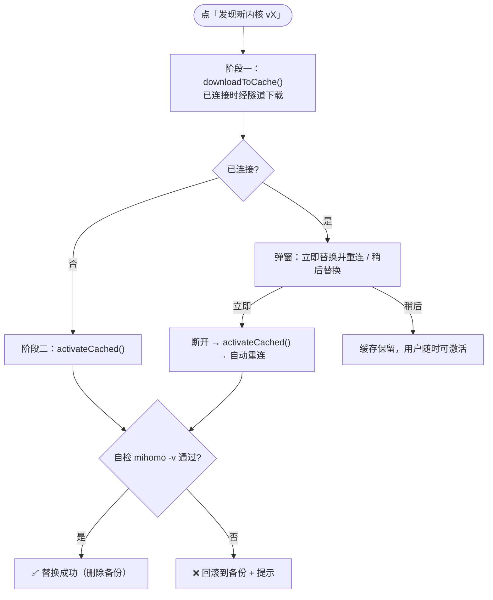

# 06 · 页面设计 · 移动端（Android）

> 文档版本 v1.0 · 画布基准 **390 × 844**（iPhone 14 / 主流 Android 逻辑尺寸）
> 图例：`▓` 主按钮区 · `▒` 卡片 · `░` 弱化/骨架 · `─` 分隔线 · `▸` 可点击
> 左右安全边距统一 **22px**（`compact` 高度 <820 时降为 16px）

---

## 6.0 页面索引

| # | 页面 | 章节 |
|---|---|---|
| A1 | 登录页 | [§6.1](#61-a1--登录页) |
| A2 | 注册页 | [§6.2](#62-a2--注册页) |
| A3 | 忘记密码页 | [§6.3](#63-a3--忘记密码页) |
| A4 | 修改密码页 | [§6.4](#64-a4--修改密码页) |
| B1 | **首页** | [§6.5](#65-b1--首页核心页) |
| B2 | **节点页** | [§6.6](#66-b2--节点页) |
| B3 | **套餐页** | [§6.7](#67-b3--套餐页) |
| B4 | **我的页** | [§6.8](#68-b4--我的页) |
| C1 | 订单记录页 | [§6.9](#69-c1--订单记录页) |
| C2 | 设备管理页 | [§6.10](#610-c2--设备管理页) |
| C3 | 设备增量升级页 | [§6.11](#611-c3--设备增量升级页) |
| C4 | 通知中心页 | [§6.12](#612-c4--通知中心页) |
| D1 | 设置页 | [§6.13](#613-d1--设置页) |
| D2 | 内核管理页（桌面为主） | [§6.14](#614-d2--内核管理页) |
| D3 | 日志中心页 | [§6.15](#615-d3--日志中心页) |
| D4 | 代理与分流页 | [§6.16](#616-d4--代理与分流页) |
| D5 | 分应用代理页 | [§6.17](#617-d5--分应用代理页android) |
| D6 | 分流数据更新页 | [§6.18](#618-d6--分流数据更新页) |
| F1 | 节点快速选择弹层 | [§6.19](#619-f1--节点快速选择弹层) |
| F2 | 支付二维码弹窗 | [§6.20](#620-f2--支付二维码弹窗) |

---

## 6.1 A1 · 登录页

```
┌──────────────────────────────────────────┐
│ 9:41                        ▂▄▆  ᯤ  ▮   │ 状态栏 56px
│                                          │
│         ╭──────────╮                     │  ← 光晕 glow1 (左上, brand .35)
│         │    ▓M    │  60×60 品牌标       │
│         ╰──────────╯                     │
│                                          │
│            M o n e y F l y               │  26px/700 Chakra Petch
│              Fla y → brandLight          │
│                                          │
│        极速 · 稳定 · 全球畅连             │  13px txt3 letter-spacing .12em
│                                          │
│  ┌────────────────────────────────────┐  │
│  │ 账号 / 邮箱                         │  │ 54px 输入框 r16
│  └────────────────────────────────────┘  │
│  ┌────────────────────────────────────┐  │
│  │ 密码                          👁    │  │
│  └────────────────────────────────────┘  │
│                                          │
│  自动登录                          ●──○  │ 44×26 开关 (默认开)
│                                          │
│  ▓▓▓▓▓▓▓▓▓▓▓▓  登 录  ▓▓▓▓▓▓▓▓▓▓▓▓▓▓▓▓  │ 54px 渐变主按钮
│                                          │
│  ┌─ ☐ 我已阅读并同意《用户协议》《隐私政策》│ 18×18 渐变复选框
│                                          │
│      还没有账号？ 立即注册                 │ 13px txt2 / brandLight
│      忘记密码？                           │
│                                          │
│              Mclash v2.3.0                │ 10.5px txt3 Chakra Petch
└──────────────────────────────────────────┘
       ↑ 光晕 glow2 (右下, brand3 .22)
```

| # | 元素 | 规格 | 行为 |
|---|---|---|---|
| 1 | 品牌标 | 60×60，圆角 17px，黑底，`M` 折线 `brand` 35px；外发光 `0 18px 50px rgba(69,95,233,.4)` | 无 |
| 2 | 字标 | `Money` + `Fly`（`brandLight`），26px/700，`letter-spacing:.06em` | 无 |
| 3 | Slogan | 13px / `txt3` / `.12em` | 无 |
| 4 | 账号字段 | 高 54，圆角 16，底 `card`，边 `line-2`；标签「账号 / 邮箱」12.5px `txt2` 上方 7px | 失焦校验；支持邮箱或用户名 |
| 5 | 密码字段 | 同上；右侧眼睛图标 13px `txt3`（`right:14px; top:37px`） | 切换明文/密文 |
| 6 | 自动登录开关 | 44×26 圆角 13；开 `brand` 滑块右 3px，关 `#2A3242` 滑块左 3px | 持久化 `auto_login`；关闭时启动不恢复登录态 |
| 7 | 主按钮 | `MFPrimaryButton` 54px 圆角 16 渐变 + `0 10px 30px rgba(69,95,233,.35)` | 未勾选协议时**禁用**（不弹提示，按钮变灰）；提交时转圈 + 禁重复点击 |
| 8 | 协议复选框 | 18×18 圆角 6，选中为品牌渐变 + 白色对勾 | 《用户协议》《隐私政策》可点击 → 内嵌 WebView |
| 9 | 注册/忘记密码 | 13px；「立即注册」`brandLight` 600 | → A2 / A3 |
| 10 | 版本号 | 10.5px `txt3` `Chakra Petch` | 长按 3 秒进入诊断（隐藏入口） |

**状态**

| 状态 | 表现 |
|---|---|
| 默认 | 主按钮启用（若已勾选协议） |
| 字段为空 / 格式错 | 字段边框转 `red`，下方 10.5px 红字「请输入账号」/「邮箱格式不正确」 |
| 提交中 | 按钮内 22×22 白色 spinner；所有输入框 `enabled=false` |
| 账号或密码错误 | 顶部滑入错误条：红底 `rgba(255,90,95,.1)` + 红字「账号或密码错误」，3 秒后自动消失 |
| 账号被禁用 | 居中 `AlertDialog`（同 F2 样式）：标题「🚫\n账号已被禁用」+ 文案「您的账号已被禁用，无法使用服务。如有疑问，请联系客服。」+ 单选「好的」 |
| 频率限制 | 错误条「操作过于频繁，请稍后再试」+ 按钮倒计时 30s |
| 网络失败 | 错误条「网络连接失败，请检查网络后重试」+ 主按钮变「重试」 |

**改造点（相对 baseline）**
- 🆕 协议未勾选时**按钮禁用**而非点击后弹提示（baseline 用 4 段 `TextSpan` 且 key `agree_tos` 未被引用 → 改为 i18n key）
- 🔧 版本号写入 `AppStrings`，不硬编码
- 🔧 底部不再出现域名（`dy.moneyfly.top` 硬编码移除），改到「关于」页

---

## 6.2 A2 · 注册页

```
┌──────────────────────────────────────────┐
│ ‹  注册                            登录 ›│  ← AppBar：返回 + 右侧「登录」
│                                          │
│  邮箱                                    │
│  ┌────────────────────────────────────┐  │
│  └────────────────────────────────────┘  │
│  验证码                                  │
│  ┌──────────────────────┐ ┌───────────┐  │
│  │ 6 位验证码           │ │ 获取验证码│  │ 输入 flex:1 + 按钮 104×54
│  └──────────────────────┘ └───────────┘  │
│                                          │
│  用户名                                  │
│  ┌────────────────────────────────────┐  │
│  └────────────────────────────────────┘  │
│  密码                                    │
│  ┌────────────────────────────────────┐  │
│  │                              👁    │  │
│  └────────────────────────────────────┘  │
│   ✓ 至少 8 位                            │ 实时规则提示
│   ○ 大小写字母/数字/符号至少三种（0/4）    │ 12px green / txt3
│  确认密码                                │
│  ┌────────────────────────────────────┐  │
│  └────────────────────────────────────┘  │
│  邀请码（可选）                           │
│  ┌────────────────────────────────────┐  │
│  └────────────────────────────────────┘  │
│                                          │
│  ┌─ ☐ 我已阅读并同意《用户协议》《隐私政策》│
│                                          │
│  ▓▓▓▓▓▓▓▓▓▓▓▓  注 册  ▓▓▓▓▓▓▓▓▓▓▓▓▓▓▓▓  │
└──────────────────────────────────────────┘
```

| # | 元素 | 规格 | 行为 |
|---|---|---|---|
| 1 | 验证码行 | 输入 `flex:1` + 「获取验证码」按钮 `min-width:104px; height:54px` 品牌渐变 | 点击后按钮变「60s 后重发」，背景转 `card` + 边 `line-2` + 字 `txt3` `Chakra Petch`；倒计时结束恢复 |
| 2 | 密码规则提示 | ✅ `check_circle` 12px `green` / ○ `circle_outlined` 12px `txt3`；两条规则：「至少 8 位」、「大小写字母/数字/符号至少三种（{n}/4）」 | 实时随输入更新（`ValueListenableBuilder`） |
| 3 | 密码强度 | `specials = !@#$%^&*()_+-=[]{}|;:,.<>?`；`kindsOf` 统计大写/小写/数字/符号 4 类；`< 8` → 「密码至少 8 位」；`kinds < 3` → 「密码强度不足：需包含大小写字母、数字、特殊字符中的至少三种」 | 与后端 `auth.ValidatePasswordStrength` 完全一致 |
| 4 | 邀请码 | 可选字段 | 通过 `/invites/validate/:code` 前置校验，有效则显示绿色「✓ 邀请码有效」 |
| 5 | 注册按钮 | 同 A1 | 主体校验不通过时禁用 |

**错误态**：邮箱已注册 → 邮箱字段下方红字「该邮箱已被注册」；验证码错误 → 验证码字段红字。

---

## 6.3 A3 · 忘记密码页

```
┌──────────────────────────────────────────┐
│ ‹  忘记密码                        登录 ›│
│                                          │
│         ✓ 验证身份 ── ②  设置新密码        │ 步骤指示器
│         on(green)      txt3              │
│                                          │
│  邮箱                                    │
│  ┌────────────────────────────────────┐  │
│  └────────────────────────────────────┘  │
│  验证码                                  │
│  ┌──────────────────────┐ ┌───────────┐  │
│  │                      │ │ 获取验证码│  │
│  └──────────────────────┘ └───────────┘  │
│                                          │
│  ⚠ 验证码错误或已过期                      │ ← 持久红色错误行
│                                          │
│  ▓▓▓▓▓▓▓▓▓▓  下一步  ▓▓▓▓▓▓▓▓▓▓▓▓▓▓▓▓▓  │
└──────────────────────────────────────────┘
        ↓ 第 2 步
┌──────────────────────────────────────────┐
│ ‹  设置新密码                      登录 ›│
│         ✓ 验证身份 ── ✓ 设置新密码        │
│  新密码  ┌────────────────────────────┐  │
│  确认密码┌────────────────────────────┐  │
│   ✓ 至少 8 位   ○ 三种字符（0/4）         │
│  ▓▓▓▓▓▓▓▓▓▓  重置密码  ▓▓▓▓▓▓▓▓▓▓▓▓▓▓  │
└──────────────────────────────────────────┘
```

| # | 元素 | 说明 |
|---|---|---|
| 1 | 步骤指示器 | 两段：圆形序号（20px）+ 文案 11.5px；当前 `brandLight` + 渐变圆，完成 `green` + 20% 绿底圆，未开始 `txt3` + `#232B3D` 圆；中间 26px 连接线 |
| 2 | 错误提示行 | **必须持久显示在按钮上方**（不自动消失）—— 这是「点了重置没反应」问题的修复：只在 Toast 里提示会被忽略 |
| 3 | 流程 | `POST /auth/forgot-password`（发送验证码）→ `POST /auth/reset-password`（验证码 + 新密码） |

---

## 6.4 A4 · 修改密码页

```
┌──────────────────────────────────────────┐
│ ‹  修改密码                              │
│                                          │
│  ⓘ 修改密码后，需要重新登录                 │ 提示条 card2 r12
│                                          │
│  当前密码  ┌──────────────────────────┐  │
│  新密码    ┌──────────────────────────┐  │
│  确认新密码┌──────────────────────────┐  │
│   ✓ 至少 8 位   ○ 三种字符（0/4）         │
│                                          │
│  ▓▓▓▓▓▓▓▓  保存新密码  ▓▓▓▓▓▓▓▓▓▓▓▓▓▓  │
└──────────────────────────────────────────┘
```

**成功后行为**：清 token → 断开连接 → 清订阅缓存 → `popUntil(isFirst)` → 回登录页 + Toast「密码已修改，请重新登录」。

---

## 6.5 B1 · 首页（核心页）

> **约束：单屏 ≤ 7 个可点击元素。** 主按钮区固定不滚，下半部滚动。

```
┌──────────────────────────────────────────┐  ① 顶部栏 (header 56px)
│ ╭──╮ MoneyFly              ⟳      ⚙     │  ← 36×36 logo + 刷新 + 设置
│ ╰──╯ 全球加速已就绪                        │     10.5px txt3
├──────────────────────────────────────────┤  ② 订阅信息条 (52px)
│ ▒ 到期      │ 设备    │ 剩余    │ ⟳ 14:32│  ← 4 格；渐变底 brand@.18→.06
│    2026-03-14│ 2/3    │ 128 天  │        │     值 13.5px/800 Chakra
├──────────────────────────────────────────┤  ③ 账号横幅（仅受限时出现）
│ ⏰ 您的套餐已到期，购买套餐后即可继续畅连  │ 红底/红边
│                          ▸ 去续费         │
├──────────────────────────────────────────┤  ④ 连接卡（固定，不滚）
│  ┌────────────────────────────────────┐  │  r22 渐变底 brand@.22→.06
│  │            已连接                   │  │  13px/600 green
│  │      已连接 00:12:30 · ↑1.2 ↓840 MB │  │  10.5px txt3 Chakra
│  │                                    │  │
│  │            ╭───────╮               │  │  ← 电源环 108px（compact 80）
│  │           │   ⏻    │              │  │     已连接：绿光晕 呼吸 1.8s
│  │            ╰───────╯               │  │     未连接：品牌弱光晕
│  │                                    │  │
│  │  ┌──────────────────────────────┐  │  │
│  │  │ 🇯🇵 当前线路              86ms │  │  │  ← 节点行（可点击）
│  │  │    日本 · 东京 · 01     切换 ›│  │  │
│  │  └──────────────────────────────┘  │  │
│  │                                    │  │
│  │   🇯🇵 真实出口 · 日本               │  │  11px green
│  │                                    │  │
│  │  ┌───────────┬───────────┐         │  │  模式分段控件
│  │  │ ◎ 智能模式 │  ⊕ 全局模式│        │  │  38px 高
│  │  └───────────┴───────────┘         │  │
│  └────────────────────────────────────┘  │
├──────────────────────────────────────────┤  ⑤ 实时统计（可滚动区开始）
│ ┌────────────────┐ ┌────────────────┐    │
│ │ ↑ 上行         │ │ ↓ 下行         │    │  r16 卡片
│ │ 1.2  MB/s      │ │ 8.4  MB/s      │    │  26px/700 Chakra
│ │  ╱╲__╱╲___     │ │  ___╱╲╱╲       │    │  26px 曲线
│ └────────────────┘ └────────────────┘    │
├──────────────────────────────────────────┤  ⑥ 自动测速选优卡
│ ┌────────────────────────────────────┐   │
│ │ ⚡ 自动测速与选优      ● 已自动选优  │   │  r16 蓝调卡
│ │ ┌──────────────────────┐ ┌───────┐ │   │
│ │ │🇯🇵 日本·东京 01  86ms │ │ ⚡重测 │ │   │
│ │ │              「最优」 │ │       │ │   │
│ │ └──────────────────────┘ └───────┘ │   │
│ │ 上次测速 14:28 · 共 68 个节点         │   │  10px txt3
│ └────────────────────────────────────┘   │
├──────────────────────────────────────────┤  ⑦ 快速切换国家
│ 快速切换国家 · 点按即切最优节点            │  11.5px txt2
│ ┌──────┐ ┌──────┐ ┌──────┐ ┌──────┐     │
│ │✦自动 │ │🇯🇵 日本│ │🇺🇸 美国│ │🇸🇬 新加坡│   │  胶囊 r99
│ │      │ │ 86ms │ │112ms │ │ 94ms │     │
│ └──────┘ └──────┘ └──────┘ └──────┘     │
├──────────────────────────────────────────┤
│ ①首页  ②节点  ③套餐  ④我的               │ 底部导航 78px
└──────────────────────────────────────────┘
```

### 6.5.1 区块规格

| 区块 | 高度 | 圆角 | 背景 | 关键规格 |
|---|---|---|---|---|
| ① 顶部栏 | 56 | — | — | logo 36×36 圆角 11 黑底；刷新/设置 `IconButton` 20px `txt2` |
| ② 订阅信息条 | 52 | 15 | `linear-gradient([brand@.18, brand@.06])`（受限时改红/琥珀） | 4 格 `_InfoCell`；值 13.5px/800 `Chakra Petch`；标签 9.5px `txt2`；「剩余」数字 `green`；第 4 格为刷新按钮 + `HH:mm` |
| ③ 账号横幅 | 自适应 | 14 | `linear-gradient([soft, color@.06])` + 边 `color@.45` | emoji 16px + 文案 12px/1.5 + 行动胶囊（渐变 r10） |
| ④ 连接卡 | 自适应 | 22 | `linear-gradient(topLeft→bottomRight, [brand@.22, brand@.06, white@.04])`；边框 `connected ? green@.55 : brand@.45` | 详见下方 |
| ⑤ 统计卡 ×2 | ~90 | 16 | `card` + 边 `line` | 图标 16px；标签 12px/600 `txt2`；值 26px/700 `Chakra`；曲线 26px |
| ⑥ 自动测速卡 | ~92 | 16 | `linear-gradient(120deg, [brand@.16, brand@.04 60%, transparent])` + 边 `brand@.35` | 头部图标 26×26 r8 渐变 + 标题 13px/700 + 右侧状态胶囊（`green@.1` 底 / `green@.28` 边 / 10.5px `green`/600） |
| ⑦ 国家胶囊 | 34 | 99 | 选中 `brand@.2` + 边 `brand@.7`；默认 `card` + 边 `line` | 国旗 15px + 国家名 12px/600 + 延迟 10px `Chakra` `txt3`；「自动」胶囊选中态用 `green@.18`/`green@.7` |

### 6.5.2 连接卡内部规格

**状态文字**（13px / 600）

| 连接状态 | 文案 | 颜色 |
|---|---|---|
| `disconnected` | 已断开 | `txt3` |
| `testing` | 测速中 | `amber` |
| `connecting` | 连接中 | `amber` |
| `reconnecting` | 重连中 | `amber` |
| `disconnecting` | 断开中 | `amber` |
| `connected` | 已连接 | `green` |
| `connected` + 后台测速 | 已连接 · 测速中 | `green` |
| `error` | 连接失败 | `red` |

**电源按钮**

| 属性 | 未连接 | 已连接 | 忙（连接/断开中） |
|---|---|---|---|
| 外径 | 108px（compact 80） | 同 | 同 |
| 外发光 | `brand@.25` blur 34 | `green@(.45×pulse)` blur 34 | 同未连接 |
| 呼吸动画 | 无 | `AnimationController(1800ms, lowerBound .35, upperBound 1)` `repeat(reverse:true)` | 无 |
| 内核圆 | 80px，边 1.2 `line-2`，`radial-gradient(#1B2233 → #0E121B)` | 边 1.2 `green@.5`，`radial-gradient(#1E3B3A → #0E1716)` | 同左 |
| 中心 | `power_settings_new_rounded` 44px（compact 34）`txt2` | 同图标 `green` | `CircularProgressIndicator` 28px strokeWidth 2.5 |

**节点行**（当前/将连接）

| 槽位 | 规格 |
|---|---|
| 容器 | `padding 14/12`，底 `card2@.55`，边 `line`，圆角 14 |
| 国旗 | `CountryFlag` 20px |
| 标签 | `current == null ? '将连接' : '当前线路'` 10px `txt3` |
| 节点名 | 14px/600 `txt`，单行省略 |
| 延迟胶囊 | 仅 `online && latencyMs >= 0`；`"${ms} ms"` 12px/600 `Chakra`，色 `mfLatencyColor`，底 `color@.12`，边 `color@.25`，圆角 20 |
| 切换芯片 | `padding 10/5`，底 `brand@.22`，边 `brand@.5`，圆角 9；「切换」11.5px/700 `brandLight` + `chevron_right` 15px |

### 6.5.3 交互逻辑

**主按钮点击（`_toggleConnect`）决策表**

| 当前状态 / 前置条件 | 行为 |
|---|---|
| `switchingMode == true` | 忽略点击 |
| `disconnecting` | 忽略点击 |
| `connected` | `disconnect()` |
| `testing \| connecting \| reconnecting` | `disconnect()` + Toast「已取消连接」 |
| `AccountService.isBlocked` | 弹 `_showBlockedDialog`（不进入连接流程） |
| `syncingSubscription && nodes.isEmpty` | Toast「正在同步订阅，请稍候再连接」 |
| `nodes.isEmpty` | Toast「没有可用节点，请先刷新订阅」 |
| 其他 | `_ensurePermissionsGuided()` → `conn.connect()` |

**权限引导循环**：首次连接 → `_showVpnExplainer`（说明弹窗）→ `ensureAllForConnect()`；失败 → `_showVpnDeniedSheet`（底部弹层，返回 `retry` / `settings` / `null`）；`retry` 回到说明弹窗；`settings` 打开系统 VPN 设置并中止。

**节点加载顺序（`_ensureNodes`）**
1. 若有 force 或未加载 → `AccountService.refresh()` —— **账号闸门先于节点判定**
2. 若无节点、未连接、未受限 → 立即注入 `loadCachedNodes()` 磁盘缓存（**离线首屏**）
3. `fetchNodes(force:)` → `conn.applySubscriptionNodes()`
4. `conn.autoConnectIfEnabled()`
5. 出错 → `ApiClient.errorMsg`；命中「已被移除 / 踢下线 / removed / kicked」→ 断开 + 清空节点

### 6.5.4 改造点（相对 baseline）

| # | 改造 | 理由 |
|---|---|---|
| T1 | 🆕 **新增「自动测速与选优卡」**（区块 ⑥） | 用户明确要求「自动测速」。baseline 测速结果只体现在节点页，首页看不到「已自动选优」这一核心卖点 |
| T2 | 🔧 全部 emoji 图标 → Material Icons（横幅、错误行动按钮、快捷国家） | emoji 在不同平台渲染差异大，且 Windows 上国旗 emoji 渲染成字母；i18n 卫生 |
| T3 | 🔧 连接卡渐变硬编码 `0x38455FE9 / 0x0F455FE9 / 0x0AFFFFFF` → `MFColors.brand.withOpacity(...)` | 暖白/纯黑主题下蓝色光晕视觉不一致 |
| T4 | 🔧 电源环径向渐变 `#1E3B3A/#0E1716/#1B2233/#0E121B` → 由 `MFColors` 派生 | 同上 |
| T5 | 🔧 头部域名/版本硬编码 `MoneyFly` → `AppStrings` | en 语言下品牌名可配置 |
| T6 | ➕ **区块 ⑥ 出现时隐藏 ⑦ 的「自动」胶囊**（功能重复），保留国家胶囊 | 减少认知负担 |
| T7 | 🔧 受限账号时隐藏 ⑥⑦ 两个区块（保留 ②③*以维持 ≤7 元素预算 | 受限账号不需要测速/切国家 |

---

## 6.6 B2 · 节点页

```
┌──────────────────────────────────────────┐
│ 节点列表                    ⟳ 刷新订阅 ▸ │ 自定义标题行
├──────────────────────────────────────────┤
│ ┌────────────────────────────────────┐   │  ⚡ 自动选优条
│ │ ⚡ 自动选优已开启      ● 已选优     │   │  r14 蓝调
│ │                        ▸ 立即选优   │   │
│ └────────────────────────────────────┘   │
│ ┌──────────────────────┐ ┌──┐ ┌───────┐  │
│ │ 🔍 搜索节点/国家      │ │⇅ │ │ ✨最优 │  │  46px 搜索 + 排序 + 最优
│ └──────────────────────┘ └──┘ └───────┘  │
│ ▓▓▓▓▓▓▓▓▓▓░░░░░░░░░░░░░  12/68           │  测速进度条（测速时）
├──────────────────────────────────────────┤
│ ▾ 🇯🇵 日本                          8 个  │  分组头（可折叠）
│  ┌────────────────────────────────────┐  │
│  │ 🇯🇵 日本·东京·01             86ms   │  │  当前节点
│  │    vmess · 443            ✓ 已选中  │  │  蓝底蓝边
│  └────────────────────────────────────┘  │
│  ┌────────────────────────────────────┐  │
│  │ 🇯🇵 日本·大阪·02            112ms   │  │
│  │    trojan · 443                    │  │
│  └────────────────────────────────────┘  │
│ ▸ 🇺🇸 美国                         12 个  │  折叠
│ ▸ 🇸🇬 新加坡                        6 个  │
│ ▸ 🇭🇰 香港                          9 个  │
│ ▸ 🌐 其他                          4 个  │
├──────────────────────────────────────────┤
│ ①首页  ②节点  ③套餐  ④我的               │
└──────────────────────────────────────────┘
```

### 6.6.1 规格

| 元素 | 规格 |
|---|---|
| 标题行 | 「节点列表」18px/700 + 右侧「⟳ 刷新订阅」芯片（`brand@.12` 底 / `brand@.4` 边 / `brandLight` 字 12px/700） |
| 自动选优条 | r14，`linear-gradient(120deg,[brand@.14, brand@.03])`，边 `brand@.3`；左：`⚡ 自动选优已开启` 12.5px/600 + 状态胶囊（`green@.1` 底/`green@.3` 边/10px `green`/700）；右：「立即选优」按钮 30px 高 r9 渐变 11.5px/600 |
| 搜索框 | 46px，r14，`card` 底，边 `line-2`；`🔍` 16px `txt3` + placeholder 13.5px；**300ms 防抖**；有内容时显示清除 `×` |
| 排序按钮 | 46×46 r14；点击弹出选择器：`默认（国家）` / `按延迟` / `按名称` |
| 「最优」按钮 | 仅「按延迟」排序时显示；渐变 r14 高 46，字 12.5px/600 |
| 测速进度条 | 高 4px，r6，底 `#232B3D`，填充渐变 `brand→brandLight`；右侧 `12/68` 12px/600 `Chakra` `brandLight` |
| 分组头 | 国旗 + 国名（12px/600 `txt3` `.08em`）+ `N 个节点`（`Chakra` 11px，右对齐）；右侧 `▾/▸` 14px 旋转 200ms |
| 节点行 | 见 §3.5.6；当前节点附加 `✓ 已选中`（11px `brandLight` 600） |
| 折叠默认 | **仅当前节点所在国家展开**，其余折叠；搜索时**全部强制展开** |

### 6.6.2 交互

| 操作 | 行为 |
|---|---|
| 点节点行 | 切换节点 → Toast「已切换到 {name}」；若已连接则热切换（不重启内核不断流） |
| 点延迟胶囊 | 单节点测速（胶囊内显示 spinner，测完回填） |
| 点「⚡ 测速」 | 测**当前筛选结果**（进度分母 = 筛出数量）；未筛中的节点状态保留 |
| 点分组头 | 折叠/展开 |
| 下拉 | `RefreshIndicator` → `fetchNodes(force: true)` |
| 长按节点行 | 弹出操作菜单：复制节点名 / 复制服务器地址 / 仅显示该国 |

### 6.6.3 状态

| 状态 | 表现 |
|---|---|
| 加载中（首次） | 6 行 `░` 骨架（灰块 `#232B3D`，shimmer 1.2s） |
| 空（受限账号） | `⛔` 48px `txt3` + 「暂无节点，请先刷新订阅」+ 无重试按钮（横幅承载 CTA） |
| 空（正常账号） | 云朵图标 48px `txt3` + 「节点加载失败，请检查网络后重试」+ 渐变「重试」按钮 |
| 搜索无结果 | 「未找到匹配的节点」+ 「清除搜索」文字按钮 |
| 测速中 | 进度条 + 每行实时回填延迟（300ms 节流重排） |

### 6.6.4 改造点

| # | 改造 | 理由 |
|---|---|---|
| T1 | 🆕 增加「⚡ 自动选优条」（baseline 无） | 呼应「自动测速」要求，让用户理解系统已自动选优 |
| T2 | 🔧 测速按钮文案增加进度 `12/68`（baseline 已有）→ 保留 |
| T3 | 🔧 emoji `⚡🔄✨⛔` → Material Icons（`bolt`, `refresh`, `auto_awesome`, `block`） | 一致性 |
| T4 | ➕ 长按节点行操作菜单（复制节点名/服务器） | 排障刚需（用户反馈节点不通时能给出信息） |
| T5 | 🔧 分组「其他」改为「🌐 未识别地区」 | 「其他」语义模糊 |

---

## 6.7 B3 · 套餐页

```
┌──────────────────────────────────────────┐
│ 套餐购买                                  │ 22px/700
│ 选择一个适合你的套餐                       │ 12.5px txt3
├──────────────────────────────────────────┤
│ 当前订阅（已有订阅时）                     │
│ ┌────────────────────────────────────┐   │
│ │ 标准版 · 100G            ● 生效中   │   │
│ │ 2026-03-14 到期 · 剩余 128 天       │   │
│ └────────────────────────────────────┘   │
├──────────────────────────────────────────┤
│  ┌────────────────────────────────────┐  │
│  │         「最划算」                  │  │ 推荐标签浮出 -9px
│  │  标准版                            │  │
│  │  ¥ 19.9 /月                        │  │ 24px/700 Chakra
│  │  30 天 · 3 设备 · 100GB            │  │
│  └────────────────────────────────────┘  │ 选中：渐变底 + brand@.8 边
│  ┌────────────────────────────────────┐  │
│  │  轻量版        ¥ 9.9 /月            │  │
│  │  30 天 · 1 设备 · 30GB             │  │
│  └────────────────────────────────────┘  │
│  ┌────────────────────────────────────┐  │
│  │  旗舰版        ¥ 49.9 /月           │  │
│  │  30 天 · 5 设备 · 500GB            │  │
│  └────────────────────────────────────┘  │
├──────────────────────────────────────────┤
│ ┌────────────────────────────────────┐   │
│ │   流量     │   设备    │   有效期    │   │ 套餐详情条 r16
│ │  100 GB    │   3 台    │   30 天     │   │
│ └────────────────────────────────────┘   │
├──────────────────────────────────────────┤
│ ┌──────────────────────┐ ┌────────────┐  │
│ │ 输入优惠码            │ │   验证     │  │
│ └──────────────────────┘ └────────────┘  │
├──────────────────────────────────────────┤
│ 选择支付方式                              │ 13px/600 txt2
│ ┌────────────────────────────────────┐   │
│ │ Ⓐ 支付宝  推荐 · 扫码支付      ◉   │   │ 选中：蓝底蓝边
│ └────────────────────────────────────┘   │
│ ┌────────────────────────────────────┐   │
│ │ Ⓦ 微信    扫码支付             ○   │   │
│ └────────────────────────────────────┘   │
│ ┌────────────────────────────────────┐   │
│ │ ₮ USDT    链上确认后开通        ○   │   │
│ └────────────────────────────────────┘   │
│ 支付即表示同意《服务条款》                  │ 11px txt3
├──────────────────────────────────────────┤
│ 合计 ¥19.9          ▓▓ 立即支付 ▓▓       │ 底部结算栏
├──────────────────────────────────────────┤
│ ①首页  ②节点  ③套餐  ④我的               │
└──────────────────────────────────────────┘
```

### 6.7.1 规格

| 元素 | 规格 |
|---|---|
| 套餐卡 | 整行可点击选中；`padding 16/12`，r18；选中态 `linear-gradient(180deg,[brand@.18, card])` + 边 `brand@.8` + `shadow 0 10px 30px brand@.25` |
| 推荐标签 | 绝对定位 `top:-9px; left:50%` 居中，品牌渐变，10px/700 白字，r20，`.08em` |
| 价格 | 24px/700 `Chakra Petch`；单位 `/月` 12px `txt3` 500；**尾零剥离**（`0.02` → `0.02`，不是 `0`） |
| 套餐详情条 | r16，`card` 底，三格居中：值 14px/600 / 标签 10.5px `txt3` |
| 优惠码 | 输入 `flex:1` 48px + 「验证」按钮（`card` 底 / `line-2` 边 / `brandLight` 字）；验证成功显示绿色 `-¥X` |
| 支付方式卡 | `padding 13/14`，r16；图标 34×34 r10（支付宝 `#1677FF` / 微信 `#07C160` / USDT `#2A3242` + 琥珀字）；名称 14px/600 + 说明 11px `txt3`；右侧单选圆 20px（选中 `brandLight` 边 + 内 8px 实心点） |
| 底部结算栏 | `card` 底 + 顶部 `line` 分隔；左「合计」12.5px `txt2` + 金额 22px/700 `Chakra`；右主按钮「立即支付」 |
| 设备增量入口 | 套餐列表底部一行文字链接「需要更多设备？ +N 台 →」→ C3 |

### 6.7.2 状态

| 状态 | 表现 |
|---|---|
| 冷启动 | 先渲染**磁盘缓存**的套餐目录（秒显）；无缓存时显示 3 行**静态灰块骨架**（不闪烁） |
| 加载失败 | 云朵图标 + 「套餐加载失败」+ 重试按钮 |
| 无套餐 | 「暂无可用套餐」+ 「请联系客服」 |
| 未选择套餐 | 底部按钮禁用（灰） |

---

## 6.8 B4 · 我的页

```
┌──────────────────────────────────────────┐
│ ╭────╮ moneyfly@example.com              │
│ │ ✈  │ MoneyFly              ¥ 128.50    │ 56×56 黑底 logo
│ ╰────╯                          账户余额  │
├──────────────────────────────────────────┤
│ ⏰ 订阅将于 5 天后到期          ▸ 立即续费 │ 到期提醒（≤7 天）
├──────────────────────────────────────────┤
│ ┌────────────────────────────────────┐   │
│ │ 标准版 · 100G            ● 生效中   │   │ 订阅卡 r22 渐变 + 右上光晕
│ │ ────────────────────────────────── │   │
│ │  到期时间   │  剩余天数  │  设备数   │   │
│ │  2026-03-14 │   128 天   │   2/3     │   │
│ └────────────────────────────────────┘   │
├──────────────────────────────────────────┤
│ ┌────────────────────────────────────┐   │
│ │ 📱 设备管理                    2/3 ›│   │ 菜单行 r16 34×34 图标
│ └────────────────────────────────────┘   │
│ ┌────────────────────────────────────┐   │
│ │ 🧾 订单记录                       › │   │
│ └────────────────────────────────────┘   │
│ ┌────────────────────────────────────┐   │
│ │ 🔔 通知中心                    3 › │   │ 未读胶囊
│ └────────────────────────────────────┘   │
│ ┌────────────────────────────────────┐   │
│ │ 🔒 修改密码                       › │   │
│ └────────────────────────────────────┘   │
│ ┌────────────────────────────────────┐   │
│ │ 💬 在线客服                       › │   │
│ └────────────────────────────────────┘   │
├──────────────────────────────────────────┤
│ ┌────────────────────────────────────┐   │
│ │ ⚙  设置                           › │   │
│ └────────────────────────────────────┘   │
│ ┌────────────────────────────────────┐   │
│ │ ℹ  关于               v2.3.0      › │   │
│ └────────────────────────────────────┘   │
│ ┌────────────────────────────────────┐   │
│ │ ⟳  版本更新                       › │   │ 有新版时挂 8px 红点
│ └────────────────────────────────────┘   │
├──────────────────────────────────────────┤
│ ┌────────────────────────────────────┐   │
│ │            退出登录                 │   │ 红 ghost 按钮
│ └────────────────────────────────────┘   │
├──────────────────────────────────────────┤
│ ①首页  ②节点  ③套餐  ④我的               │
└──────────────────────────────────────────┘
```

| 元素 | 规格 |
|---|---|
| 头部 | 头像标 56×56 r16 黑底 + 白色飞机图标；用户名 17px/700；邮箱 12px `txt3`；右侧余额 `Chakra` 17px/700 `brandLight` + 「账户余额」10.5px `txt3` |
| 状态横幅优先级 | 账号禁用 > 订阅禁用 > 已到期 > 设备已满 > 剩余 ≤7 天 |
| 订阅卡 | r22，`linear-gradient(135deg,[#1A2140, card 60%, bg2])` + 边 `brand@.4`；右上角 180px 径向光晕 `brand@.35`；标题 15px/700 + 状态胶囊；三格：值 16px/700 `Chakra` / 标签 10.5px `txt3` |
| 菜单行 | `padding 14/16`，r16；图标 34×34 r10 `#1B2233` 底 + `brandLight` 图标 15px；标题 14px/500；右侧胶囊/箭头 12px `txt3` |
| 退出登录 | `margin 18/22`，高 50，r16，红 ghost（`rgba(255,90,95,.07)` 底 + `rgba(255,90,95,.35)` 边 + `red` 字 14.5px/600）→ 二次确认弹窗 |

---

## 6.9 C1 · 订单记录页

```
┌──────────────────────────────────────────┐
│ ‹  订单记录                          ⟳   │
├──────────────────────────────────────────┤
│ ┌────────────────────────────────────┐   │
│ │ 标准版 · 100G            ● 已支付   │   │ 状态胶囊
│ │ ¥19.9                              │   │
│ │ 订单号 MF20260314001               │   │ Chakra 11.5px
│ │ 下单时间 2026-03-14 14:32           │   │
│ └────────────────────────────────────┘   │
│ ┌────────────────────────────────────┐   │
│ │ 轻量版                   ○ 待支付   │   │ 琥珀
│ │ ¥9.9                               │   │
│ │ 订单号 MF20260310007               │   │
│ │ 下单时间 2026-03-10 09:15           │   │
│ │ ┌──────────┐ ┌──────────────────┐  │   │
│ │ │ 取消订单 │ │    继续支付       │  │   │ 待支付专属
│ │ └──────────┘ └──────────────────┘  │   │
│ └────────────────────────────────────┘   │
```

| 元素 | 规格 |
|---|---|
| 状态胶囊 | `已支付` `green` 底 10% + 边 22%；`待支付` `amber`；其他 `txt3` |
| 金额 | 20px/700 `Chakra` |
| 订单号 | 11.5px `Chakra` `txt3`，长按复制 |
| 待支付操作 | 「取消订单」红 ghost + 「继续支付」渐变；行内可显示 spinner |
| 分页 | 滚动到底自动加载下一页（`page` / `page_size`） |
| 空态 | `MFEmpty`：42px `txt3` 图标 + 「暂无订单记录」 |

**改造点**：baseline 用 `order_time {'time': ''}` + 原始时间戳拼接，英文下会读成 `Order time 2026-03-14...`（缺冒号）→ 改为独立 key `order_time_label` 与格式化时间。

---

## 6.10 C2 · 设备管理页

```
┌──────────────────────────────────────────┐
│ ‹  设备管理                          ⟳   │
├──────────────────────────────────────────┤
│ ┌────────────────────────────────────┐   │
│ │ 📈 升级设备数量          当前 3/3   │   │ 满额时琥珀底
│ │    需要更多设备？可增量升级          │   │
│ └────────────────────────────────────┘   │
├──────────────────────────────────────────┤
│ ┌────────────────────────────────────┐   │
│ │ Ⓐ 我的 iPhone          ● 在线       │   │ OS 首字母方块 34×34
│ │   iOS · iPhone 15 Pro              │   │
│ │   IP 1.2.3.4 · 日本东京             │   │ 元信息 wrap
│ │   版本 2.3.0 · 访问 42 次           │   │
│ │   最近 2026-03-14 14:32             │   │
│ │   ┌──────────┐ ┌──────────┐        │   │
│ │   │  改备注  │ │   删除   │        │   │
│ │   └──────────┘ └──────────┘        │   │
│ └────────────────────────────────────┘   │
│ ┌────────────────────────────────────┐   │
│ │ ⒲ 家里的电脑           ○ 离线       │   │
│ │   Windows · ...                     │   │
│ └────────────────────────────────────┘   │
```

| 元素 | 规格 |
|---|---|
| 升级卡 | r16；`amber@.12` 底 + `amber@.4` 边（满额时）；否则 `card` + `line` |
| 设备卡 | r16；OS 首字母方块 34×34 r10 `#1B2233`；备注/显示名 14px/600；`OS · 型号` 11.5px `txt3`；在线/离线胶囊；元信息 11px `txt3` 自动换行 |
| 操作 | 「改备注」→ 输入弹窗；「删除」→ 二次确认（红色）→ 每行独立 loading |
| 空态 | 「暂无设备」 |

---

## 6.11 C3 · 设备增量升级页

```
┌──────────────────────────────────────────┐
│ ‹  升级设备数量                           │
├──────────────────────────────────────────┤
│ ┌────────────────────────────────────┐   │
│ │ 当前 标准版 · 3 台设备              │   │ 当前订阅卡
│ │ 2026-03-14 到期                     │   │
│ └────────────────────────────────────┘   │
│ 增加设备数量                              │ 13px/600
│ ┌──┐┌──┐┌──┐┌──┐┌──┐                     │
│ │+1││+2││+3││+4││+5│                     │ 芯片 r12 40px 高
│ └──┘└──┘└──┘└──┘└──┘                     │
│ 顺延时长（可选）                          │
│ ┌──────┐┌──────┐┌──────┐┌───────┐        │
│ │不加  ││+30天 ││+90天 ││+180天 │        │ 过期时「不加」禁用
│ └──────┘└──────┘└──────┘└───────┘        │
│                          「推荐」琥珀标   │
├──────────────────────────────────────────┤
│ ┌────────────────────────────────────┐   │
│ │ 应付金额         ¥29.8  ¥~~39.8~~   │   │ 原价划线
│ └────────────────────────────────────┘   │
├──────────────────────────────────────────┤
│ 支付方式：Ⓐ 支付宝  Ⓦ 微信  ₮ USDT       │ 紧凑芯片
├──────────────────────────────────────────┤
│ ▓▓▓▓▓▓▓  立即支付 ¥29.8  ▓▓▓▓▓▓▓▓▓▓▓▓  │ 无价格时置灰
└──────────────────────────────────────────┘
│ ⓘ 增量升级会立即生效；顺延时长在下次到期时叠加 │ 11px txt3
```

| 元素 | 规格 |
|---|---|
| 设备芯片 | 40px 高，r12；选中品牌渐变 + 白字；未选中 `card` + `line` |
| 时长芯片 | 同上；过期用户「不加时长」禁用（`txt3` + 45% 透明）；「推荐」为琥珀色 10px 标签浮于右上 |
| 价格预览 | **350ms 防抖**调用 `POST /orders/upgrade-devices`（`preview_only: true`）；期间显示金额位 `░` 骨架 |
| 支付按钮 | 未取到价格前置灰禁用 |

---

## 6.12 C4 · 通知中心页

```
┌──────────────────────────────────────────┐
│ ‹  通知中心                        全部已读│
├──────────────────────────────────────────┤
│ ┌────────────────────────────────────┐   │
│ │ ● 订阅即将到期                      │   │ 未读：brand@.07 底 + 7px 圆点
│ │   您的订阅将于 5 天后到期，请及时续费 │   │
│ │   2 小时前                          │   │
│ └────────────────────────────────────┘   │
│ ┌────────────────────────────────────┐   │
│ │   系统维护通知                      │   │ 已读：正常底色
│ │   今晚 02:00-04:00 进行线路维护      │   │
│ │   昨天 18:00                        │   │
│ └────────────────────────────────────┘
```

| 元素 | 规格 |
|---|---|
| 未读卡 | `brand@.07` 底 + 左边 7px 圆点 `brand`；已读无底色 |
| 标题 | 14px/600；内容 12.5px `txt2` 1.6 行高；时间 11px `txt3` |
| 点击 | 标记已读（`PUT /notifications/{id}/read`）+ 展开/跳转 |
| **删除** | 🔧 **改造**：baseline 只有长按删除（桌面端不可发现）→ 改为**每行右侧 `×` 图标**（12px `txt3`，点击二次确认）+ 保留长按 |
| 全部已读 | 仅有未读时显示于 AppBar |
| 空态 | 「暂无通知」 |

---

## 6.13 D1 · 设置页

> 改造：baseline 是 **28 行平铺**（7 个分组头）。本设计**收敛为 7 组、保留 28 行**，
> 但把「诊断类」行下移到第 5 组末尾，并新增第 6 组（桌面专属）。

```
┌──────────────────────────────────────────┐
│ ‹  设置                          恢复默认 │
├──────────────────────────────────────────┤
│ 连接                                      │ 11px/700 txt3 .14em
│ ┌────────────────────────────────────┐   │
│ │ ◎  连接模式        [智能][全局]     │   │ 分段控件
│ └────────────────────────────────────┘   │
│ ┌────────────────────────────────────┐   │
│ │ ⟳  自动连接                    ○──●│   │
│ └────────────────────────────────────┘   │
│ ┌────────────────────────────────────┐   │
│ │ ⚡  自动测速与选优              ●──○│   │ 默认开
│ └────────────────────────────────────┘   │
│ ┌────────────────────────────────────┐   │
│ │ 🔁  断线自动重连                ●──○│   │
│ └────────────────────────────────────┘   │
│ ┌────────────────────────────────────┐   │
│ │ 🚀  开机自启动   （桌面）        ○──●│   │ 仅桌面
│ └────────────────────────────────────┘   │
│ ┌────────────────────────────────────┐   │
│ │ 🖥  系统代理     （桌面）        ●──○│   │ 仅桌面
│ └────────────────────────────────────┘   │
│                                          │
│ 代理与分流                                │
│ ┌────────────────────────────────────┐   │
│ │ 🧭  代理与分流                     › │   │ → D4
│ └────────────────────────────────────┘   │
│ ┌────────────────────────────────────┐   │
│ │ 📱  分应用代理 （Android）         › │   │ → D5
│ └────────────────────────────────────┘   │
│ ┌────────────────────────────────────┐   │
│ │ 🧩  分流数据更新                   › │   │ → D6
│ └────────────────────────────────────┘   │
│ ┌────────────────────────────────────┐   │
│ │ 🧱  直连名单                  12 条 ›│   │ 绕过域名
│ └────────────────────────────────────┘   │
│ ┌────────────────────────────────────┐   │
│ │ 🔢  本地端口                   2080 ›│   │
│ └────────────────────────────────────┘   │
│ ┌────────────────────────────────────┐   │
│ │ 🔧  内核 API 端口              9090 ›│   │
│ └────────────────────────────────────┘   │
│ ┌────────────────────────────────────┐   │
│ │ ⏱  测速地址              gstatic.com ›│   │
│ └────────────────────────────────────┘   │
│ ┌────────────────────────────────────┐   │
│ │ 🪪  订阅 User-Agent            默认 ›│   │
│ └────────────────────────────────────┘   │
│                                          │
│ 内核                                      │
│ ┌────────────────────────────────────┐   │
│ │ 🌐  内核管理     v1.19.30         › │   │ 仅桌面可更新 → D2
│ └────────────────────────────────────┘   │
│ ┌────────────────────────────────────┐   │
│ │ 📋  内核日志级别              warning›│   │
│ └────────────────────────────────────┘   │
│ ┌────────────────────────────────────┐   │
│ │ 🔓  放宽 hy2/tuic 证书校验      ●──○│   │ 默认开
│ └────────────────────────────────────┘   │
│                                          │
│ 外观                                      │
│ ┌────────────────────────────────────┐   │
│ │ 🎨  外观模式      ●●●●●●  （6 色卡）│   │ 横排 6 个 24×24 圆
│ └────────────────────────────────────┘   │
│ ┌────────────────────────────────────┐   │
│ │ 🌏  语言                    简体中文 ›│   │
│ └────────────────────────────────────┘   │
│                                          │
│ 诊断                                      │
│ ┌────────────────────────────────────┐   │
│ │ 🧾  日志中心                       › │   │ → D3
│ └────────────────────────────────────┘   │
│ ┌────────────────────────────────────┐   │
│ │ 💥  崩溃日志上报                ○──●│   │ 默认关
│ └────────────────────────────────────┘   │
│ ┌────────────────────────────────────┐   │
│ │ 📤  导出诊断包                     › │   │ 🆕 一键导出日志+配置+环境
│ └────────────────────────────────────┘   │
│                                          │
│ 桌面                                      │
│ ┌────────────────────────────────────┐   │
│ │ 🚪  关闭窗口行为          每次询问 ›│   │ 仅桌面
│ └────────────────────────────────────┘   │
│                                          │
│ 账户与数据                                │
│ ┌────────────────────────────────────┐   │
│ │ 🔒  修改密码                       › │   │
│ └────────────────────────────────────┘   │
│ ┌────────────────────────────────────┐   │
│ │ 🧹  清除本地数据                   › │   │ 危险样式（红）
│ └────────────────────────────────────┘   │
│ ┌────────────────────────────────────┐   │
│ │ 🔄  检查更新              v2.3.0   › │   │
│ └────────────────────────────────────┘   │
│                                          │
│   Mclash v2.3.0 · 内核 v1.19.30          │ 11px txt3 居中
└──────────────────────────────────────────┘
```

### 6.13.1 设置项默认值（权威表）

| key | 默认值 | 说明 |
|---|---|---|
| `autoConnect` | `false` | 启动自动连接 |
| `autoTest` | **`true`** | 自动测速与选优 |
| `autoReconnect` | `false` | 断线自动重连（内核崩溃自愈与此开关**解耦**） |
| `reconnectTimes` | `3` | 重连上限 |
| `testIntervalMin` | `30` | 订阅定时刷新间隔（分钟） |
| `dns` | `223.5.5.5` | 主 DNS |
| `dnsNameservers` | `['223.5.5.5','119.29.29.29']` | DNS 列表 |
| `fakeIpFilterExtra` | `[]` | fake-ip 额外白名单 |
| `defaultMode` | `'smart'` | 默认连接模式 |
| `localPort` | `2080` | 本地混合入站口 |
| `clashApiPort` | `9090` | 内核 API 端口 |
| `testUrl` | `https://www.gstatic.com/generate_204` | **强制 HTTPS**（明文易被劫持导致误判掉线） |
| `tunMode` | Android/iOS → `'auto'`；桌面 → `'off'` | TUN 开关 |
| `tunStack` | `'gvisor'` | Android TUN 栈 |
| `kernelLogLevel` | `'warning'` | 内核日志级别 |
| `dnsMode` | `'auto'` | DNS 模式 |
| `udpSkipCertVerify` | **`true`** | 放宽 hy2/tuic 证书校验 |
| `accessControlMode` | `'all'` | 分应用代理模式 |
| `accessControlApps` | `[]` | 已选应用 |
| `bypassDomains` | `[]` | 直连名单 |
| `bypassLan` | `true` | 局域网直连 |
| `appearance` | `'light'` | 外观模式 |
| `subscribeUserAgent` | `''`（空 = 默认 `Mclash/<版本>`） | 自定义订阅 UA |
| `language` | `'zh'` | 语言（首次跟随设备） |
| `notify` | `true` | 本地通知 |
| `crashReport` | `false` | 崩溃上报 |
| `analytics` | `false` | 统计 |
| `launchAtStartup` | `false` | 开机自启 |
| `closeAction` | `'ask'` | 桌面关闭行为 |

### 6.13.2 改造点

| # | 改造 | 理由 |
|---|---|---|
| T1 | 🆕 新增「导出诊断包」 | 排障刚需：内核日志 + 运行日志 + 设置 + 设备信息 + 内核版本一键打包 |
| T2 | 🔧 28 行重新分组为 7 组（连接 / 代理与分流 / 内核 / 外观 / 诊断 / 桌面 / 账户与数据） | baseline 7 组命名偏技术（`内核与数据`/`关于与诊断`），新命名面向用户 |
| T3 | 🔧 外观模式行由「点开弹窗选」改为**行内 6 个色卡**（24×24 圆，选中加 2px 品牌环） | 减少一次点击 |
| T4 | 🔧 「测速地址」值显示为域名缩写（`gstatic.com`）而非完整 URL | 行宽不足 |
| T5 | 🔧 危险操作（清除本地数据）统一红色样式 | baseline 已有，规范化 |
| T6 | 🔧 底部版本行去掉域名硬编码，改为 `Mclash vX · 内核 vY` | i18n + 信息更有用 |
| T7 | 🔧 语言弹窗标题 `Language` → 「语言」 | baseline 在中文下弹窗标题仍是英文 |

---

## 6.14 D2 · 内核管理页

```
┌──────────────────────────────────────────┐
│ ‹  内核管理                                │
├──────────────────────────────────────────┤
│ 内核状态                                  │
│ ┌────────────────────────────────────┐   │
│ │ 当前内核  内置 v1.19.30             │   │
│ └────────────────────────────────────┘   │
│ ┌────────────────────────────────────┐   │
│ │ 运行状态  ● 运行中 / ○ 已停止        │   │
│ └────────────────────────────────────┘   │
│                                          │
│ 内核更新（桌面端）                         │
│ ┌────────────────────────────────────┐   │
│ │ 🧩 检测最新版本                    › │   │
│ └────────────────────────────────────┘   │
│ ┌────────────────────────────────────┐   │
│ │ 🆕 发现新内核 v1.19.32             › │   │ 仅在有新版时
│ │    ▓▓▓▓▓▓▓▓░░░░░  下载中 68%        │   │ 进度条
│ └────────────────────────────────────┘   │
│ ┌────────────────────────────────────┐   │
│ │ 🔀 内核变体     [兼容版][标准版]     │   │ 仅 x64/amd64
│ └────────────────────────────────────┘   │
│ ┌────────────────────────────────────┐   │
│ │ ♻  恢复内置内核                    › │   │ 有用户副本时
│ └────────────────────────────────────┘   │
│                                          │
│ ⓘ 官方内核来自 MetaCubeX/mihomo。          │
│   Intel/老 CPU 请使用「兼容版」（标准版需要 │
│   AVX2 指令集，老机器会启动即崩溃）。        │
│                                          │
│   Android：内核随 App 更新，不支持运行期替换。│
└──────────────────────────────────────────┘
```

### 两阶段替换流程（避免「下载中被迫断网」）



| 规则 | 说明 |
|---|---|
| 内核位置 | **用户副本目录**（`getApplicationSupportDirectory()/kernel`），**绝不修改安装目录** → 装到 `Program Files` 也能更新 |
| 缓存 | `kernel/cache/{variant}_{version}{ext}`；本地已有该 (变体,版本) → 秒切，不重复下载 |
| 备份回滚 | 替换前 `mihomo → .mihomo.bak`；自检失败自动回滚 |
| 运行中禁止替换 | `activateCached` 要求内核已停止（Windows 上运行中的 exe 被文件锁） |
| 恢复内置 | 删除用户副本（`restoreBuiltin`），删除后**复查确认**（Windows 删除运行中 exe 会静默失败） |
| Win/mac x64 默认 | `compatible`（标准版满足 AVX2 要求，老 CPU `0xC0000005` 崩溃） |
| 下载代理 | 已连接时**显式**走本地混合代理（App 自身请求不走系统代理） |

---

## 6.15 D3 · 日志中心页

```
┌──────────────────────────────────────────┐
│ ‹  日志中心                               │
├──────────────────────────────────────────┤
│ ┌──────────┬──────────┐                  │ TabBar
│ │ 内核日志 │ 运行日志 │                  │
│ └──────────┴──────────┘                  │
├──────────────────────────────────────────┤
│ [DEBUG][INFO][WARNING][ERROR][SILENT]     │ 级别芯片（同时改内核+过滤显示）
│ ● 已连接                  ⧉ 复制  🗑 清空 │
├──────────────────────────────────────────┤
│ ⓘ 级别说明：ERROR 是错误级别记录，不是崩溃  │ 说明卡
│   日志。崩溃日志为 Dart 未捕获异常。        │
├──────────────────────────────────────────┤
│ 14:32:18 [INFO]  inbound/tun: started     │ ← 最新在**上**
│ 14:32:18 [INFO]  dns: fake-ip enabled     │   可选文本
│ 14:32:17 [WARN]  proxy group url-test ... │
│ 14:32:16 [ERROR] dial tcp 1.2.3.4:443 ... │ 红 #FF6B6B
└──────────────────────────────────────────┘
```

| 元素 | 规格 |
|---|---|
| TabBar | 两个 Tab，等宽，下划线从左侧滑入 250ms |
| 级别芯片 | 高 30，r9；选中品牌渐变 + 白字；未选中 `card` + `line`；点击**同时** PATCH 内核日志级别 + 过滤本页显示 |
| 连接状态点 | 8px 圆；连接 `green`，断开 `txt3` |
| 日志行 | `Chakra`（时间）+ 级别色：`[ERROR]` `#FF6B6B`、`[WARN]` `#E0A93C`、`[INFO]` `#8FB4E8`、`[DEBUG]` `txt3` |
| 排序 | **最新在上**（避免日志少时内容堆在底部留大片空白） |
| 运行日志 Tab | 长说明文本 + 刷新 / 「只看错误」筛选 / 复制 / 清空（二次确认）；错误行红色高亮 |
| Android 内核日志 | 每 1200ms 轮询 `MethodChannel('top.moneyfly/vpc_core').fetchKernelLogs({incremental})`，多轮 drain |
| 桌面内核日志 | tail `kernel_log.txt` 文件 / 订阅 `kernelLogStream` |

---

## 6.16 D4 · 代理与分流页

```
┌──────────────────────────────────────────┐
│ ‹  代理与分流                             │
├──────────────────────────────────────────┤
│ 连接模式（仅 Android 显示 TUN 相关）        │
│ ┌────────────────────────────────────┐   │
│ │ 🧱  TUN 模式            [自动][关]  │   │ Android
│ └────────────────────────────────────┘   │
│ ┌────────────────────────────────────┐   │
│ │ 🌐  TUN 内核栈         [gvisor][sys]│   │ 仅 Android
│ └────────────────────────────────────┘   │
│ ┌────────────────────────────────────┐   │
│ │ ⚠ TUN 模式会接管全部流量，部分游戏/   │   │ 平台特定警告
│ │   UDP 应用可能异常。桌面端需管理员权限。│   │
│ └────────────────────────────────────┘   │
│                                          │
│ DNS                                      │
│ ┌────────────────────────────────────┐   │
│ │ 🌏  DNS 模式            [自动][手动] │   │
│ └────────────────────────────────────┘   │
│ ┌────────────────────────────────────┐   │
│ │ 📋  上游 DNS                2 条   › │   │ 弹窗编辑多行
│ └────────────────────────────────────┘   │
│ ┌────────────────────────────────────┐   │
│ │ 🧩  fake-ip 额外白名单       0 条  › │   │
│ └────────────────────────────────────┘   │
│                                          │
│ 直连                                     │
│ ┌────────────────────────────────────┐   │
│ │ 🏠  局域网直连                 ●──○│   │ 默认开
│ └────────────────────────────────────┘   │
│ ┌────────────────────────────────────┐   │
│ │ 🚫  直连名单                 12 条 ›│   │ → 直连名单页
│ └────────────────────────────────────┘   │
└──────────────────────────────────────────┘
```

**直连名单子页（原 BypassPage）**

```
┌──────────────────────────────────────────┐
│ ‹  直连名单                               │
│ 不走代理的域名 / IP 段，每行一条            │ 12.5px txt2
│ ┌──────────────────────────┐ ┌────────┐  │
│ │ 例：example.com          │ │  添加  │  │ 48px
│ └──────────────────────────┘ └────────┘  │
│ 支持：域名后缀（默认）· DOMAIN: 精确域名   │ 11px txt3
│      · IP-CIDR: 192.168.0.0/16           │
│ 共 12 条 · 更改在下次连接时生效             │ 11px txt3
├──────────────────────────────────────────┤
│ ┌────────────────────────────────────┐   │
│ │ 🌐 example.com          [后缀]  ✕  │   │ 48px 条目卡
│ └────────────────────────────────────┘   │
│ ┌────────────────────────────────────┐   │
│ │ 🎯 DOMAIN:api.test.com  [精确]  ✕  │   │
│ └────────────────────────────────────┘   │
│ ┌────────────────────────────────────┐   │
│ │ 📡 IP-CIDR:10.0.0.0/8   [IP段]  ✕  │   │
│ └────────────────────────────────────┘   │
└──────────────────────────────────────────┘
```

三种解析器：后缀（默认）/ `DOMAIN:` 前缀 / `IP-CIDR:` 前缀；重复检测；裸 CIDR 检测（提示需加 `IP-CIDR:` 前缀）；每种错误有专属文案。

---

## 6.17 D5 · 分应用代理页（Android）

```
┌──────────────────────────────────────────┐
│ ‹  分应用代理                      ⟳ 重连 │
├──────────────────────────────────────────┤
│ ┌────────────────────────────────────┐   │
│ │  [全部走代理][仅以下应用][排除以下] │   │ 三段控件
│ └────────────────────────────────────┘   │
│ ⓘ 当前模式：所有应用流量都经过代理         │ 模式专属提示盒
│ 已选 3 个 · 更改已保存，点「重连」生效      │
├──────────────────────────────────────────┤
│ ┌──────────────────────┐                 │
│ │ 🔍 搜索应用           │                 │ 44px
│ └──────────────────────┘                 │
├──────────────────────────────────────────┤
│ ☑ 🟦 Chrome                           │ CheckboxListTile
│      com.android.chrome               │ 包名 11px txt3
│ ☐ 🟩 微信                             │
│      com.tencent.mm                   │
│ ☑ 🟨 YouTube                          │
│      com.google.android.youtube       │
└──────────────────────────────────────────┘
```

| 元素 | 规格 |
|---|---|
| 三段控件 | 「全部走代理」/「仅以下应用走代理」/「排除以下应用」，38px 高 |
| 提示盒 | r12，`brand@.1` 底 + `brand@.3` 边；文案随模式变化 |
| 应用行 | `CheckboxListTile`；`all` 模式下全部禁用（`onChanged: null`） |
| 重连 | AppBar 右侧「⟳ 重连」→ 确认弹窗「应用后需要重连生效，是否立即重连？」 |
| 权限失败 | 专属空态：文件/传感器图标 + 「无法读取应用列表」+ 「打开系统设置」按钮 |
| 数据源 | `MethodChannel('top.moneyfly/vpc_core').invokeListMethod('getInstalledApps')` |

**重要约束**：「仅以下应用走代理」模式下**不得把本 App 自己放进隧道** —— 进程内内核会自代理循环，导致该模式下无流量。

---

## 6.18 D6 · 分流数据更新页

```
┌──────────────────────────────────────────┐
│ ‹  分流数据更新                           │
├──────────────────────────────────────────┤
│ 当前数据                                  │
│ ┌────────────────────────────────────┐   │
│ │ 📦 country.mmdb      随 App 内置 🟢  │   │ IP 国家库
│ └────────────────────────────────────┘   │
│ ┌────────────────────────────────────┐   │
│ │ 📦 geosite.dat       随 App 内置 🟢  │   │ 域名分类
│ └────────────────────────────────────┘   │
│ ┌────────────────────────────────────┐   │
│ │ 📦 手动更新副本       2026-03-01 ⚪  │   │ 用户副本
│ └────────────────────────────────────┘   │
├──────────────────────────────────────────┤
│ ⓘ 分流数据用于「智能模式」下判断哪些流量直连。│ 长说明
│   随 App 内置一份，也可手动更新（下载最新   │
│   规则）。更新失败不影响已有数据。           │
├──────────────────────────────────────────┤
│ ▓▓▓▓▓▓▓  检查并更新  ▓▓▓▓▓▓▓▓▓▓▓▓▓▓▓▓▓  │ 下载中显示「下载中 1/2」
├──────────────────────────────────────────┤
│ 数据来源：MetaCubeX/meta-rules-dat         │ 11px txt3
└──────────────────────────────────────────┘
```

| 规则 | 说明 |
|---|---|
| 原子写 | 下载到临时文件 → 校验 → `rename` 覆盖；**失败绝不标记已同步**（否则静默损坏分流规则） |
| 内置优先 | 内置数据永远可用；手动副本仅当校验通过才生效 |
| 状态点 | 🟢 有效 / ⚪ 无副本 / 🟡 校验失败 |

---

## 6.19 F1 · 节点快速选择弹层

```
┌──────────────────────────────────────────┐  ← 遮罩 rgba(3,5,10,.7) blur(6px)
│                                          │
│                  ▬▬▬▬                    │ 抓手 36×4
│  ┌────────────────────────────────────┐  │  ← 弹层 r24 顶
│  │ 节点列表   点击切换线路      ⚡ 测速 │  │ 17px/700 + 11px txt3 + 渐变按钮
│  ├────────────────────────────────────┤  │
│  │ ┌────────────────────────────────┐ │  │
│  │ │🇯🇵 日本·东京·01     86ms   ✓  │ │  │ 当前：brand@.09 底 + brand@.55 边
│  │ └────────────────────────────────┘ │  │
│  │ ┌────────────────────────────────┐ │  │
│  │ │🇸🇬 新加坡·01        94ms       │ │  │
│  │ └────────────────────────────────┘ │  │
│  │ ┌────────────────────────────────┐ │  │
│  │ │🇺🇸 美国·洛杉矶     112ms       │ │  │
│  │ └────────────────────────────────┘ │  │
│  │ ┌────────────────────────────────┐ │  │
│  │ │🇭🇰 香港·01         —          │ │  │ 未测（— 为 txt3）
│  │ └────────────────────────────────┘ │  │
│  └────────────────────────────────────┘  │
└──────────────────────────────────────────┘
```

| 属性 | 值 |
|---|---|
| 形态 | `showModalBottomSheet(isScrollControlled: true)` + `DraggableScrollableSheet(expand:false)` |
| 尺寸 | `initialChildSize .62` / `minChildSize .35` / `maxChildSize .9` |
| 圆角 | 顶部 24px |
| 排序 | 在线优先 → 延迟升序 → 未测最后（同延迟按名称） |
| 重排节流 | **300ms**（测速时高频更新，不节流会卡） |
| 行点击 | 关闭弹层 → 切换节点 → Toast「已切换到 {name}」 |
| 测速按钮 | 渐变 r10 高 30；测速中显示 13×13 白色 spinner 且禁用 |

---

## 6.20 F2 · 支付二维码弹窗

```
┌──────────────────────────────────────────┐
│  ▒▒▒▒▒▒▒▒▒▒▒▒▒▒▒▒▒▒▒▒▒▒▒▒▒▒▒▒▒▒▒▒▒▒▒▒▒  │ 遮罩 rgba(3,5,10,.7) blur(6px)
│  ▒                                    ▒  │
│  ▒  ┌──────────────────────────────┐  ▒  │ 弹窗 r26
│  ▒  │        扫码支付               │  ▒  │ 17px/700
│  ▒  │   请使用支付宝扫码             │  ▒  │ 11px txt3 .08em
│  ▒  │                              │  ▒  │
│  ▒  │  ┌────────────────────────┐  │  ▒  │
│  ▒  │  │                        │  │  ▒  │ 200×200 白底 r18
│  ▒  │  │      ██▀▀█ █▀ ██▀▀█    │  │  ▒  │ 点击可放大至 250
│  ▒  │  │      █▄▄█ ▄▀ █▄▄█      │  │  ▒  │
│  ▒  │  │      ▀▀▀▀▀ ▀ ▀▀▀▀▀     │  │  ▒  │
│  ▒  │  └────────────────────────┘  │  ▒  │
│  ▒  │                              │  ▒  │
│  ▒  │         ¥ 19.9               │  ▒  │ 32px/700 Chakra
│  ▒  │  订单号 MF20260314001234      │  ▒  │ 11.5px Chakra 长按复制
│  ▒  │                              │  ▒  │
│  ▒  │   ◌ 等待支付…                │  ▒  │ spinner 14px + 12.5px
│  ▒  │                              │  ▒  │
│  ▒  │  ┌──────────┐ ┌────────────┐ │  ▒  │
│  ▒  │  │ 取消订单 │ │  我已支付  │ │  ▒  │ 48px 等宽
│  ▒  │  └──────────┘ └────────────┘ │  ▒  │
│  ▒  └──────────────────────────────┘  ▒  │
│  ▒▒▒▒▒▒▒▒▒▒▒▒▒▒▒▒▒▒▒▒▒▒▒▒▒▒▒▒▒▒▒▒▒▒▒▒▒  │
└──────────────────────────────────────────┘
```

| 属性 | 值 |
|---|---|
| 弹窗背景 | `linear-gradient(180deg, #171E2E, #10141F)`（固定深色，不随外观模式 —— 二维码需高对比） |
| 阴影 | `0 30px 80px rgba(0,0,0,.6), 0 0 60px rgba(69,95,233,.18)` |
| 二维码 | 200×200（点击放大 196↔250），白底，12px 内边距 |
| 轮询 | **每 3 秒**，最长 **15 分钟**；`status == paid` 自动关闭 |
| 移动端专属 | 「打开支付宝支付」深链按钮仅 Android/iOS 显示 |
| USDT 变体 | 额外显示链类型 / 收款地址（可复制）/ **精确应付数量** / 汇率有效期倒计时 |
| 超时态 | 15 分钟后：「未检测到支付」+ 「重新生成二维码」+ 「稍后在订单记录继续」 |

---

## 6.21 全局组件设计

### 6.21.1 MFEmpty（空态）

```
        ┌────────────┐
        │            │
        │     ☁      │  42px icon, txt3
        │            │
        └────────────┘
          暂无订单记录         14px txt2
       下单后可在此查看        12px txt3
        ┌──────────────┐
        │   去购买      │     渐变 chip（仅当同时提供 label 与回调）
        └──────────────┘
```

### 6.21.2 mfInput（统一输入装饰）

| 属性 | 全局 ThemeData | `mfInput()` |
|---|---|---|
| 圆角 | 14 | 12 |
| 填充 | `card2` | `card` |
| 内边距 | 16/16 | 16/16 |
| hint | 14px `txt3` | 12.5px `txt3` |
| error | — | 11px `red` |

> **设计裁决**：保留两套是有意的 —— 表单页用全局（更饱满），弹窗/内联输入用 `mfInput()`（更紧凑）。
> 但需在 §3 中登记为**已知双轨**，避免后续再引入第三套。

### 6.21.3 CountryFlag

- 144 个国旗 PNG 内置于 `assets/flags/{cc}.png`
- 尺寸 13–20px；可选圆角裁剪 2.5px
- 找不到对应 PNG → 回退 emoji（`🇯🇵`）
- **Windows 上必须走 PNG**（emoji 国旗渲染成字母对 `JP`）

### 6.21.4 PasswordRuleHints

- 自接线 `ValueListenableBuilder`（监听 controller，无需父级 setState）
- 规则行：`check_circle` / `circle_outlined` 12px，`green` / `txt3`
- 第二条规则实时显示 `（{n}/4）` 计数
