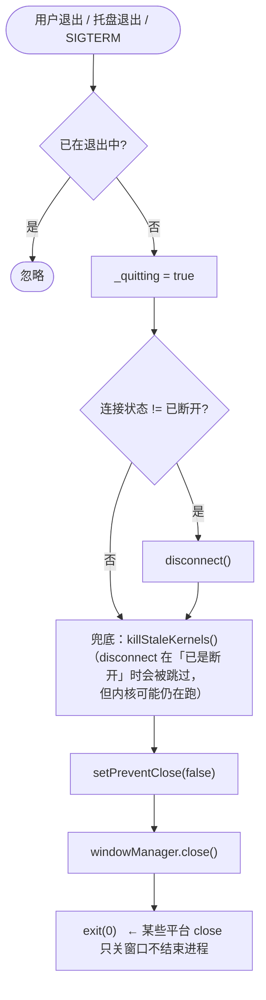

# 07 · 页面设计 · 桌面端（Windows / macOS）

> 文档版本 v1.0 · 覆盖 **Windows 10+ (amd64)** 与 **macOS 11+（arm64 / x86_64）**
> 设计目标：**不增加复杂度**，只把移动端的纵向流在宽屏上重排为**双栏**，并补齐窗口/托盘/权限三类桌面专属形态。

---

## 7.1 桌面 vs 移动的差异总览

| 维度 | 移动端（Android） | 桌面端（Windows / macOS） |
|---|---|---|
| 导航 | 底部 `BottomNavigationBar`（< 840px） | 左侧 `NavigationRail`（≥ 840px） |
| 内容容器 | 全宽 | **最大 1040px 居中**（🆕 改造，baseline 无 max-width） |
| 首页布局 | 单列纵向滚动 | **双栏**：左连接区（固定 400px）+ 右信息栏 |
| 窗口 | 全屏 | 默认 **980×680**，最小 **380×620**；可缩放/最大化 |
| 关闭窗口 | — | **三选弹窗**：最小化到托盘 / 退出 / 每次询问（可记住） |
| 托盘 / 菜单栏 | — | 🆕 托盘图标 + 右键菜单（显示窗口 / 连接 / 断开 / 退出） |
| 系统代理 | 不用（走 TUN） | **自动置系统代理**（Windows 注册表 / macOS `networksetup`），20s 保活 |
| TUN | 默认 `auto` | 默认 `off`（需管理员权限） |
| 开机自启 | 不用 | 可选（Windows 计划任务 / macOS LaunchAgent） |
| 内核管理 | 只读（随 App 更新） | **可热替换**（下载官方内核、变体切换、恢复内置） |
| 分应用代理 | ✅ 有 | ❌ 无 |
| 快捷键 | — | 🆕 `Ctrl/Cmd+K` 连接/断开，`Ctrl/Cmd+,` 设置，`Esc` 关弹层 |
| 更新分发 | APK | `.exe` 安装包 / `.zip` 便携版 / `.dmg` |

---

## 7.2 窗口规格

```
┌────────────────────────────────────────────────────────────────────────────┐
│  Mclash                                        ─   □   ✕                    │ ← 标题栏（系统原生）
├──────────┬─────────────────────────────────────────────────────────────────┤
│          │                                                                 │
│   ①首页  │                   主内容区                                    │
│   ②节点  │              （最大宽 1040px 居中）                             │
│   ③套餐  │                                                                 │
│   ④我的  │                                                                 │
│          │                                                                 │
│  ──────  │                                                                 │
│   设置   │                                                                 │
│          │                                                                 │
├──────────┴─────────────────────────────────────────────────────────────────┤
│  ● 已连接 · 日本·东京 01 · 86ms                          ↑1.2 ↓8.4 MB/s    │ ← 状态条（🆕）
└────────────────────────────────────────────────────────────────────────────┘
```

| 属性 | 值 |
|---|---|
| 默认尺寸 | **980 × 680**（🆕 baseline 未设默认，仅设最小 380×620） |
| 最小尺寸 | 380 × 620 |
| 标题 | `Mclash`（macOS 用 `CFBundleDisplayName`） |
| 拖拽区 | 整条标题栏（桌面端用 Flutter 的 `DragToMoveArea` 或原生标题栏 —— 建议**保留原生标题栏**，避免自绘带来的跨平台差异） |
| 🆕 底部状态条 | 高 32px，仅在窗口高度 ≥ 560 时显示；左：连接状态点 + 当前节点 + 延迟；右：实时上/下行速率。**任意页面都可见** —— 桌面用户常在设置页排障时也需要看连接状态 |
| 🆕 侧边栏底部 | 「设置」入口（与移动端「我的 → 设置」等价），桌面用户更习惯侧边栏直达 |

### 7.2.1 侧边导航（`NavigationRail`）

| 属性 | 值 |
|---|---|
| 宽度 | 96px（`labelType: all`，图标 24px + 文字 12px） |
| 背景 | `MFColors.bg`，右侧 `1px line` |
| 指示器 | `brand.withOpacity(.12)`，圆角 16 |
| 选中 | 图标 `brandLight`，文字 12px/500 `brandLight` |
| 未选中 | `txt3` |
| 底部分隔 | `1px line` + 「设置」入口 |
| Tab 3 红点 | 有新版时「我的」图标右上角 7px 红点 |
| 折叠 | 窗口宽 < 840 → 该 rail 整体隐藏，改回底部导航（同移动端） |

---

## 7.3 桌面首页（双栏）

```
┌──────────┬───────────────────────────────────────────────────────────────────┐
│          │                                                                   │
│  ① 首页  │  MoneyFly                                     ⟳ 刷新      🔔 3    │ ← 顶部条 48px
│  ② 节点  │  ─────────────────────────────────────────────────────────────── │
│  ③ 套餐  │                                                                   │
│  ④ 我的  │ ┌───────────────────────────┐  ┌──────────────────────────────┐  │
│          │ │ ① 连接卡（固定宽 400px）   │  │ ② 订阅信息卡                 │  │
│  ─────   │ │                           │  │  到期 2026-03-14             │  │
│  ⚙ 设置  │ │        已连接              │  │  剩余 128 天 · 设备 2/3       │  │
│          │ │   00:12:30 · ↑1.2 ↓840MB   │  │  ─────────────────────────── │  │
│          │ │                           │  │  流量 42.3 GB / 100 GB       │  │
│          │ │        ╭───────╮          │  │  ▓▓▓▓▓▓▓▓░░░░░░░░  42%       │  │
│          │ │       │   ⏻    │         │  └──────────────────────────────┘  │
│          │ │        ╰───────╯          │  ┌──────────────────────────────┐  │
│          │ │                           │  │ ③ 实时速率                    │  │
│          │ │ ┌───────────────────────┐ │  │  ↑ 1.2 MB/s   ↓ 8.4 MB/s      │  │
│          │ │ │🇯🇵 当前线路       86ms │ │  │  ╱╲__╱╲___╱╲__╱╲             │  │
│          │ │ │   日本·东京·01   切换› │ │  └──────────────────────────────┘  │
│          │ │ └───────────────────────┘ │  ┌──────────────────────────────┐  │
│          │ │                           │  │ ④ 自动测速与选优   ● 已选优   │  │
│          │ │  🇯🇵 真实出口 · 日本        │  │  🇯🇵 日本·东京 01  86ms [最优] │  │
│          │ │                           │  │  上次 14:28 · 68 个节点 ⚡重测│  │
│          │ │ ┌───────────┬───────────┐ │  └──────────────────────────────┘  │
│          │ │ │ ◎智能模式 │ ⊕全局模式  │ │  ┌──────────────────────────────┐  │
│          │ │ └───────────┴───────────┘ │  │ ⑤ 快速切换国家                │  │
│          │ └───────────────────────────┘  │ ✦自动 🇯🇵86 🇺🇸112 🇸🇬94 🇭🇰72 │  │
│          │                                └──────────────────────────────┘  │
├──────────┴───────────────────────────────────────────────────────────────────┤
│ ● 已连接 · 日本·东京 01 · 86ms                              ↑1.2 ↓8.4 MB/s    │
└──────────────────────────────────────────────────────────────────────────────┘
```

### 布局规则

| 属性 | 值 |
|---|---|
| 内容最大宽 | **1040px** 居中（🆕） |
| 左右栏间距 | 20px |
| 左栏宽 | 固定 **400px** |
| 右栏宽 | `flex: 1`（最大 620px） |
| 窄屏退化 | 窗口宽 < 900px → **自动切回单列**（同移动端顺序） |
| 区块顺序（单列时） | 连接卡 → 订阅信息 → 速率 → 自动测速 → 快速国家 |

### 桌面专属细节

| # | 项 | 说明 |
|---|---|---|
| 1 | 悬停态 | 所有可点击元素必须有 hover（背景提亮 6%、边框提亮 10%），过渡 180ms |
| 2 | 焦点环 | 键盘 Tab 焦点显示 2px `brand` 外环（`0 0 0 2px brand` + `2px offset`） |
| 3 | 工具提示 | 纯图标按钮（刷新/通知/设置）必须 `tooltip`（延迟 500ms） |
| 4 | 鼠标光标 | 可点击元素 `cursor: pointer` |
| 5 | 无下拉刷新 | 桌面端**移除** `RefreshIndicator`（改用显式「⟳ 刷新」按钮） |
| 6 | 滚动条 | 使用系统样式，宽度 8px，`hover` 时加宽到 12px |
| 7 | 连接卡 | 电源环直径 88px（比移动 108 略小，因双栏空间更紧凑） |

---

## 7.4 桌面节点页

```
┌──────────┬───────────────────────────────────────────────────────────────────┐
│  ① 首页  │  节点列表                          ⟳ 刷新订阅   ⇅ 排序   ✨ 最优   │
│  ② 节点  │  ─────────────────────────────────────────────────────────────── │
│  ③ 套餐  │  ┌─────────────────────────────────────────────────────────────┐ │
│  ④ 我的  │  │ ⚡ 自动选优已开启                          ● 已选优  ▸ 立即选优 │ │
│  ─────   │  └─────────────────────────────────────────────────────────────┘ │
│  ⚙ 设置  │  ┌───────────────────────────────┐  ┌────────────────────────┐  │
│          │  │ 🔍 搜索节点/国家               │  │ 68 个节点 · 62 在线    │  │
│          │  └───────────────────────────────┘  └────────────────────────┘  │
│          │  ▓▓▓▓▓▓▓▓▓▓░░░░░░░░░░░░░░░░  12/68                              │
│          │  ┌─────────────────────────────────────────────────────────────┐ │
│          │  │ ▾ 🇯🇵 日本                                        8 个     │ │
│          │  │  ┌───────────────────────────────────────────────────────┐  │ │
│          │  │  │🇯🇵 日本·东京·01  vmess·443              86ms  ✓ 已选中│  │ │
│          │  │  └───────────────────────────────────────────────────────┘  │ │
│          │  │  ┌───────────────────────────────────────────────────────┐  │ │
│          │  │  │🇯🇵 日本·大阪·02  trojan·443            112ms          │  │ │
│          │  │  └───────────────────────────────────────────────────────┘  │ │
│          │  │ ▸ 🇺🇸 美国                                       12 个     │ │
│          │  │ ▸ 🇸🇬 新加坡                                      6 个     │ │
│          │  └─────────────────────────────────────────────────────────────┘ │
├──────────┴───────────────────────────────────────────────────────────────────┤
│ ● 已连接 · 日本·东京 01 · 86ms                              ↑1.2 ↓8.4 MB/s    │
└──────────────────────────────────────────────────────────────────────────────┘
```

**桌面差异**

| 项 | 移动 | 桌面 |
|---|---|---|
| 操作按钮 | 图标 + 文字混合，位置在标题行 | 标题行右侧**平铺**（刷新订阅 / 排序 / 最优），间距 12px |
| 统计胶囊 | 无 | 🆕 `68 个节点 · 62 在线` 胶囊（桌面信息密度可略高） |
| 节点行高 | 56px | **48px**（桌面鼠标精度高，可更紧凑） |
| 节点行悬停 | 无 | 背景提亮 + 右侧浮出操作图标（测速 / 复制 / 收藏） |
| 右键菜单 | 长按 | **右键上下文菜单**：切换到此节点 / 测速 / 复制节点名 / 复制服务器地址 / 仅显示该国 |
| 虚拟滚动 | `ListView.builder` | 同（≥ 200 节点时必须 `itemExtent` 固定高度） |

---

## 7.5 桌面套餐页 / 我的页 / 设置页

### 7.5.1 套餐页（桌面）

```
┌──────────┬───────────────────────────────────────────────────────────────────┐
│  ① 首页  │  套餐购买                                                          │
│  ② 节点  │  ─────────────────────────────────────────────────────────────── │
│  ③ 套餐  │  ┌─────────────────────┐  ┌─────────────────────┐  ┌───────────┐ │
│  ④ 我的  │  │      「最划算」      │  │                     │  │           │ │
│  ─────   │  │  标准版              │  │  轻量版             │  │  旗舰版   │ │
│  ⚙ 设置  │  │  ¥19.9 /月           │  │  ¥9.9 /月           │  │  ¥49.9 /月│ │
│          │  │  30天·3设备·100GB   │  │  30天·1设备·30GB   │  │  30天·5台 │ │
│          │  └─────────────────────┘  └─────────────────────┘  └───────────┘ │
│          │  ┌─────────────────────────────────────────────────────────────┐ │
│          │  │   流量 100 GB  │  设备 3 台  │  有效期 30 天               │ │
│          │  └─────────────────────────────────────────────────────────────┘ │
│          │  ┌─────────────────────────────────────────────────────────────┐ │
│          │  │ Ⓐ 支付宝 · 推荐      Ⓦ 微信      ₮ USDT                    │ │
│          │  └─────────────────────────────────────────────────────────────┘ │
│          │  ┌─────────────────────────────────────────────────────────────┐ │
│          │  │ 优惠码 [________] [验证]        合计 ¥19.9    ▓ 立即支付 ▓  │ │
│          │  └─────────────────────────────────────────────────────────────┘ │
├──────────┴───────────────────────────────────────────────────────────────────┤
```

| 桌面差异 | 说明 |
|---|---|
| 套餐卡布局 | 🆕 **横向 3 列**（移动端为纵向列表），卡片高度统一 180px |
| 支付方式 | 🆕 同一行 3 个横向卡片（移动端为纵向 3 行） |
| 结算栏 | 🆕 与优惠码同行，靠右对齐（移动端为固定底部栏） |
| 支付弹窗 | 同 F2，宽度 `min(420px, 90vw)` |
| 「打开支付宝支付」 | **桌面端不显示**（无支付宝 App 深链），改为「在手机支付宝中扫描二维码」 |

### 7.5.2 我的页（桌面）

```
┌──────────┬───────────────────────────────────────────────────────────────────┐
│  ④ 我的  │  ┌───────────────────────┐  ┌────────────────────────────────┐   │
│          │  │ ╭──╮ MoneyFly         │  │ 订阅卡（同移动端 r22）          │   │
│          │  │ │✈ │ moneyfly@…      │  │ 标准版 · 100G      ● 生效中     │   │
│          │  │ ╰──╯        ¥ 128.50  │  │ 到期 / 剩余 / 设备 三格         │   │
│          │  │            账户余额    │  └────────────────────────────────┘   │
│          │  └───────────────────────┘  ┌────────────────────────────────┐   │
│          │  ┌───────────────────────┐  │ 📱 设备管理            2/3   › │   │
│          │  │ ⏰ 订阅将于 5 天后到期 │  │ 🧾 订单记录                  › │   │
│          │  │            ▸ 立即续费  │  │ 🔔 通知中心             3    › │   │
│          │  └───────────────────────┘  │ 🔒 修改密码                  › │   │
│          │                             │ 💬 在线客服                  › │   │
│          │                             │ ⚙  设置                      › │   │
│          │                             │ ℹ  关于            v2.3.0    › │   │
│          │                             │ ⟳  版本更新                  › │   │
│          │                             └────────────────────────────────┘   │
│          │                             ┌────────────────────────────────┐   │
│          │                             │          退出登录               │   │
│          │                             └────────────────────────────────┘   │
├──────────┴───────────────────────────────────────────────────────────────────┤
```

| 桌面差异 | 说明 |
|---|---|
| 布局 | 🆕 左栏（用户头 + 状态横幅，宽 340px）+ 右栏（订阅卡 + 菜单） |
| 菜单行高 | 44px（移动 52px） |
| 「关于」行 | 显示 `v2.3.0` 版本号 |

### 7.5.3 设置页（桌面）

同移动端 §6.13 的 7 组结构，桌面差异：

| 项 | 桌面差异 |
|---|---|
| 容器宽 | 🆕 最大 **760px** 居中（设置项过长难扫读） |
| 显示的行 | 显示「开机自启动」「系统代理」「关闭窗口行为」；**隐藏**「分应用代理」（Android 专属） |
| 内核管理行 | 显示版本号 `v1.19.30` 且有 `›`（可进入并可更新） |
| 快捷键提示 | 🆕 设置页底部显示「快捷键：`Ctrl/Cmd+K` 连接/断开 · `Ctrl/Cmd+,` 设置」 |

---

## 7.6 桌面专属形态

### 7.6.1 关闭窗口询问弹窗（F3）

```
┌────────────────────────────────────────────┐
│  关闭窗口                                   │  16px/700
│                                            │
│  你想最小化到托盘还是退出 Mclash？           │  13.5px txt2 / 1.6
│  最小化到托盘后，代理连接将保持。            │
│                                            │
│  ☐ 记住我的选择                             │  12.5px txt2
│                                            │
│              [ 取消 ]  [最小化到托盘]  [退出]│
└────────────────────────────────────────────┘
```

| 项 | 规格 |
|---|---|
| 触发 | 点窗口关闭按钮（`onWindowClose`），且 `closeAction == 'ask'` |
| 背景 | `MFColors.card2`（跟随外观模式） |
| 按钮 | 「取消」`txt` / 「最小化到托盘」`txt` / 「退出」`red` |
| 记住 | 勾选后写入 `closeAction = 'hide' | 'quit'`；设置页可改回「每次询问」 |
| 关键实现约束 | 弹窗必须用 **`rootNavigatorKey.currentContext`** —— 本 State 在 `MaterialApp` 之上，用自身 `context` 找不到 `Navigator` → `showDialog` 抛异常 → 「点 ✕ 没反应」 |
| 兜底 | 若 Navigator 未就绪（启动极早期点 ✕）→ 延迟 250ms 重试；仍失败 → 直接最小化到托盘（绝不什么都不做） |

**决策表**

| `closeAction` | 点 ✕ 的行为 |
|---|---|
| `'ask'` | 弹上面的询问弹窗 |
| `'hide'` | 直接 `windowManager.hide()`（连接保持） |
| `'quit'` | 直接走 `_quitApp()`（断开 → 恢复系统代理 → 收内核 → 退出） |

### 7.6.2 托盘 / 菜单栏

| 平台 | 形态 | 图标 |
|---|---|---|
| Windows | 系统托盘（通知区域） | `assets/tray_icon.ico`（**必须是 .ico** —— `LoadImage(IMAGE_ICON)` 不认 PNG，用 PNG 会导致托盘图标空白） |
| macOS | 菜单栏（Menu Bar） | PNG（base64 加载） |

**右键菜单**

| 项 | 行为 |
|---|---|
| 显示主窗口 | `windowManager.show()` + `focus()` |
| ─ 分隔 ─ | |
| 连接 / 断开 | 根据当前状态动态显示；点击即执行（不打开窗口） |
| 当前节点：日本·东京 01 | 只读信息行（灰色，不可点） |
| ─ 分隔 ─ | |
| 退出 Mclash | `_quitApp()` |

**托盘图标状态**（🆕）
- 已连接 → 彩色图标
- 未连接 → 灰色图标
- 连接中 → 交替闪烁（1s 间隔）

### 7.6.3 退出流程（`_quitApp`）



**系统事件钩子**

| 平台 | 事件 | 处理 |
|---|---|---|
| Windows | `WM_QUERYENDSESSION` / `WM_ENDSESSION`（注销/关机） | MethodChannel `top.moneyfly/lifecycle` → `systemShutdown` → `SystemProxyManager.restore()`（2s 超时）+ `killStaleKernels()`（2s 超时） |
| macOS | `applicationShouldTerminate` | 同上 |
| macOS / Linux | `SIGTERM` / `SIGINT` | `sig.watch()` → `_quitApp()` |
| Windows | 第二实例启动 | 原生 `CreateMutexW` 在**创建窗口之前**拦截（Dart 侧不再检查 —— 否则第一实例会被自己持有的 mutex 误判成「已有实例」而自杀） |
| macOS / Linux | 第二实例（`open -n`） | 排他文件锁（必须在**任何系统代理/内核清扫之前**获取 —— 否则第二实例的启动巡检已经在动第一实例的内核与系统代理） |

### 7.6.4 系统代理（桌面专属功能）

| 平台 | 实现 |
|---|---|
| Windows | 注册表 `HKCU\Software\Microsoft\Windows\CurrentVersion\Internet Settings`：`ProxyEnable=1`、`ProxyServer=127.0.0.1:{port}`、`ProxyOverride=<local>;localhost;127.*;10.*;172.16.*-172.31.*;192.168.*` |
| macOS | `networksetup -setwebproxy <service> 127.0.0.1 <port>` + `-setsecurewebproxy` + `-setproxybypassdomains`（逐网络服务，必须同时设 HTTP 与 HTTPS） |

| 行为 | 说明 |
|---|---|
| 连接时 | `apply(mixedPort, bypassList)` |
| 连接期间 | **20s 保活**：被系统/其他软件关掉就重新开启（探测用 `reg query` / `networksetup -getwebproxy`，20s 一次避免进程创建开销累积） |
| 断开时 | `restore()` —— 恢复用户**原有**代理设置（不是简单地关闭） |
| 启动巡检 | `clearResidual(port)` 清掉指向**死端口**的残留代理 |
| 残留判据 | 「指向本机端口 **且** 该端口**已无人监听**」才算残留（只看「指向本机端口」会误清活着的代理 → 界面显示已连接但浏览器打不开） |
| 关机钩子 | 见 7.6.3（不做的话关机后系统代理指向死端口 → 重启整机断网） |
| 单实例联动 | `killStaleKernels()` 只收「父进程已消失的真孤儿」；**仍在工作的内核一律不动**（否则会杀掉另一个实例正在使用的活内核） |

### 7.6.5 开机自启动

| 平台 | 实现 |
|---|---|
| Windows | 计划任务（`autoStartCreate(name, runElevated: admin)`），任务名 `"<AppName> Autorun"`。**注意**：`launch_at_startup` 0.3.x 的 `StartupApproved` 会导致注册表异常 → 固定使用 0.2.2 |
| macOS | LaunchAgent plist 写入 `~/Library/LaunchAgents/` |

### 7.6.6 键盘快捷键（🆕）

| 快捷键 | 行为 |
|---|---|
| `Ctrl/Cmd + K` | 连接 / 断开切换 |
| `Ctrl/Cmd + ,` | 打开设置 |
| `Ctrl/Cmd + R` | 刷新订阅 |
| `Ctrl/Cmd + T` | 立即测速 |
| `Ctrl/Cmd + 1..4` | 切换 Tab（首页/节点/套餐/我的） |
| `Esc` | 关闭顶部弹层 / 弹窗 |
| `Enter` | 触发当前焦点处的主按钮 |
| `Tab` / `Shift+Tab` | 焦点遍历（顺序 = 视觉顺序） |

---

## 7.7 macOS 专属

| 项 | 处理 |
|---|---|
| 应用包 | `Mclash.app`，`CFBundleIdentifier = top.moneyfly.mclash` |
| 菜单栏 | 🆕 可选：状态栏额外图标显示连接状态（与托盘菜单等价） |
| Dock 图标 | 关闭窗口后隐藏 Dock 图标（`hideDockIcon(true)`），从托盘恢复时显示 |
| Apple 芯片 (arm64) | 内核 `mihomo-darwin-arm64-v{V}.gz`；`lipo -verify_arch arm64` 断言 |
| Intel (x86_64) | 内核 `mihomo-darwin-amd64-compatible-v{V}.gz`（**必须 compatible**）；`arch -x86_64 flutter build macos --release` 整链 Rosetta 构建；`lipo -verify_arch x86_64` 断言 |
| 签名 | 本地开发 `codesign --force --deep -s -` + `Release.entitlements`；正式发布用 Developer ID + 公证 |
| 分发 | `.dmg`，内含 `uninstall.command`（双击卸载：删配置/节点/缓存/令牌） |
| Gatekeeper | 首次打开提示「无法验证开发者」→ 在关于页/下载页提供「右键 → 打开」引导文案 |
| 卸载脚本 | 删除 `~/Library/Application Support/top.moneyfly.mclash/`、`~/Library/Preferences/`、`~/Library/Caches/` 下相关目录 |

---

## 7.8 Windows 专属

| 项 | 处理 |
|---|---|
| 安装包 | Inno Setup `.exe`（开始菜单 + 桌面快捷方式 + 卸载器，`lzma` 压缩，`ArchitecturesInstallIn64BitMode=x64os`） |
| 便携版 | `.zip`（解压即用，**内核 `mihomo.exe` 与 `Mclash.exe` 同目录**） |
| 防火墙 | 连接时 `firewallAddPorts([mixedPort, apiPort], "Mclash.exe")`（否则 Windows 防火墙拦截环回） |
| 内核变体 | amd64 默认 **compatible**（老 CPU 跑标准版 `0xC0000005` 崩溃）；设置页可切标准版 |
| 高 DPI | 支持 125% / 150% / 200% 缩放（Flutter 自动）；图标资源提供多尺寸 |
| 卸载彻底 | 删除 `%APPDATA%\top.moneyfly.mclash\`、`%LOCALAPPDATA%\` 下缓存与内核副本 |
| 系统代理残留 | 见 7.6.4；进程被强杀后的残留由下次启动巡检清理 |

---

## 7.9 桌面端信息密度对照表

| 元素 | 移动 | 桌面 |
|---|---|---|
| 页面左右边距 | 22px | 24px（内容居中后由容器给出） |
| 卡片圆角 | 16–22px | 14–18px |
| 卡片内边距 | 16px | 16px |
| 列表行高 | 56px | 44–48px |
| 正文字号 | 14px | 13.5px |
| 标题字号 | 18px | 17px |
| 主按钮高 | 54px | 44px |
| 输入框高 | 54px | 42px |
| 设置行高 | 52px | 44px |
| 图标（列表） | 24px | 20px |
| 图标（设置行） | 28×28 | 26×26 |
| 导航 | 底部 78px | 左侧 96px |

> **原则**：桌面端只压缩**垂直节奏**与**控件尺寸**，不压缩信息量 ——
> 移动端能看到的每一块信息，桌面端都必须能看到（且能更早看到，因为宽屏可并排）。

---

## 7.10 桌面端验收清单

- [ ] 窗口默认 980×680，可缩放至最小 380×620 且不破版
- [ ] 宽 ≥ 840 显示 `NavigationRail`；< 840 回退底部导航且**不重建页面状态**
- [ ] 内容区最大宽 1040px 居中（设置页 760px）
- [ ] 首页在 ≥ 900px 时呈双栏；< 900px 自动单列
- [ ] 底部状态条在高度 ≥ 560 时显示，且**任意页面可见**
- [ ] 所有纯图标按钮有 tooltip
- [ ] 键盘：`Ctrl/Cmd+K` 连接、`Ctrl/Cmd+,` 设置、`Tab` 遍历、`Esc` 关弹层
- [ ] 点 ✕ 弹询问弹窗；勾「记住」后按记忆执行；设置页可恢复「每次询问」
- [ ] 托盘图标：连接态彩色、断开态灰色、连接中闪烁；右键菜单四项可用
- [ ] 退出时：断开 → 恢复系统代理 → 收残留内核 → 进程结束（无孤儿）
- [ ] 第二实例启动被拦截（Windows 原生 mutex / mac 文件锁），且**不影响第一实例的连接**
- [ ] 关机/注销后重启，系统代理**不残留**（浏览器可用）
- [ ] 内核管理：下载（已连接时经隧道）→ 自检 → 替换 → 失败回滚
- [ ] Intel Mac：内置内核为 `compatible` 版，`lipo -verify_arch x86_64` 通过
- [ ] Apple 芯片：`lipo -verify_arch arm64` 通过
