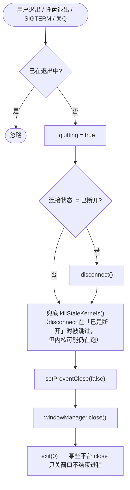

# 07 · 页面设计 · 桌面端（Windows / macOS）

> 文档版本 **v3.0** —— Clash Mi 视觉语言 + 4 Tab（宽屏转左侧导航）
> 覆盖 **Windows 10+ (amd64)** 与 **macOS 11+（arm64 / x86_64）**
> 依据 [`03-设计系统-Design-Tokens.md`](./03-设计系统-Design-Tokens.md) ·
> [`04-信息架构与导航地图.md`](./04-信息架构与导航地图.md) §4.1.2

---

## 7.0 桌面 vs 移动的差异总览

| 维度 | 移动端（Android） | 桌面端（Windows / macOS） |
|---|---|---|
| 视觉语言 | Clash Mi | **完全相同**（Clash Mi 桌面与移动同一套） |
| 主题 | 3 模式 + 种子色 `#293CA0` | 完全相同 |
| 一级导航 | 底部导航 56px | **≥ 840px → 左侧导航 88px**；< 840px → 底部导航 |
| 内容容器 | 全宽 | **全宽**（Clash Mi 桌面不加 max-width） |
| 页面转场 | Cupertino 横向滑入 | 完全相同（`platform: TargetPlatform.iOS` 强制） |
| 窗口 | 全屏 | 默认 **400 × 700**，最小 **400 × 700**（Clash Mi 逐值） |
| 关闭窗口 | — | 默认**直接隐藏到托盘**（`windowManager.hide()`） |
| 托盘 / 菜单栏 | — | 托盘图标 + 右键菜单（连接/断开/三种模式/显示窗口/退出） |
| 系统代理 | 不用（走 TUN） | **自动置系统代理**（Windows 注册表 / macOS `networksetup`）+ 20s 保活 |
| TUN | 默认 `auto` | 默认 `off`（需管理员/sudo） |
| 开机自启 | 不用 | 可选 |
| 内核管理 | 只读（随 App 更新） | **可热替换**（下载官方内核、变体切换、恢复内置） |
| 分应用代理 | ✅ 有（Android） | ❌ 无（改为 Windows UWP 豁免） |
| 快捷键 | — | 🆕 `Ctrl/Cmd+K` 连接、`Ctrl/Cmd+1..4` 切 Tab |
| 更新分发 | APK | `.exe` / `.zip` / `.dmg` |

---

## 7.1 窗口与桌面外壳

```
┌──────────────────────────────────────────────────────────────────────────────┐
│  Mclash                                              ─   □   ✕               │ 系统原生标题栏
├──────────┬───────────────────────────────────────────────────────────────────┤
│          │                                                                   │
│  ⌂ 主页  │                                                                   │
│          │                            内容区                                  │
│  ▤ 节点  │                                                                   │
│          │                                                                   │
│  ▦ 套餐  │                                                                   │
│          │                                                                   │
│  ◔ 我的  │                                                                   │
│          │                                                                   │
├──────────┴───────────────────────────────────────────────────────────────────┤
│ ● 已连接 · 日本·东京 01 · 86ms                            ↑1.2 ↓8.4 MB/s      │ 🆕 状态条 30px
└──────────────────────────────────────────────────────────────────────────────┘
   ↑ 88px
```

| 属性 | 值 | 依据 |
|---|---|---|
| 默认尺寸 | **400 × 700** | Clash Mi `setMinimumSize(Size(400, 700))` |
| 最小尺寸 | **400 × 700** | 同上 |
| 标题 | `Mclash` | — |
| 标题栏 | **系统原生**（不自绘） | Clash Mi 桌面用原生标题栏 + `windowManager` |
| 关闭按钮（✕） | **直接 `windowManager.hide()` 到托盘** | Clash Mi `onWindowClose → hide()`（Mclash 可选弹 D-10 询问） |
| 🆕 底部状态条 | 高 **30**，仅在窗口高度 ≥ 560 时显示 | 桌面用户在设置页排障时也需要看连接状态 |

### 7.1.1 🆕 状态条规格（桌面专属）

```
│ ● 已连接 · 日本·东京 01 · 86ms                       ↑ 1.2 MB/s  ↓ 8.4 MB/s │
```

| 属性 | 值 |
|---|---|
| 高度 | **30** |
| 背景 | `colorScheme.surface` |
| 顶边 | `Divider(height: 1, thickness: 0.3)` |
| 左侧 | 8×8 状态点（`Colors.green`/`Colors.grey`）+ `已连接 · <组> -> <节点> · <延迟>`（12px） |
| 右侧 | `↑ x MB/s` `↓ y MB/s`（12px） |
| 可见性 | 窗口高度 ≥ 560 |
| 点击 | 状态点区域 → 切 Tab 1（节点列表） |

### 7.1.2 左侧导航（≥ 840px）

| 属性 | 值 |
|---|---|
| 宽度 | **88** |
| 背景 | `colorScheme.surface`（深 `#121212` / 浅 `#F0F0F0`） |
| 右分隔 | `VerticalDivider(width: 1, thickness: 0.3)` |
| 每项高度 | **56**，垂直居中排列 |
| 图标 | **26**（桌面用 26，与顶部栏动作图标一致） |
| label | **12** |
| 选中色 | `ThemeDefine.kColorBlue` `#FF2196F3` |
| 未选中色 | `colorScheme.onSurfaceVariant` |
| 指示器 | **无**（同底部导航） |
| badge | 8×8 `Colors.red`（「我的」未读通知） |
| 切换 | **无自定义动画** |

**四个条目**（与底部导航同一份 `_mainNavEntries`）：

| # | label | 未选中 / 选中图标 |
|---|---|---|
| 0 | 主页 | `Icons.home_outlined` / `Icons.home` |
| 1 | 节点列表 | `Icons.dns_outlined` / `Icons.dns` |
| 2 | 套餐购买 | `Icons.shopping_cart_outlined` / `Icons.shopping_cart` |
| 3 | 我的 | `Icons.person_outline` / `Icons.person` |

> **窄窗退化**：窗口宽 < 840px → 左侧导航隐藏，改为底部导航（与移动端一致）。
> 两套导航共用 `_mainNavEntries`，切换不重建页面状态。

---

## 7.2 T-0 主页（桌面）

> 与移动端**完全相同**（Clash Mi 桌面就是移动布局居中显示），仅以下微调：
> 卡片宽度受窗口限制（400 宽窗口下卡内边距仍是 `fromLTRB(20,0,20,0)`），
> 标题仍然居中，无任何两栏布局。

```
┌──────────┬──────────────────────────────────────┐
│  ⌂ 主页  │              Mclash                  │
│  ▤ 节点  │                                      │
│  ▦ 套餐  │  ┌────────────────────────────────┐  │
│  ◔ 我的  │  │ ● 已连接            [ 开关 ]   │  │
│          │  │ ↑ 1.2 GB   ↓ 8.4 GB            │  │
│          │  │ ↑ 120 KB/s   ↓ 840 KB/s        │  │
│          │  │ ──────────────────────────────  │  │
│          │  │  [ 规则 ][ 全局 ][ 直连 ][拦截 ] │  │
│          │  │ ──────────────────────────────  │  │
│          │  │ 我的配置           🔔  ⊕   ›    │  │
│          │  │ MoneyFly 订阅                   │  │
│          │  │ ↑ 42.3 GB ↓ 128.4 GB/100 GB     │  │
│          │  │ 2026-03-14 到期                 │  │
│          │  │ ──────────────────────────────  │  │
│          │  │ 代理                        ›   │  │
│          │  │ 🇯🇵 手动选择 -> 日本·东京 (86 ms)│  │
│          │  │ ──────────────────────────────  │  │
│          │  │  [ 运行时配置 ]  [ 网络检测 ]   │  │
│          │  └────────────────────────────────┘  │
│          │  ┌── 账户状态条 ──────────────────┐  │
│          │  │ 标准版 · 剩余 128 天 · 42.3/100G›│  │
│          │  └────────────────────────────────┘  │
│          │  ┌── 设置卡 ──────────────────────┐  │
│          │  │ ⚙ 应用设置                  ›  │  │
│          │  │ ⚙ 内核设置                  ›  │  │
│          │  │ 🍱 核心日志                 ›  │  │
│          │  │ ☁ 备份与同步                ›  │  │
│          │  │ ? 帮助                      ›  │  │
│          │  │ ⓘ 关于                      ›  │  │
│          │  └────────────────────────────────┘  │
├──────────┴──────────────────────────────────────┤
│ ● 已连接 · 日本·东京 01 · 86ms      ↑1.2 ↓8.4   │
└─────────────────────────────────────────────────┘
```

### 桌面专属交互补充

| # | 项 | 说明 |
|---|---|---|
| 1 | **悬停态** | `ListTile` / `InkWell` 的 hover 高亮（M3 默认 `InkWell` hover 已有）；**不额外加 hover 样式** |
| 2 | 鼠标指针 | 可点击元素 `MouseCursor.click` |
| 3 | 滚动条 | **`Scrollbar` 常显**（Clash Mi 的 `Card` 内就是 `Scrollbar` + `ListView`） |
| 4 | 无下拉刷新 | Clash Mi 全 App 无 `RefreshIndicator` —— 订阅刷新走「更新」按钮 |
| 5 | 文本框 | 桌面启用 `TextFieldEx.popupEdit`：设置行的文本框点击后弹出居中 `SimpleDialog` 编辑（Clash Mi 原有） |
| 6 | 方向键导航 | `TextFieldEx` 内置 ↑↓←→ 焦点遍历（Clash Mi 原有） |
| 7 | 🆕 快捷键 | 见 §7.6 |

---

## 7.3 T-1 节点列表（桌面）

```
┌──────────┬──────────────────────────────────────────────────────────────┐
│  ⌂ 主页  │ 节点列表                     ⚙组    ⇅    ⚡                  │
│  ▤ 节点  │ ┌── 自动选优条 ─────────────────────────────────────────┐   │
│  ▦ 套餐  │ │ ⚡ 自动选优已开启              ● 已选优  [ 立即选优 ] │   │
│  ◔ 我的  │ └───────────────────────────────────────────────────────┘   │
│          │ ┌───────────────────────────────────────────────────────┐   │
│          │ │ 🔍 搜索节点 / 国家                                 ✕  │   │
│          │ └───────────────────────────────────────────────────────┘   │
│          │ ▓▓▓▓▓▓▓▓▓▓░░░░░░░░░░  12 / 68                               │
│          │ ▾ 🇯🇵 日本                                            8 个 │
│          │   1  日本·东京 01   vmess (86 ms)                    ✓     │
│          │   2  日本·大阪 02   trojan (112 ms)                        │
│          │ ▸ 🇸🇬 新加坡                                          6 个 │
│          │ ▸ 🇺🇸 美国                                           12 个 │
│          │ ▸ 🇭🇰 香港                                            9 个 │
├──────────┴──────────────────────────────────────────────────────────────┤
│ ● 已连接 · 日本·东京 01 · 86ms                          ↑1.2 ↓8.4 MB/s   │
└─────────────────────────────────────────────────────────────────────────┘
```

| 桌面差异 | 说明 |
|---|---|
| 节点行高 | **56**（移动 66）—— 桌面鼠标精度高，可略紧凑 |
| 节点行悬停 | 行右侧浮出操作图标（单节点测速 / 复制） |
| 右键菜单 | 🆕 上下文菜单：切换到此节点 / 测速 / 复制节点名 / 复制服务器地址 / 仅显示该国 |
| 虚拟滚动 | ≥ 200 节点时用固定 `itemExtent` |
| 测速并发 | **10**（`PlatformUtils.isPC()`） |

---

## 7.4 T-2 套餐购买 / T-3 我的（桌面）

> 与移动端**结构完全相同**，仅容器宽度受窗口限制。Clash Mi 桌面**没有两栏布局**，Mclash 保持一致。

```
┌──────────┬──────────────────────────────────────┐
│  ⌂ 主页  │ 套餐购买                              │
│  ▤ 节点  │  ┌── 当前订阅 ────────────────────┐  │
│  ▦ 套餐  │  │ 标准版 · 100G        ● 生效中   │  │
│  ◔ 我的  │  │ 到期 2026-03-14 · 剩余 128 天   │  │
│          │  │ ▓▓▓▓▓▓▓░░░░░  42.3 / 100 GB    │  │
│          │  └────────────────────────────────┘  │
│          │  ┌── 标准版 ────────── 最划算 ───┐  │
│          │  │ ¥ 19.9 /月                     │  │
│          │  │ 30 天 · 3 设备 · 100 GB        │  │
│          │  └────────────────────────────────┘  │
│          │  ┌── 轻量版 ─────────────────────┐  │
│          │  │ ¥ 9.9 /月                      │  │
│          │  └────────────────────────────────┘  │
│          │  ┌────────────────────────────────┐  │
│          │  │ 合计 ¥19.9  [ ▓ 立即支付 ▓ ]   │  │
│          │  └────────────────────────────────┘  │
├──────────┴──────────────────────────────────────┤
```

| 桌面差异 | 说明 |
|---|---|
| 套餐列表 | **纵向**（不做横向 3 列 —— Clash Mi 桌面也没有横向卡片） |
| 支付弹窗 | 同 S-12，宽度 `min(420px, 90vw)`；**不显示「打开支付宝」深链** |
| 我的设置卡 | 显示桌面专属行（开机启动 / 便携模式 / 关闭窗口行为） |

---

## 7.5 桌面专属页面与形态

### 7.5.1 关闭行为（D-10，可选）

> **Clash Mi 原始行为 = 直接隐藏到托盘**（`onWindowClose → windowManager.hide()`）。
> Mclash 保留这一默认，另提供「每次询问」选项（默认 **关**）。

```
┌────────────────────────────────────────────┐
│  提示                                       │  SimpleDialog 标题 14px
│                                            │
│  你想最小化到托盘还是退出 Mclash？           │  14px
│  最小化到托盘后，代理连接将保持。            │
│                                            │
│  ☐ 记住我的选择                             │  Checkbox（fill=卡片色，check=#08C70F）
│                                            │
│     [ 取消 ]  [最小化到托盘]  [ 退出 ]       │  ElevatedButton 胶囊
└────────────────────────────────────────────┘
```

| `closeAction` | 点 ✕ 的行为 |
|---|---|
| `hide`（**默认**） | 直接 `windowManager.hide()` —— 与 Clash Mi 一致 |
| `quit` | `_quitApp()`：断开 → 恢复系统代理 → 收内核 → 退出 |
| `ask` | 弹上面的询问弹窗 |

| 关键实现约束 | 说明 |
|---|---|
| 必须用 `rootNavigatorKey.currentContext` | State 在 `MaterialApp` 之上，用自身 `context` 找不到 `Navigator` → 「点 ✕ 没反应」 |
| 兜底 | Navigator 未就绪时延迟 250ms 重试；仍失败 → 直接隐藏到托盘 |
| macOS 快捷键 | `⌘W` → `windowManager.hide()`（Clash Mi 原有注册） |

### 7.5.2 托盘 / 菜单栏（Clash Mi 原样保留）

| 平台 | 形态 | 图标 |
|---|---|---|
| Windows | 系统托盘 | `assets/images/tray.ico`（连接）/ `grey_tray.ico`（未连接） |
| macOS | 菜单栏 | `assets/images/tray.png` / `grey_tray.png`；**菜单栏标题显示实时流量**（`trayManager.setTitle(speed)`） |

**右键菜单**（Clash Mi 逐值为 7 项）

| 项 | menu key | 行为 |
|---|---|---|
| `   连接   ` | `connect` | 连接 |
| `   断开   ` | `disconnect` | 断开 |
| `   规则   ` | `mode_rule` | 切规则模式 |
| `   全局   ` | `mode_global` | 切全局模式 |
| `   直连   ` | `mode_direct` | 切直连模式 |
| `   显示窗口   ` | `show_window` | `show()` + `focus()` |
| `   退出   ` | `exit_app` | 退出 |

> 菜单文案两侧的空格是 **Clash Mi 为了原生菜单对齐刻意加的**，保留。

### 7.5.3 退出流程



**系统事件钩子**

| 平台 | 事件 | 处理 |
|---|---|---|
| Windows | `WM_QUERYENDSESSION` / `WM_ENDSESSION` | MethodChannel `top.moneyfly/lifecycle` → `systemShutdown` → `SystemProxyManager.restore()`（2s 超时）+ `killStaleKernels()`（2s 超时） |
| macOS | `applicationShouldTerminate` | 同上 |
| macOS / Linux | `SIGTERM` / `SIGINT` | `sig.watch()` → `_quitApp()` |
| Windows | 第二实例 | 原生 `CreateMutexW` 在**创建窗口之前**拦截 |
| macOS / Linux | 第二实例（`open -n`） | 排他文件锁（必须在**任何系统代理/内核清扫之前**获取） |

### 7.5.4 系统代理（桌面专属）

| 平台 | 实现 |
|---|---|
| Windows | 注册表 `HKCU\Software\Microsoft\Windows\CurrentVersion\Internet Settings`：`ProxyEnable=1`、`ProxyServer=127.0.0.1:{mixedPort}`、`ProxyOverride=<local>;localhost;127.*;10.*;172.16.*-172.31.*;192.168.*` |
| macOS | `networksetup -setwebproxy <service> …` + `-setsecurewebproxy` + `-setproxybypassdomains`（**逐网络服务**，HTTP 与 HTTPS 都要设） |

| 行为 | 说明 |
|---|---|
| 连接时 | `apply(mixedPort, bypassList)` |
| 连接期间 | **20s 保活**（`reg query` / `networksetup -getwebproxy` 探测） |
| 断开时 | `restore()` —— 恢复用户**原有**代理设置 |
| 启动巡检 | `clearResidual(port)` 清掉指向**死端口**的残留代理 |
| 残留判据 | 「指向本机端口 **且** 该端口**已无人监听**」才算残留 |
| 关机钩子 | 见 §7.5.3 |

### 7.5.5 内核管理（桌面专属增强）

> Clash Mi 的内核通过 `clashmiService` 外部二进制加载，**不支持运行期替换**。
> Mclash 在**保留 Clash Mi 内核设置全套**的基础上，把 moneyfly 的内核热替换能力加进**开发者选项**。

```
┌── 开发者选项 → 内核变体 ──────────────────┐
│ 当前内核                      内置 v1.19.30│
│ 运行状态                        ● 运行中   │
│ ──────────────────────────────────────────│
│ 🔍 检测最新版本                        ›  │
│ 🆕 发现新内核 v1.19.32                 ›  │
│    ▓▓▓▓▓▓▓▓░░░░░  下载中 68%              │
│ ──────────────────────────────────────────│
│ 内核变体        兼容版   ⌄                │  StringPicker
│ ♻  恢复内置内核                        ›  │
└───────────────────────────────────────────┘
```

| 规则 | 说明 |
|---|---|
| 内核位置 | **用户副本目录**（`getApplicationSupportDirectory()/kernel`），**绝不修改安装目录** |
| 缓存 | `kernel/cache/{variant}_{version}{ext}`；本地已有该 (变体,版本) → 秒切 |
| 备份回滚 | 替换前 `mihomo → .mihomo.bak`；自检 `mihomo -v` 失败自动回滚 |
| 运行中禁止替换 | `activateCached` 要求内核已停止（Windows 上运行中的 exe 被文件锁） |
| 恢复内置 | 删除用户副本后**复查确认**（Windows 删除运行中 exe 会静默失败） |
| Win/mac x64 默认 | `compatible`（标准版要求 AVX2，老 CPU `0xC0000005` 崩溃） |
| 下载代理 | 已连接时**显式**经隧道下载（App 自身请求不走系统代理） |

### 7.5.6 UWP 网络隔离豁免（Windows 专有）

Clash Mi 原有的 Windows 专属设置项，**保留**：勾选后为 UWP 应用添加网络隔离豁免（`CheckNetIsolation`），
使 Microsoft Store 应用能走代理。

### 7.5.7 便携模式（Windows 专有）

`portableMode` 开关：在 `clashmi.exe` 同目录创建 `portable` 文件夹，配置/缓存/日志全部落到该目录。
退出便携模式 = 退出应用后手动删除 `portable` 文件夹（Clash Mi 原有提示文案，保留）。

---

## 7.6 🆕 键盘快捷键

| 快捷键 | 行为 |
|---|---|
| `Ctrl/Cmd + K` | 连接 / 断开切换 |
| `Ctrl/Cmd + 1` | 切 Tab 0 主页 |
| `Ctrl/Cmd + 2` | 切 Tab 1 节点列表 |
| `Ctrl/Cmd + 3` | 切 Tab 2 套餐购买 |
| `Ctrl/Cmd + 4` | 切 Tab 3 我的 |
| `Ctrl/Cmd + R` | 刷新订阅（同 C-01「更新」） |
| `Ctrl/Cmd + T` | 立即测速（同 Tab 1「⚡」） |
| `Ctrl/Cmd + W` | 隐藏到托盘（macOS 原生行为，Clash Mi 已注册） |
| `Esc` | 关闭顶部弹层 / 弹窗 |
| `↑` `↓` `←` `→` | 焦点遍历（`TextFieldEx` 内置） |
| `Enter` | 触发当前焦点处的主按钮 |
| `Tab` / `Shift+Tab` | 焦点遍历（顺序 = 视觉顺序） |

---

## 7.7 macOS 专属

| 项 | 处理 |
|---|---|
| 应用包 | `Mclash.app`，`CFBundleIdentifier = top.moneyfly.mclash` |
| `⌘W` | 隐藏窗口（Clash Mi 原有 `hotKeyManager` 注册，`HotKeyScope.inapp`） |
| 菜单栏标题 | 显示实时流量（`trayManager.setTitle`） |
| Dock 图标 | **可隐藏**（应用设置「隐藏Dock图标」，Clash Mi 原有） |
| 完全磁盘访问权限 | 系统扩展安装时若权限不足 → 显示 `FullDiskAccessPermissionRequired` 引导（Clash Mi 原有） |
| Apple 芯片 (arm64) | 内核 `mihomo-darwin-arm64-v{V}.gz`；`lipo -verify_arch arm64` 断言 |
| Intel (x86_64) | 内核 `mihomo-darwin-amd64-compatible-v{V}.gz`（**必须 compatible**）；`arch -x86_64 flutter build macos --release` 整链 Rosetta；`lipo -verify_arch x86_64` 断言 |
| 启动前置检查 | Release 下必须在 `/Applications` 内（Clash Mi 原有 `invalidInstallPath`） |
| 签名 | 本地 `codesign --force --deep -s -` + entitlements；正式发布 Developer ID + 公证 |
| 首次启动 | 弹 `UserAgreementScreen`（`userAgreementAgreedIdKey` 记 LocalStorage，Clash Mi 原有）→ `LanguageSettingsScreen` |
| 分发 | `.dmg`，内含 `uninstall.command`（双击卸载） |

---

## 7.8 Windows 专属

| 项 | 处理 |
|---|---|
| 安装包 | Inno Setup `.exe`（开始菜单 + 桌面快捷方式 + 卸载器；`lzma` 压缩；`ArchitecturesInstallIn64BitMode=x64os`） |
| 便携版 | `.zip`（解压即用；**内核 `mihomo.exe` 与 `Mclash.exe` 同目录**） |
| 启动前置检查 | 拒绝 UNC 路径与临时目录安装（Clash Mi 原有 `invalidInstallPath`）；系统版本 ≥ Windows 10（`systemVersionLow`） |
| 单实例 | 原生 `CreateMutexW`（Dart 侧不再检查，避免第一实例自我误判） |
| 防火墙 | 连接时 `firewallAddPorts([mixedPort, apiPort], "Mclash.exe")` |
| UWP 豁免 | 见 §7.5.6 |
| 便携模式 | 见 §7.5.7 |
| 高 DPI | 支持 125% / 150% / 200% |
| 卸载彻底 | 删 `%APPDATA%\top.moneyfly.mclash\` 与 `%LOCALAPPDATA%\` 下缓存与内核副本 |
| 系统代理残留 | 见 §7.5.4；进程被强杀后的残留由下次启动巡检清理 |
| Edge WebView2 | 内嵌 WebView（客服/公告）需 Edge WebView2 运行时；缺失时提示 `edgeRuntimeNotInstalled`（Clash Mi 原有文案，保留） |

---

## 7.9 桌面端信息密度对照

| 元素 | 移动 | 桌面 | 说明 |
|---|---|---|---|
| 页面左右边距 | 20 | **20**（Clash Mi 桌面与移动相同） | — |
| 卡片圆角 | 12 | **12** | — |
| 卡片内边距 | `fromLTRB(20,0,20,0)` | 同 | — |
| 节点行高 | 66 | **56** | 桌面鼠标精度高 |
| 设置行高 | 46 | **46** | 同 |
| 正文字号 | 15/14 | **14**（`kFontSizeGroupItem` 桌面分支） | — |
| 标题字号 | 18 | **18** | 同 |
| 顶部栏图标 | 26 | **26** | 同 |
| 导航图标 | 24（底部） | **26**（左侧） | — |
| 导航宽度 | —（高 56） | **88** | — |

> **原则**：Clash Mi 桌面与移动**几乎不做密度区分**（这是它的设计选择）。
> Mclash 只在两处微调：节点行高 66→56（桌面列表更长）、正文字号走桌面分支 14。

---

## 7.10 桌面端验收清单

- [ ] 窗口默认 400×700，最小 400×700
- [ ] 宽 ≥ 840 → 左侧导航 88px；< 840 → 底部导航；切换**不重建页面状态**
- [ ] 左侧导航与底部导航图标/选中色/无指示器完全一致，共用 `_mainNavEntries`
- [ ] 底部状态条在窗口高 ≥ 560 时显示，任意 Tab 可见
- [ ] 点 ✕ **默认隐藏到托盘**（`closeAction: hide`）；「我的 → 设置 → 关闭窗口行为」可改为退出或每次询问
- [ ] macOS `⌘W` 隐藏窗口
- [ ] 托盘图标：连接/未连接两套图标；菜单 7 项可用；macOS 菜单栏标题显示流量
- [ ] 退出时：断开 → 恢复系统代理 → 收残留内核 → 进程结束（无孤儿）
- [ ] 第二实例被拦截，且**不影响第一实例的连接**
- [ ] 关机/注销后重启，系统代理**不残留**
- [ ] 系统代理逐网络服务设置（macOS）+ 20s 保活；残留判据为「指向本机端口且端口已无人监听」
- [ ] 内核热替换：下载（已连接时经隧道）→ 自检 → 替换 → 失败回滚
- [ ] Intel Mac 内置 **compatible** 内核，`lipo -verify_arch x86_64` 通过
- [ ] Apple 芯片 `lipo -verify_arch arm64` 通过
- [ ] Windows：便携模式 / UWP 豁免 / 防火墙放行 三项可用
- [ ] 快捷键 `Ctrl/Cmd+K`（连接）· `1..4`（切 Tab）· `R`（刷新）· `T`（测速）· `Esc`（关弹层）
- [ ] 设置行文本框点击弹出居中编辑对话框（`TextFieldEx.popupEdit`）
- [ ] 无自定义动画、无 SnackBar、无 Chip/Slider/PopupMenu/TabBar
