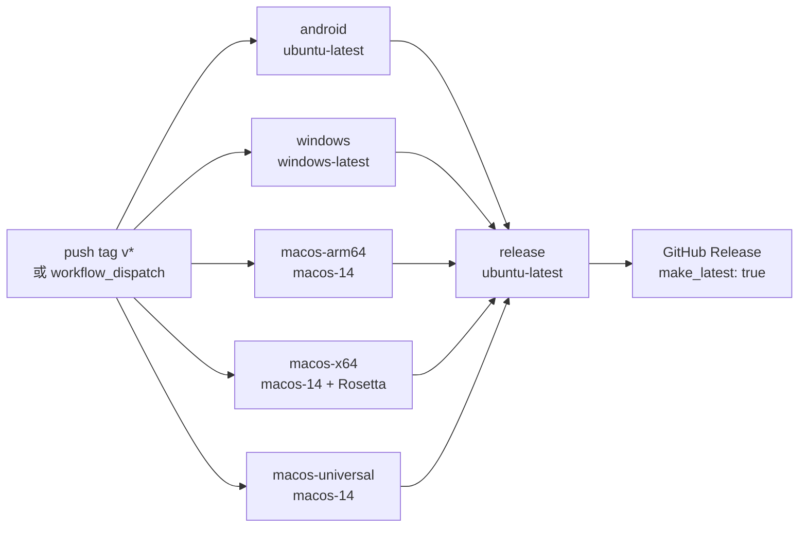

# 08 · 内核集成与平台构建发布

> 文档版本 v1.0 · 对应项目 `github.com/moneyfly004/Mclash`

---

## 8.1 内核来源总表（**不使用 fork**）

| 平台 | 架构 | 内核资产 | 来源 | 集成形式 |
|---|---|---|---|---|
| Android | arm64-v8a | `libmihomo.aar` | `github.com/moneyfly004/mihomo-lib` Releases（tag = 内核版本，如 `v1.19.30`） | **进程内**（gomobile bind） |
| Android | armeabi-v7a | 同上 | 同上 | 同上 |
| Android | x86_64 | 同上 | 同上 | 同上 |
| Windows | amd64 | `mihomo-windows-amd64-compatible-v{V}.zip` | `github.com/MetaCubeX/mihomo` 官方 Release | 子进程 `mihomo.exe` |
| macOS | arm64 | `mihomo-darwin-arm64-v{V}.gz` | 同上 | 子进程 `mihomo` |
| macOS | x86_64 | `mihomo-darwin-amd64-compatible-v{V}.gz` | 同上 | 子进程 `mihomo` |
| macOS | universal | 上面两个 `lipo -create` 合并 | 同上 | 子进程 `mihomo` |
| （iOS，范围外） | arm64 | `Mihomelib.xcframework` | `moneyfly004/mihomo-lib` | NetworkExtension 扩展内 |

**统一版本变量**：CI 与本地脚本均以 `MIHOMO_VERSION`（默认 `1.19.30`）为唯一真源。升级内核**只改这一个值**。

---

## 8.2 Android 内核集成

### 8.2.1 编译侧（`moneyfly004/mihomo-lib` 仓库，不在本仓库）

```bash
export ANDROID_NDK_HOME=$ANDROID_HOME/ndk/27.2.12479018
go mod download
go get github.com/metacubex/mihomo@v${VERSION}
go get -tool golang.org/x/mobile/cmd/gobind
gomobile bind -target=android -androidapi 21 \
  -tags "with_gvisor,cmfa" \
  -javapkg top.moneyfly \
  -o libmihomo.aar .
```

| 项 | 值 |
|---|---|
| 触发 | ① `workflow_dispatch` 手动指定版本 ② 每日 UTC 03:00 自动检测官方新稳定版 ③ push `v*` tag |
| 幂等粒度 | **按资产**判断（某版本已有 release 但缺 AAR → 只补编 AAR，不重复发布） |
| Go 版本 | `1.26.6`（与官方构建工具链一致） |
| 额外能力 | 内核日志环形缓冲（`Logs()` 返回增量）+ panic/recover 保护 + TUN fd 注入 |

### 8.2.2 Java API（`top.moneyfly.mihomelib.Mihomelib`）

| 方法 | 签名 | 说明 |
|---|---|---|
| `start` | `(homeDir: String, configYaml: ByteArray, tunFd: Int): void` | 启动内核；`tunFd > 0` 时注入 `tun.file-descriptor`；**幂等**（已启动返回错误） |
| `stop` | `(): void` | `executor.Shutdown()` |
| `reload` | `(configYaml: ByteArray): void` | 热重载（不重启进程、不断流） |
| `running` | `(): Boolean` | — |
| `version` | `(): String` | 如 `v1.19.30` |
| `logs` | `(): String` | 自上次调用以来的新增日志（首次返回全部历史） |

### 8.2.3 Go 层关键实现细节（必须保留）

| # | 细节 | 原因 |
|---|---|---|
| 1 | `C.SetHomeDir(homeDir)` **且** `C.SetConfig(filepath.Join(homeDir, "config.yaml"))` | `configFile` 默认是相对路径 `config.yaml`；库模式不设绝对路径时，`config.Init` 会在进程工作目录（Android 上是 `/`，只读）尝试创建文件 → `read-only file system` |
| 2 | `defer recover()` 包裹 `Start` | Go panic 跨 cgo 边界会直接崩掉整个 App → 必须转成「可重试错误」 |
| 3 | panic/失败路径关闭 `tunFd`（若已传） | 已接管则由内核关（`EBADF` 无害）；未接管则补关防泄漏。Go 层 `close` 不经 libc，**不会触发 Android fdsan double-close 崩溃** |
| 4 | `log.Subscribe()` 起常驻 goroutine drain | 不消费会让 subscriber 缓冲（200 条）满 → **阻塞内核日志路径** |
| 5 | 日志环形缓冲上限 1000，`logConsumed` 同步下调 | 增量语义正确 |
| 6 | `init()` 中即启动日志采集 | mihomo 的 `log` 包 `init` 先于本包执行（依赖先初始化），保证启动日志不丢 |
| 7 | `injectTunFd` 只在 `tun.enable == true` 时注入 | 配置未开 TUN 时保持原样 |
| 8 | `applyTunDefaults(tun)`（平台相关） | Android：`auto-route=false`、`auto-detect-interface=false`（VpnService 已下发路由并排除自身进程）；iOS(darwin)：`auto-route=false` 但**必须** `auto-detect-interface=true`（否则扩展进程自己的出站流量被自己的隧道抓回来自环） |

### 8.2.4 Kotlin 侧（`MclashVpnService`）

```kotlin
class MclashVpnService : VpnService() {
    companion object {
        const val ACTION_START = "top.moneyfly.vpn.START"
        const val ACTION_STOP  = "top.moneyfly.vpn.STOP"
        const val EXTRA_CONFIG  = "config_yaml"
        const val EXTRA_NEED_TUN = "need_tun"
        const val CHANNEL_ID = "mclash_vpn_channel"
        private const val NOTIFY_ID = 1001

        private const val TUN_GATEWAY = "172.19.0.1"
        private const val TUN_PREFIX  = 30
        private const val TUN_DNS     = "172.19.0.2"

        @Volatile var isRunning: Boolean = false; private set
        @Volatile var lastStartError: String? = null; private set

        fun kernelVersion(): String = try { Mihomelib.version() ?: "" } catch (e: Exception) { "" }
        fun fetchKernelLogs(): String = try { Mihomelib.logs() ?: "" } catch (e: Exception) { "" }
    }

    private var tunFd: Int = 0   // establish 后 detach，所有权归内核
    private val coreExecutor = Executors.newSingleThreadExecutor()
    ...
}
```

**`onStartCommand` 分支表（必须严格实现）**

| 输入 | 行为 |
|---|---|
| `ACTION_STOP` | 串行执行 `stopBox()` → `stopForegroundCompat()` → `stopSelf()`；返回 `START_NOT_STICKY` |
| `ACTION_START` **且 configYaml == null**（来自 BootReceiver / 系统重启） | `startForeground()` 满足 Android 12+ 5s 约束 → 延迟 1500ms → 若内核未跑且 `!isRunning` → `stopForegroundCompat()` + `stopSelf()`。**绝不留「前台通知挂着但内核没跑」的幽灵连接**；若期间 Dart 侧发来带配置的 START，则被新任务替代 |
| `intent == null`（`START_STICKY` 重启） | 无配置可恢复 → 直接结束 |
| `ACTION_START` 且 configYaml != null | `startForeground()` → 串行 `startBox(cfg, needTun)`；异常则 `isRunning=false` + 停止前台 + `stopSelf()`；返回 `START_STICKY` |

**`startBox` 竞态处理**：Dart 断开后立刻重连时，旧内核可能还在停止中（`running=true` 但用户已发起新连接）。
此时**不能「忽略」新请求** —— 否则旧内核随后停掉，新连接轮询超时。语义：收到新的启动请求 = 先停旧的再启新的（串行 executor 保证）。

**TUN 建立**

```kotlin
val builder = Builder()
    .setSession("Mclash")
    .addAddress(TUN_GATEWAY, TUN_PREFIX)      // 172.19.0.1/30
    .addDnsServer(TUN_DNS)                    // 172.19.0.2 → 内核 dns-hijack + fake-ip
    .addRoute("0.0.0.0", 0)
    .setMtu(1280)
val pfd = builder.establish()
tunFd = pfd.detachFd()                        // 所有权移交内核，Kotlin 侧绝不再 close
```

### 8.2.5 AndroidManifest 权限与声明（完整）

```xml
<uses-permission android:name="android.permission.INTERNET" />
<uses-permission android:name="android.permission.ACCESS_NETWORK_STATE" />
<uses-permission android:name="android.permission.ACCESS_WIFI_STATE" />
<uses-permission android:name="android.permission.BIND_VPN_SERVICE" />
<uses-permission android:name="android.permission.FOREGROUND_SERVICE" />
<uses-permission android:name="android.permission.FOREGROUND_SERVICE_SPECIAL_USE" />
<uses-permission android:name="android.permission.POST_NOTIFICATIONS" />
<uses-permission android:name="android.permission.WAKE_LOCK" />
<uses-permission android:name="android.permission.REQUEST_IGNORE_BATTERY_OPTIMIZATIONS" />
<uses-permission android:name="android.permission.VIBRATE" />
<uses-permission android:name="android.permission.QUERY_ALL_PACKAGES" />
```

```xml
<application android:label="Mclash"
             android:allowBackup="false"
             android:fullBackupContent="false"
             android:dataExtractionRules="@xml/data_extraction_rules">

    <!-- 前台服务类型必须是 specialUse + subtype=vpn。
         connectedDevice 在 targetSdk>=34 + Android 14+ 上因前置权限不满足
         （需 CHANGE_NETWORK_STATE / 蓝牙 / CDM 关联）会抛 SecurityException
         → 表现为「授权过一次后点连接不再弹框、也永远连不上」 -->
    <service
        android:name=".vpn.MclashVpnService"
        android:exported="false"
        android:foregroundServiceType="specialUse"
        android:permission="android.permission.BIND_VPN_SERVICE">
        <intent-filter>
            <action android:name="android.net.VpnService" />
        </intent-filter>
        <property
            android:name="android.app.PROPERTY_SPECIAL_USE_FGS_SUBTYPE"
            android:value="vpn" />
    </service>

    <!-- 🆕 吸收 clashmi：快捷设置磁贴 -->
    <service
        android:name=".tile.MclashTileService"
        android:exported="true"
        android:icon="@drawable/ic_tile"
        android:label="Mclash"
        android:permission="android.permission.BIND_QUICK_SETTINGS_TILE">
        <intent-filter>
            <action android:name="android.service.quicksettings.action.QS_TILE" />
        </intent-filter>
    </service>
</application>
```

| 设计要点 | 说明 |
|---|---|
| `allowBackup="false"` + `dataExtractionRules` | 关闭系统备份/云恢复/设备迁移 → 卸载后数据不残留，重装必须重新登录并重拉订阅 |
| `QUERY_ALL_PACKAGES` | 「分应用代理」需要枚举已安装应用（Android 11+ 包可见性） |
| `lastStartError` | Dart 侧启动超时后读取，用于精确定位失败原因（而不是只说「内核启动超时」） |

---

## 8.3 Windows 内核集成

### 8.3.1 布局

```
build/windows/x64/runner/Release/
├── Mclash.exe
├── mihomo.exe                 ← 内核（与主程序同目录）
├── flutter_windows.dll
├── data/
│   ├── flutter_assets/
│   │   └── assets/rules/{country.mmdb, geosite.dat}
│   └── ...
└── *.dll
```

### 8.3.2 原生入口（`windows/runner/main.cpp`）

```cpp
// 单实例拦截必须在创建窗口之前：第二进程连窗口都不会创建就退出。
// Dart 侧不再做检查 —— 否则第一实例会被自己持有的 mutex 误判为「已有实例」而自杀。
HANDLE mutex = CreateMutexW(nullptr, TRUE, L"Global\\MclashSingleInstance");
if (mutex == nullptr || GetLastError() == ERROR_ALREADY_EXISTS) {
  return 0;
}
```

**系统注销/关机钩子**（在 `win32_window.cpp` 的 `WndProc` 中）：

```cpp
case WM_QUERYENDSESSION:
case WM_ENDSESSION:
    // 通过 MethodChannel 通知 Dart 侧做最后清理（恢复系统代理 + 收内核）
    SendLifecycleMessage("systemShutdown");
    break;
```

### 8.3.3 启动与就绪

```dart
// ProxyCoreCli
final proc = await Process.start(mihomoPath, ['-d', workDir],
    environment: {'PATH': Platform.environment['PATH'] ?? ''});
// 写 config.yaml + 确保 country.mmdb / geosite.dat 就位（原子写）

// 就绪探测（每 200ms，总超时 10s）
final r = await api.get('/configs');          // 必须 200
final port = await Socket.connect('127.0.0.1', mixedPort);  // 必须可连接
```

### 8.3.4 打包（Inno Setup）

| 项 | 值 |
|---|---|
| 脚本 | `scripts/windows_installer.iss` |
| 压缩 | `lzma` + `SolidCompression=yes` |
| 安装模式 | `ArchitecturesInstallIn64BitMode=x64os` |
| 默认目录 | `{autopf}\Mclash` |
| 排除 | `.pdb` / `.lib` / `.exp` / `.log` |
| 产物 | `Mclash-setup-{V}.exe` |
| 便携版 | `Mclash-windows-x64-portable-{V}.zip`（`Compress-Archive`） |

---

## 8.4 macOS 内核集成

### 8.4.1 布局

```
Mclash.app/
└── Contents/
    ├── MacOS/
    │   ├── Mclash            ← 主程序（架构由构建链决定）
    │   └── mihomo            ← 内核（架构必须与主程序匹配）
    ├── Frameworks/
    ├── Resources/
    └── Info.plist
```

### 8.4.2 双架构分别获取（**关键**）

| 目标 | 内核资产 | 构建命令 | 断言 |
|---|---|---|---|
| arm64 | `mihomo-darwin-arm64-v{V}.gz` | `flutter build macos --release`（在 Apple Silicon runner 上） | `lipo <app>/Contents/MacOS/Mclash -verify_arch arm64`<br>`lipo <app>/Contents/MacOS/mihomo -verify_arch arm64` |
| x86_64 | `mihomo-darwin-amd64-compatible-v{V}.gz` | `arch -x86_64 flutter build macos --release`（Rosetta 整链） | `lipo ... -verify_arch x86_64` ×2 |
| universal | 上面两个 `lipo -create` 合并 | `flutter build macos --release` | `lipo ... -verify_arch arm64 x86_64` ×2 |

> ⚠️ **为什么 Intel 必须用 `compatible`**：官方 `mihomo-darwin-amd64` 按 **AMD64 v3（AVX2）** 编译。
> Rosetta 转译层与 2015 年前的老 Intel CPU 不支持 → 内核启动即崩（`SIGILL` / 无输出退出）。
>
> ⚠️ **为什么 Intel 不做 universal 裁剪**：`universal → thin` 裁剪在历史上出现过
> 「主程序裁成 x86_64 但 Flutter 引擎快照仍只含 arm64」的坏包。用 Rosetta 跑**整条构建链**
> 得到的 x86_64 产物**自洽**（引擎 + 快照 + 内核同为 x86_64）。

### 8.4.3 系统代理（`SystemProxyManager`）

```bash
# 逐网络服务设置（必须同时设 HTTP 与 HTTPS）
networksetup -setwebproxy       "$SERVICE" 127.0.0.1 $PORT
networksetup -setsecurewebproxy "$SERVICE" 127.0.0.1 $PORT
networksetup -setproxybypassdomains "$SERVICE" \
  "localhost" "127.0.0.1" "10.0.0.0/8" "172.16.0.0/12" "192.168.0.0/16" "*.local"
```

| 要点 | 说明 |
|---|---|
| 逐服务 | 不能只设一个 —— 用户可能有 Wi-Fi / Ethernet / Thunderbolt Bridge 多个网络服务 |
| 绕过列表 | **必须**包含 `<local>` 与内网段（老版本 macOS 完全不设绕过列表 → 局域网设备全不可达） |
| 恢复 | `restore()` 恢复到用户原值（`-getwebproxy` 先读原值存入 `_original`） |
| 残留清扫 | 新进程里 `_applied/_original` 恒为空 → `restore()` 会直接 return。因此启动巡检必须走**枚举式** `clearResidual()` |

### 8.4.4 DMG 打包

```bash
STAGE="build/dmg-stage-${ARCH}"
cp -R "$APP" "$STAGE/Mclash.app"
ln -s /Applications "$STAGE/Applications"
cp scripts/uninstall_macos.command "$STAGE/uninstall.command" && chmod +x "$STAGE/uninstall.command"
codesign --force --deep -s - --entitlements macos/Runner/Release.entitlements "$STAGE/Mclash.app"
hdiutil create -volname Mclash -srcfolder "$STAGE" -ov -format UDZO \
  "dist/Mclash-macos-${ARCH}-${V}.dmg"
```

### 8.4.5 Entitlements（本地开发 / 自签分发）

`macos/Runner/Release.entitlements` 需包含：

| Key | 值 | 原因 |
|---|---|---|
| `com.apple.security.network.client` | `true` | 发起网络请求 |
| `com.apple.security.network.server` | `true` | 本地混合代理监听 |
| `com.apple.security.app-sandbox` | `false` | 沙盒会阻止 `networksetup` 调用 |
| `com.apple.security.cs.allow-jit` | `true` | Flutter 引擎 |
| `com.apple.security.cs.allow-unsigned-executable-memory` | `true` | Flutter 引擎 |
| `com.apple.security.cs.disable-library-validation` | `true` | 加载 ad-hoc 签名的 `mihomo` 子进程 |

---

## 8.5 离线分流数据（geo）

| 文件 | 大小 | 来源 | 用途 |
|---|---|---|---|
| `country.mmdb` | ~7.5 MB | `MetaCubeX/meta-rules-dat` release | `GEOIP,CN` IP 国家库 |
| `geosite.dat` | ~4 MB | 同上 | `GEOSITE,cn` 域名分类 |

**策略**：**内置**一份（避免运行时依赖被墙的远程地址）。

| 阶段 | 处理 |
|---|---|
| CI 构建时 | `curl -fL --retry 5 --max-time 300` 从官方 release 拉最新，写入 `assets/rules/`（**不入库**） |
| 本地开发 | `bash tool/fetch_geodata.sh`（已存在则跳过） |
| 运行时 | 从 assets 复制到内核工作目录；mihomo 按默认文件名直接加载 |
| 运行时更新 | 设置 → 分流数据更新（D6）：下载 → **原子写**（临时文件 → 校验 → rename）→ 失败**绝不**标记已同步 |

**为什么内置**：`raw.githubusercontent.com` 在国内不可达；若不内置，首次连接在弱网环境会因 geo 拉取失败导致分流规则为空。

---

## 8.6 CI/CD 完整设计

### 8.6.1 工作流总览



### 8.6.2 `release.yml` 关键配置

```yaml
env:
  FLUTTER_VERSION: '3.44.4'   # 与开发机一致，保证构建可复现
  MIHOMO_VERSION: '1.19.30'   # 内核版本（升级只改这里）

on:
  push: { tags: ['v*'] }
  workflow_dispatch:
    inputs:
      version: { description: '版本号（留空则用 pubspec）', required: false, default: '' }
```

**每一步的准备动作（三个平台都要做）**

```bash
# 1) 离线分流数据
mkdir -p assets/rules
curl -fL --retry 5 --retry-delay 3 --retry-all-errors --max-time 300 \
  -o assets/rules/geosite.dat \
  "https://github.com/MetaCubeX/meta-rules-dat/releases/latest/download/geosite.dat"
curl -fL --retry 5 --retry-delay 3 --retry-all-errors --max-time 300 \
  -o assets/rules/country.mmdb \
  "https://github.com/MetaCubeX/meta-rules-dat/releases/latest/download/country.mmdb"

# 2) flutter pub get
# 3) 下载内核（供 flutter test 做真实内核 e2e 验证）
# 4) flutter analyze && flutter test --concurrency=1
```

### 8.6.3 Android job

```yaml
- name: 下载 libmihomo.aar
  run: |
    mkdir -p android/app/libs
    curl -fL --retry 5 --max-time 300 -o android/app/libs/libmihomo.aar \
      "https://github.com/moneyfly004/mihomo-lib/releases/download/v$MIHOMO_VERSION/libmihomo.aar"

- name: 测试（含真实内核端到端验证）
  run: |
    export MCLASH_MIHOMO="$PWD/build/mihomo/mihomo"
    flutter analyze
    flutter test --concurrency=1

- name: 构建多 ABI APK
  run: flutter build apk --release --split-per-abi --split-debug-info=build/symbols --obfuscate
  env:
    # 必须在此注入：否则 Gradle 读不到 → 回退 debug 签名 →
    # 版本间签名不一致 → 用户无法覆盖升级、必须卸载重装
    KEYSTORE_BASE64:   ${{ secrets.KEYSTORE_BASE64 }}
    KEYSTORE_PASSWORD: ${{ secrets.KEYSTORE_PASSWORD }}
    KEY_ALIAS:         ${{ secrets.KEY_ALIAS }}
    KEY_PASSWORD:      ${{ secrets.KEY_PASSWORD }}

- name: 构建 AAB
  run: flutter build appbundle --release --split-debug-info=build/symbols --obfuscate
```

**产物命名**

```
Mclash-android-armeabi-v7a-{V}.apk
Mclash-android-arm64-v8a-{V}.apk
Mclash-android-x86_64-{V}.apk
Mclash-android-{V}.aab
SHA256SUMS.txt
```

**Gradle 配置要点**（`android/app/build.gradle.kts`）

| 项 | 值/说明 |
|---|---|
| `applicationId` | `top.moneyfly.mclash` |
| `minSdk` / `targetSdk` / `compileSdk` | `26` / `35` / `35` |
| `ndkVersion` | 与 Flutter 一致 |
| Java/Kotlin target | 17 |
| `splits.abi` | `armeabi-v7a` + `arm64-v8a` + `x86_64`，`isUniversalApk = true` |
| 签名 | **从环境变量读取**（`KEYSTORE_BASE64` → 解码到临时文件），缺失时回退 debug 并**打印醒目警告** |
| ⚠️ 禁止 | `org.gradle.java.home` **不得**硬编码路径（clashmi 的原缺陷：硬编码 `C:\Program Files\...`） |
| ⚠️ 禁止 | 签名配置**不得**在配置阶段无条件 `inputStream()`（缺文件会导致所有 buildType 都失败） |

### 8.6.4 Windows job

```yaml
- name: 下载 mihomo 内核（官方预编译，compatible 版）
  shell: bash
  run: |
    mkdir -p build/mihomo
    curl -fL --retry 5 --max-time 300 -o mihomo.zip \
      "https://github.com/MetaCubeX/mihomo/releases/download/v$MIHOMO_VERSION/mihomo-windows-amd64-compatible-v$MIHOMO_VERSION.zip"
    unzip -o mihomo.zip -d sb
    EXE=$(find sb -iname "*.exe" | head -1)   # 官方 zip 内文件名带平台前缀
    [ -n "$EXE" ] && cp "$EXE" build/mihomo/mihomo.exe || { echo "zip 内未找到 exe"; exit 1; }

- name: 测试（含真实内核 e2e）
  shell: bash
  run: |
    export MCLASH_MIHOMO="$PWD/build/mihomo/mihomo.exe"
    flutter analyze
    flutter test --concurrency=1

- name: 构建 Windows release
  run: flutter build windows --release

- name: 内置 mihomo 内核
  shell: bash
  run: |
    RELEASE_DIR="build/windows/x64/runner/Release"
    cp build/mihomo/mihomo.exe "$RELEASE_DIR/mihomo.exe"

- name: 安装 Inno Setup
  run: choco install innosetup --no-progress -y

- name: 打包（exe 安装包 + zip 便携版）
  shell: bash
  run: |
    WIN_RELEASE_DIR=$(cygpath -w "$(pwd)/$RELEASE_DIR")
    WIN_DIST=$(cygpath -w "$(pwd)/dist")
    powershell -Command "Compress-Archive -Path '$WIN_RELEASE_DIR\*' -DestinationPath '$WIN_DIST\Mclash-windows-x64-portable-$V.zip' -Force"
    "/c/Program Files (x86)/Inno Setup 6/ISCC.exe" //DVERSION="$V" //DBUILD_DIR="$WIN_RELEASE_DIR" scripts/windows_installer.iss
```

### 8.6.5 macOS jobs

**arm64**

```yaml
macos-arm64:
  runs-on: macos-14
  steps:
    - run: flutter build macos --release
    - run: lipo build/macos/Build/Products/Release/Mclash.app/Contents/MacOS/Mclash -verify_arch arm64
    - name: 内置 mihomo 内核
      run: |
        curl -fL -o mihomo.gz \
          "https://github.com/MetaCubeX/mihomo/releases/download/v$MIHOMO_VERSION/mihomo-darwin-arm64-v$MIHOMO_VERSION.gz"
        gunzip -f mihomo.gz && cp mihomo "$APP/Contents/MacOS/mihomo" && chmod +x "$APP/Contents/MacOS/mihomo"
        lipo "$APP/Contents/MacOS/mihomo" -verify_arch arm64
```

**x64（Intel）—— Rosetta 整链**

```yaml
macos-x64:
  runs-on: macos-14            # GitHub 公共 Intel runner(macos-13) 队列极长
  steps:
    - name: 安装 Rosetta 2
      run: |
        if ! arch -x86_64 true 2>/dev/null; then
          softwareupdate --install-rosetta --agree-to-license || true
        fi
    - name: 构建 macOS（x64，Rosetta 整链）
      run: arch -x86_64 flutter build macos --release
    - run: lipo build/macos/Build/Products/Release/Mclash.app/Contents/MacOS/Mclash -verify_arch x86_64
    - name: 内置 mihomo 内核（compatible 版）
      run: |
        curl -fL -o mihomo.gz \
          "https://github.com/MetaCubeX/mihomo/releases/download/v$MIHOMO_VERSION/mihomo-darwin-amd64-compatible-v$MIHOMO_VERSION.gz"
        gunzip -f mihomo.gz && cp mihomo "$APP/Contents/MacOS/mihomo" && chmod +x "$APP/Contents/MacOS/mihomo"
        lipo "$APP/Contents/MacOS/mihomo" -verify_arch x86_64
```

**universal**

```yaml
- name: 内置 mihomo 内核（universal：arm64 + amd64-compatible）
  run: |
    cd sb
    curl -fL -o mihomo-arm64.gz ".../mihomo-darwin-arm64-v$MIHOMO_VERSION.gz"
    curl -fL -o mihomo-x64.gz   ".../mihomo-darwin-amd64-compatible-v$MIHOMO_VERSION.gz"
    gunzip -f mihomo-arm64.gz mihomo-x64.gz
    lipo -create mihomo-arm64 mihomo-x64 -output mihomo
    chmod +x mihomo
    cp mihomo "$APP/Contents/MacOS/mihomo"
    lipo "$APP/Contents/MacOS/mihomo" -verify_arch arm64 x86_64
```

### 8.6.6 Release 正文模板（必须包含的安装指引）

```markdown
# Mclash {VERSION}

## 安装包与系统要求
- **Android**: `Mclash-android-{arm64-v8a|armeabi-v7a|x86_64}.apk` + `.aab`（Android 8.0+）
- **Windows**: `Mclash-setup-*.exe` 安装版 + `Mclash-windows-x64-portable-*.zip`（Windows 10+）
- **macOS arm64**（Apple 芯片 / M 系列）: `Mclash-macos-arm64-*.dmg` — 需 **macOS 11+**
- **macOS x64**（Intel）: `Mclash-macos-x64-*.dmg` — 需 **macOS 10.15+**（建议 11+）

各架构安装包均为原生编译、内置匹配架构内核，请勿跨架构混装。

## 本版更新
...
```

> `make_latest: true` 必须设置 —— App 的更新检查读 `/releases/latest`，
> 若被同仓库里更晚发布但内容更旧的 release 占着，用户会更新到缺修复的包。

---

## 8.7 本地开发环境

| 步骤 | 命令 | 说明 |
|---|---|---|
| 1 | `flutter pub get` | — |
| 2 | `bash tool/fetch_geodata.sh` | 拉 `geosite.dat` / `country.mmdb` 到 `assets/rules/` |
| 3 | `bash tool/fetch_mihomo.sh 1.19.30` | 拉内核到 `build/mihomo/` 并复制进已构建的 app bundle |
| 4 | `flutter build macos --debug` | 首次需要先构建一次，脚本才能把内核放进 bundle |
| 5 | 再次运行第 3 步 | 内核进 `Debug/Release` 两个 bundle |
| 6 | `export MCLASH_MIHOMO="$PWD/build/mihomo/mihomo"` | 测试与调试用（优先级最高） |
| 7 | Windows：手动下载 `mihomo-windows-amd64-compatible-*.zip`，解压 `mihomo.exe` 到 `build/windows/x64/runner/Release/` | — |
| 8 | Android：从 `mihomo-lib` Release 下载 `libmihomo.aar` 到 `android/app/libs/` | 或用 `tool/build_mihomo_aar.sh` 本地编 |

**内核查找优先级**（`KernelManager.resolveKernelPath`）

```
1. 环境变量 MCLASH_MIHOMO（测试/调试注入）
2. 用户副本目录 <appSupport>/kernel/mihomo[.exe]（设置页切换/更新过的内核）
3. 安装目录内置：Directory(Platform.resolvedExecutable).parent/mihomo[.exe]
```

---

## 8.8 内核版本升级流程（SOP）

| 步骤 | 动作 | 校验 |
|---|---|---|
| 1 | 确认 `moneyfly004/mihomo-lib` 已发布目标版本的 `libmihomo.aar` | `gh release view v{V} --repo moneyfly004/mihomo-lib` |
| 2 | 修改 `.github/workflows/release.yml` 的 `MIHOMO_VERSION` | 全仓库只有这一处 |
| 3 | 本地：`bash tool/fetch_mihomo.sh {V}` 更新开发机内核 | `mihomo -v` 输出版本正确 |
| 4 | 运行 `flutter test`（含真实内核 e2e：`mihomo -t` 校验生成的配置） | **配置生成有了回归防线** |
| 5 | 推送 `v*` tag 触发全平台构建 | 5 个 job 全绿 |
| 6 | 验证 Release 资产 | 6 类产物 + SHA256SUMS |
| 7 | 冒烟测试 | 三平台各连一次，确认能上网、能测速、能切节点 |

---

## 8.9 构建产物清单（一次发布的完整交付物）

| 文件 | 平台 | 架构 | 大小（参考） |
|---|---|---|---|
| `Mclash-android-arm64-v8a-{V}.apk` | Android | arm64-v8a | ~28 MB |
| `Mclash-android-armeabi-v7a-{V}.apk` | Android | armeabi-v7a | ~26 MB |
| `Mclash-android-x86_64-{V}.apk` | Android | x86_64 | ~29 MB |
| `Mclash-android-{V}.aab` | Android | 全 ABI | ~45 MB |
| `Mclash-windows-x64-portable-{V}.zip` | Windows | amd64 | ~22 MB |
| `Mclash-setup-{V}.exe` | Windows | amd64 | ~24 MB |
| `Mclash-macos-arm64-{V}.dmg` | macOS | arm64 | ~24 MB |
| `Mclash-macos-x64-{V}.dmg` | macOS | x86_64 | ~25 MB |
| `Mclash-macos-universal-{V}.dmg` | macOS | arm64+x86_64 | ~40 MB |
| `SHA256SUMS*.txt` | — | — | 校验和 |

> **发布页必须让用户选对包**：资产名带完整架构后缀 + 正文加粗提示「请勿跨架构混装」。
