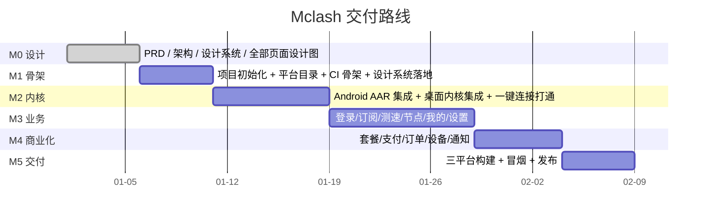

# 10 · 交付计划与验收标准

> 文档版本 v1.0 · 对应项目 `github.com/moneyfly004/Mclash`

---

## 10.1 里程碑划分

| 里程碑 | 交付物 | 出口条件 |
|---|---|---|
| **M0 设计** | 本设计文档套件（01–10）+ 高保真设计稿 | 每页设计图齐备，设计评审通过 |
| **M1 骨架** | 可运行的 Flutter 工程，三平台目录就位，CI 骨架，设计系统落地 | 三平台 `flutter build` 通过（无内核，界面可跑） |
| **M2 内核** | 三平台内核集成 + 一键连接端到端打通 | 三平台各能连上并访问外网 |
| **M3 业务** | 登录 / 自动拉订阅 / 自动测速 / 节点 / 我的 / 设置 / 日志 | 核心旅程「登录 → 自动可用 → 一键连接」跑通 |
| **M4 商业化** | 套餐 / 支付 / 订单 / 设备 / 通知 / 更新检查 | 能完成一次真实支付并续费成功 |
| **M5 交付** | 6 类安装包 + Release 页 + 冒烟报告 | 三平台安装 → 登录 → 连接 → 上网全部通过 |

---

## 10.2 从 baseline 到 Mclash 的改造任务清单

> 逐项可勾选。`P0` = 必须；`P1` = 本期尽量；`P2` = 后续。

### 10.2.1 工程与品牌（M1）

| # | 任务 | 优先级 | 说明 |
|---|---|---|---|
| E-01 | 项目重命名：`moneyfly` → `mclash` | P0 | `pubspec.yaml` name、`applicationId` → `top.moneyfly.mclash`、macOS `PRODUCT_BUNDLE_IDENTIFIER`、Windows `BINARY_NAME` |
| E-02 | 版本号重置为 `2.3.0+1` | P0 | 与后台 `/software/versions` 对齐 |
| E-03 | 移除所有对外文案中的 `MoneyFly` → `Mclash`（保留品牌标 `MoneyFly` 字样） | P0 | 窗口标题、通知标题、托盘 tooltip、UA 前缀 |
| E-04 | UA 前缀改为 `Mclash/` | P0 | 后台需按 UA 分流返回 Clash YAML |
| E-05 | 补 `.github/workflows/release.yml`（三平台 + mac 双架构 + universal） | P0 | 见 doc 08 |
| E-06 | 补 `.github/workflows/ci.yml`（analyze + test） | P0 | PR 门禁 |
| E-07 | 清理 `android/gradle.properties` 中任何硬编码路径 | P0 | clashmi 的 `org.gradle.java.home` 是硬编码 Windows 路径的反面教材 |
| E-08 | 签名配置改为从**环境变量**读取（`KEYSTORE_BASE64` 等） | P0 | 且**不得**在配置阶段无条件读文件（否则缺文件时所有 buildType 都失败） |
| E-09 | 移除 git 仓库中的任何 `key.properties` 明文密钥 | P0 | 安全 |
| E-10 | 品牌资产：图标（Android/iOS/macOS/Windows 全尺寸）、托盘图标（`.ico` + `.png`）、启动图 | P0 | macOS 图标必须是品牌画稿而非 Flutter 默认模板 |

### 10.2.2 设计系统落地（M1）

| # | 任务 | 优先级 | 说明 |
|---|---|---|---|
| S-01 | `MFColors` 六套主题与 doc 03 §3.2.2 逐值一致 | P0 | — |
| S-02 | 清除**所有**裸 `Color(0x...)`（grep 校验） | P0 | 当前至少 20 处（首页连接卡、套餐选中卡、我的信息卡、支付弹窗、日志色阶…） |
| S-03 | 首页连接卡渐变/电源环径向渐变改为从 `MFColors` 派生 | P0 | 暖白/纯黑主题下当前是硬编码蓝色 |
| S-04 | `mfLatencyColor` / `mfLatencyUsable` / `formatPrice` / `kNumFont` 全局唯一 | P0 | 禁止页面自写阈值 |
| S-05 | 统一输入装饰：明确「表单页用全局 theme（r14）」+「弹窗/内联用 `mfInput()`（r12）」 | P0 | 在 doc 03 登记为已知双轨，禁止第三套 |
| S-06 | 组件抽取：`MFConnectButton` / `MFNodeRow` / `MFSettingRow` / `MFBadge` / `MFStatusBanner` | P1 | 减少页面重复 |
| S-07 | Paper 尺寸检查：Windows 125%/150%/200% DPI | P0 | 桌面端 |

### 10.2.3 i18n 卫生（M1–M2）

| # | 任务 | 优先级 | 说明 |
|---|---|---|---|
| I-01 | 全部硬编码中文文案迁移到 `AppStrings` | P0 | 至少 15 处：注册页协议行、套餐 `/年 /季 /月`、节点「其他」、设置页语言值与弹窗标题、页脚版本行、关于页正文、支付弹窗副标题 |
| I-02 | `ApiClient.errorMsg` 的 13 条文案迁移到 i18n | P0 | en 语言下当前露中文 |
| I-03 | 删除 87 个未被引用的 i18n key | P1 | 死文案 |
| I-04 | emoji 图标 → Material Icons（或明确保留为「品牌元素」并列出白名单） | P1 | 跨平台渲染差异；i18n 卫生 |
| I-05 | en 语言覆盖率 100%（补全所有 key 的英文值） | P0 | 当前约 90% |
| I-06 | 中文/英文长度差异回归（导出 en 截图逐个核对） | P1 | en 文案普遍更长，按钮/胶囊会溢出 |

### 10.2.4 页面改造（M2–M4）

| # | 页面 | 改造 | 优先级 |
|---|---|---|---|
| U-01 | 首页 | 🆕 新增「自动测速与选优卡」（区块 ⑥） | **P0** |
| U-02 | 首页 | 🆕 加载态语义：同步中显示「正在同步订阅…」，绝不显示为错误 | **P0** |
| U-03 | 首页 | 🆕 受限账号隐藏测速卡与国家快捷区（维持 ≤7 元素预算） | P0 |
| U-04 | 首页 | 桌面端双栏布局（≥900px） | P0 |
| U-05 | 节点页 | 🆕 「⚡ 自动选优」条 | P1 |
| U-06 | 节点页 | 🆕 长按/右键节点操作菜单（复制节点名/服务器） | P1 |
| U-07 | 节点页 | 🔧 「其他」→「未识别地区」 | P1 |
| U-08 | 通知页 | 🆕 每行删除 `×`（baseline 仅长按，桌面不可发现） | P0 |
| U-09 | 订单页 | 🔧 修复 `order_time` 拼接 hack，改为独立 key + 格式化 | P0 |
| U-10 | 设置页 | 🆕 「导出诊断包」 | P1 |
| U-11 | 设置页 | 🔧 外观模式行内 6 色卡选择（免弹窗） | P1 |
| U-12 | 设置页 | 🔧 分组重命名为 7 组（连接 / 代理与分流 / 内核 / 外观 / 诊断 / 桌面 / 账户与数据） | P0 |
| U-13 | 套餐页 | 桌面端横向 3 列 + 结算栏同行 | P1 |
| U-14 | 我的页 | 桌面端双栏 | P1 |
| U-15 | 全部页面 | 🆕 桌面端内容最大宽（1040px / 设置页 760px） | P0 |
| U-16 | 全部页面 | 🆕 桌面端 hover / 焦点环 / tooltip | P0 |
| U-17 | 全部页面 | 🆕 桌面端底部状态条 | P1 |
| U-18 | 全部页面 | 🆕 桌面端键盘快捷键 | P1 |
| U-19 | 全局 | 🆕 Android 快捷设置磁贴 | P1 |

### 10.2.5 内核与可靠性（M2）

| # | 任务 | 优先级 | 说明 |
|---|---|---|---|
| K-01 | Android：下载 `libmihomo.aar` 到 `android/app/libs/` 并在 Gradle 引入 | P0 | 优先用官方 `moneyfly004/mihomo-lib` Release |
| K-02 | Android：`MclashVpnService` 实现完整 `onStartCommand` 分支表（含无配置自停防幽灵连接） | P0 | 见 doc 08 §8.2.4 |
| K-03 | Android：前台服务类型 `specialUse` + `subtype=vpn` | P0 | `connectedDevice` 在 Android 14+ 会抛 `SecurityException` |
| K-04 | Windows/macOS：`ProxyCoreCli` 子进程 + Clash API 就绪探测（**双条件**） | P0 | API 200 **且** 端口探活 |
| K-05 | 三平台：内核启停互斥（防快速连点双开） | P0 | `_starting` 标志 + `_stopInFlight` Future |
| K-06 | 三平台：崩溃自愈（3 次上限 + 10min/5 次熔断 + 稳定 60s 才清零） | P0 | 见 doc 05 P-06 |
| K-07 | 桌面：系统代理 apply / 恢复 / 残留清扫 / 20s 保活 | P0 | 见 doc 07 §7.6.4 |
| K-08 | 桌面：关机/注销钩子（Win `WM_ENDSESSION` / mac `applicationShouldTerminate` / `SIGTERM`） | P0 | 不做会导致重启整机断网 |
| K-09 | 桌面：单实例（Win 原生 mutex / mac 文件锁，且必须在任何清扫之前） | P0 | — |
| K-10 | 桌面：残留内核清扫只收「真孤儿」 | P0 | 否则杀掉另一实例的活内核 |
| K-11 | 桌面：内核热替换（用户副本目录 + 缓存 + 自检 + 回滚） | P0 | — |
| K-12 | Intel Mac：内核用 `compatible` 版 | P0 | 标准版要求 AVX2 |
| K-13 | 三平台：内核日志落盘 + 崩溃日志（退出码 + 尾部 200 行，活过重启） | P0 | 排障 |
| K-14 | 三平台：geo 数据内置 + 原子写更新 | P0 | — |

### 10.2.6 业务逻辑（M3–M4）

| # | 任务 | 优先级 | 说明 |
|---|---|---|---|
| B-01 | 订阅拉取：epoch + reqSeq 双闸 | P0 | 防计费漏洞 |
| B-02 | 订阅拉取：受限时清空缓存并**用空覆盖** | P0 | 同上 |
| B-03 | 订阅解析：三种形态 + 宽松 base64（6 类噪声） | P0 | 见 doc 09 §9.3.3 |
| B-04 | 订阅解析：12 种协议链接 | P0 | 尤其 `hy2://` 短写法的前缀切分 |
| B-05 | 占位伪节点过滤（server==baidu.com 或名称含 emoji 标记） | P0 | — |
| B-06 | 测速：并发 12 + 3 次中位数 + `mfLatencyUsable` 可信度过滤 | P0 | — |
| B-07 | 测速：UDP-only 协议返回 -1 且保持 online | P0 | 裸 TCP 探测必然失败 |
| B-08 | 测速：在副本上测 + 边测边刷（100ms 节流）+ 中途取消 | P0 | — |
| B-09 | 测速：用户请求排队（不被后台测速静默丢弃） | P0 | — |
| B-10 | 选优：延迟 + 负载惩罚 | P0 | — |
| B-11 | 切点策略：`none` / `best` / `auto` 三态 | P0 | 用户手动选过后不自动切 |
| B-12 | 定时刷新：30min + 回前台 ≥10min + 失败退避 | P0 | — |
| B-13 | 准入闸门：5 类受限状态 + 首页横幅 + 连接拦截 | P0 | — |
| B-14 | 被踢下线识别（403 文案匹配）→ 断开 + 清缓存 | P0 | — |
| B-15 | 登出/会话失效：8 步清理 + `popUntil(isFirst)` | P0 | — |
| B-16 | 并发 401 只允许 1 个 refresh 在途 | P0 | — |
| B-17 | 更新检查架构感知（Win 用户不得被引导下 APK） | P0 | — |
| B-18 | 全新安装/升级清理（强制重新登录与重拉订阅） | P0 | — |
| B-19 | 接口路径对齐（5 条 ⚠️ 待确认路由） | **P0 阻塞** | 见 doc 09 §9.10 |
| B-20 | 设备增量升级（+N 台 / +M 天，350ms 防抖预览） | P0 | — |

---

## 10.3 验收标准

### 10.3.1 核心旅程验收（每个平台各跑一遍）

| # | 步骤 | 通过标准 |
|---|---|---|
| 1 | 全新安装 → 打开 | ≤ 3s 出登录页，无崩溃，无空白 |
| 2 | 输入账号密码 → 登录 | ≤ 5s 进入首页 |
| 3 | 观察自动行为 | **无需任何操作**：节点列表自动出现、延迟自动填充、最优节点自动选出 |
| 4 | 点一次连接按钮 | ≤ 3s 变为「已连接」 |
| 5 | 打开浏览器访问外网 | 正常打开 |
| 6 | 打开首页看出口 | 显示真实出口国家 |
| 7 | 切到节点页换一个国家 | 热切换 ≤ 1.5s，连接不断 |
| 8 | 断开 | 系统代理恢复（桌面）/ TUN 关闭（Android），网络回复直连 |
| 9 | 杀进程后重开 | 无残留内核、无残留系统代理；能正常重连 |
| 10 | 卸载重装 | 必须重新登录（不沿用旧 token/配置/节点） |

### 10.3.2 平台专属验收

| 平台 | 验收项 |
|---|---|
| **Android arm64-v8a** | 首次连接弹 VPN 授权；授权后连接成功；通知栏常驻且可断开；免电池优化提示；快捷磁贴可连接 |
| **Android armeabi-v7a** | 同上（在老设备或模拟器上验证） |
| **Android x86_64** | 同上（模拟器） |
| **Windows** | 关闭窗口按记忆行为；托盘菜单四项可用；系统代理设置/恢复正确；关机后重启不断网；第二实例被拦截且不影响第一实例；老 CPU（无 AVX2）用 compatible 内核可启动 |
| **macOS arm64** | `.dmg` 拖入 Applications 可运行；系统代理逐服务设置正确；`lipo -verify_arch arm64` 通过；内核版本与 App 内置一致 |
| **macOS x64** | `lipo -verify_arch x86_64` 通过（App 与内核**都**）；在真 Intel 机或 Rosetta 下可连接 |
| **macOS universal** | `lipo -verify_arch arm64 x86_64` 通过（App 与内核**都**） |

### 10.3.3 异常与边界验收

| # | 场景 | 期望 |
|---|---|---|
| 1 | 断网后点连接 | 「网络连接失败，请检查网络后重试」+ 重试按钮；**不是**含糊的「连接已断开」 |
| 2 | 断网后拉订阅 | 回退磁盘缓存（30min TTL 内）；无缓存则明确报错 |
| 3 | 账号到期 | 首页红色横幅「套餐已到期」+ 节点清空 + 连接被拦截 |
| 4 | 账号被禁用 | 「账号已被禁用」弹窗 + 全局受限 |
| 5 | 设备被踢下线 | 「本设备已被移除」+ 自动断开 + 清空节点 |
| 6 | 设备数达上限 | 「设备数量已达上限（3/3）」+ [管理设备] [升级设备套餐] |
| 7 | 订阅是 base64 整包（末尾带换行） | **正确解析出全部节点**（不能是 0 个且无报错） |
| 8 | 订阅含 `hy2://` 节点 | 全部正确解析，UUID 不被截断 |
| 9 | 订阅含 vmess JSON | 正确转成 mihomo map（不能被内核按 `type=none` 拒载） |
| 10 | 订阅含 UDP-only 节点（hysteria2/tuic） | 显示「在线，延迟未知」而非「离线」 |
| 11 | 快速连点连接按钮 5 次 | 只起一个内核，无孤儿进程，无端口冲突 |
| 12 | 内核被安全软件结束 | 自动拉起（≤3 次）；熔断时显示「内核反复异常退出，可能被安全软件拦截；退出码 -9」 |
| 13 | 连接中途拔网线/关 WiFi | 1 分钟内检测到并尝试重连；恢复后自动连上 |
| 14 | 桌面端连接中杀进程 | 下次启动巡检清掉残留内核与残留代理；**不出现**整机断网 |
| 15 | 端口被占用（2080 被别的程序占） | 明确报错（不能误判「已连接」并把系统代理指向死端口） |
| 16 | 支付后等 30 秒 | 订单状态轮询到 `paid` → 弹窗自动关闭 → 订阅立即刷新 |
| 17 | 支付超时 15 分钟 | 「未检测到支付」+ 重新生成二维码选项 |
| 18 | 弱网（模拟 200ms 延迟 / 5% 丢包） | 连接成功；测速给出合理延迟；不出现卡死 |
| 19 | 切换外观模式 6 次 | 无残留硬编码色块（对比 doc 03 §3.2.2） |
| 20 | 切成 English | 全界面无中文残留 |

### 10.3.4 性能验收

| 指标 | 目标 |
|---|---|
| 冷启动 → 首屏可交互 | ≤ 1.5s |
| 冷启动 → 节点列表可见（读磁盘缓存） | ≤ 800ms |
| 登录 → 节点可用 | ≤ 5s（正常网络） |
| 点连接 → 已连接 | ≤ 3s |
| 68 个节点全量测速（未连接，TCP） | ≤ 20s |
| 68 个节点全量测速（已连接，内核 delay） | ≤ 30s |
| 节点列表 200 项滚动 | 稳定 60fps（必须 `itemExtent`） |
| 内存占用（连接中，首页） | ≤ 200 MB |
| 空闲 CPU（连接中，后台） | ≤ 2% |
| 安装包体积（Android arm64） | ≤ 35 MB |

### 10.3.5 安全验收

| # | 项 | 标准 |
|---|---|---|
| 1 | Token 存储 | `flutter_secure_storage`（Keychain / Keystore），非明文 |
| 2 | 日志脱敏 | 登录/刷新等敏感接口的响应体不落盘；日志中不出现 token |
| 3 | 仓库中无密钥 | 无 `key.properties`、无 keystore、无 API key |
| 4 | HTTPS 强制 | 测速地址与 API 地址均 HTTPS；旧明文地址自动迁移 |
| 5 | 订阅缓存隔离 | 换号/登出/版本升级即失效，旧账号节点不残留 |
| 6 | 无订阅导入入口 | 不存在 `mclash://import` 等深链 |
| 7 | 受限绕过 | 到期/禁用/踢下线的账号**不能**通过旧缓存继续使用代理 |

---

## 10.4 风险登记表

| ID | 风险 | 影响 | 概率 | 缓解 |
|---|---|---|---|---|
| R-01 | 后台 5 条路由未对齐（doc 09 §9.10） | 联调阻塞 | 高 | **M1 结束前必须与后台敲定**（补别名或改客户端路径） |
| R-02 | `libmihomo.aar` 与 App 的 ABI/NDK 版本不匹配 | Android 无法加载内核 | 中 | CI 下载后校验 sha256；本地先用 `tool/build_mihomo_aar.sh` 现编验证 |
| R-03 | Intel Mac 用户装了 arm64 包 | 无法启动 | 中 | 资产名带架构后缀 + 发布页加粗提示；App 启动时检测架构不匹配并给出明确提示 |
| R-04 | 老 Intel CPU 跑标准版内核崩溃 | 启动即崩 | 中 | 默认 `compatible`；`KernelManager` 自动按架构选资产 |
| R-05 | 订阅面板返回未预期的格式（zip / 加密 / 自定义） | 0 节点 | 中 | 明确的错误文案「订阅返回的是 zip 压缩包，请在服务端改为直接返回 Clash 配置」；解析失败逐条上报 |
| R-06 | Android 厂商 ROM 激进杀后台 | 断连 | 高 | 引导免电池优化 + 前台服务 + WakeLock + 崩溃自愈 |
| R-07 | macOS 未签名包被 Gatekeeper 拦截 | 无法安装 | 高 | DMG 内附引导文案；正式发布走 Developer ID 签名 + 公证 |
| R-08 | 系统代理被其他软件反复篡改 | 代理时好时坏 | 中 | 20s 保活 + 保活日志 |
| R-09 | 六套主题下出现硬编码色块 | 视觉不一致 | 高 | `grep 'Color(0x'` 加入 CI 检查；S-02 任务 |
| R-10 | en 文案过长导致布局溢出 | 界面破版 | 中 | I-06 回归；按钮/胶囊用 `Flexible` + 省略 |
| R-11 | 支付回调延迟导致订阅未及时更新 | 用户重复支付 | 中 | 支付成功后**主动** `fetchNodes(force: true)`；订单页可继续支付而非重新下单 |
| R-12 | 内核版本升级引入不兼容配置项 | 连接失败 | 低 | `flutter test` 含 `mihomo -t` 配置语法校验（回归防线） |

---

## 10.5 上线检查清单（Go / No-Go）

### 代码与构建

- [ ] `flutter analyze` 零 error、零 warning
- [ ] `flutter test` 全绿（含真实内核 e2e）
- [ ] 六套主题逐个目检无硬编码色块
- [ ] `grep -rn "Color(0x" lib/pages lib/widgets` 只命中允许列表
- [ ] `grep -rn "[一-龥]" lib --include=*.dart` 只命中 `app_strings.dart`
- [ ] 切换 English 全流程无中文残留
- [ ] 仓库无密钥、无 keystore、无 `.env`

### 平台产物

- [ ] Android：3 个 APK + 1 个 AAB，**全部为 release 正式签名**（验证 `apksigner verify`）
- [ ] Android：`minSdk 26`，在 Android 8 / 10 / 14 各测一台
- [ ] Windows：`.exe` 安装包 + `.zip` 便携版；安装包内含 `mihomo.exe`
- [ ] macOS arm64：`.dmg`；`lipo -verify_arch arm64` 通过（App + 内核）
- [ ] macOS x64：`.dmg`；`lipo -verify_arch x86_64` 通过（App + 内核）
- [ ] macOS universal（如发布）：`lipo -verify_arch arm64 x86_64` 通过（App + 内核）
- [ ] 所有产物生成 `SHA256SUMS*.txt`

### 功能

- [ ] 三平台核心旅程 10 步全过（§10.3.1）
- [ ] 异常与边界 20 项全过（§10.3.3）
- [ ] 真实完成一次支付并看到订阅立即更新
- [ ] 真实完成一次设备增量升级
- [ ] 设备页删除设备 → 被删设备端立即断开并提示

### 发布

- [ ] `make_latest: true` 已设置（更新检查读 `/releases/latest`）
- [ ] Release 正文含完整安装指引与「请勿跨架构混装」提示
- [ ] 后台 `/software/versions` 已登记新版本
- [ ] 后台 `/download/resolve` 能按 platform + arch 返回正确资产
- [ ] 官网下载页链接到本 Release

---

## 10.6 后续路线（本期范围外）

| 里程碑 | 内容 | 前置 |
|---|---|---|
| **M6** | iOS（未签名 IPA 侧载 / TestFlight）：`Mihomelib.xcframework` + `PacketTunnel.appex` | 需要 Apple 付费开发者账号签名 |
| **M7** | Linux（deb / rpm / AppImage）：与 Windows/macOS 同一条 `ProxyCoreCli` 路径 | — |
| **M8** | 扫码登录（移动端扫桌面端二维码） | 后台需新增二维码会话接口 |
| **M9** | 内嵌 zashboard 高级面板（P2 折叠入口） | — |
| **M10** | 多语言扩展（繁体中文 / 日语 / 韩语） | i18n 已就绪 |
